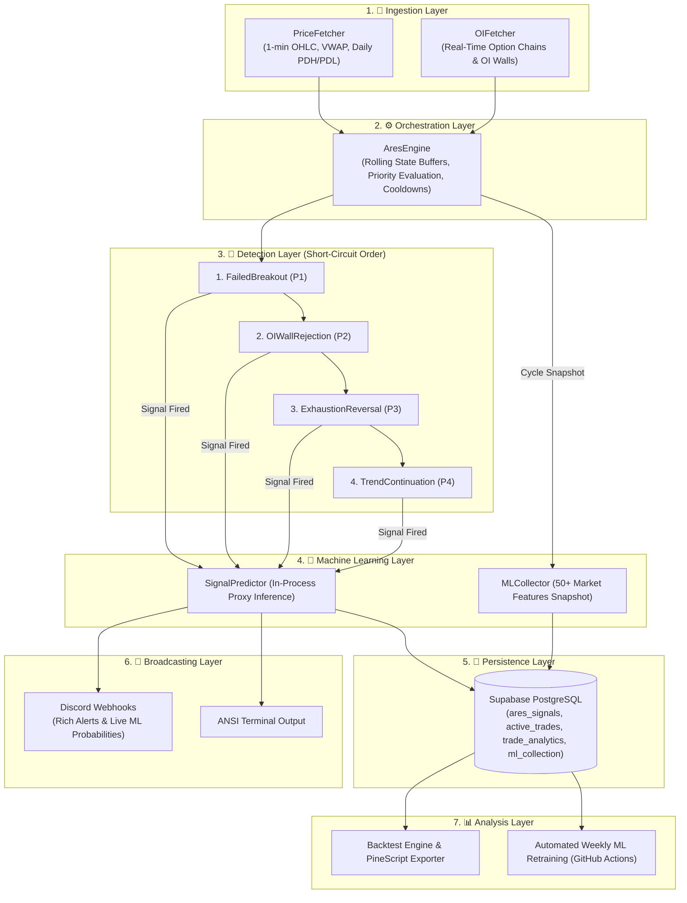

# ARES (Adaptive Reversal & Entry Signal) 🚀

<div align="center">


**High-Performance, Asynchronous Algorithmic Trading Signal & Machine Learning System for NIFTY 50 Options Scalping**

[Architecture](#-high-level-architecture) • [Design Principles](#-design-principle--ares-is-a-spot-based-system) • [Detectors](#-detection-strategies--confidence-scoring) • [Option Math](#-option-sizing--delta-based-strike-selection) • [Position Manager](#-trade-management-position-manager) • [ML Module](#-machine-learning--prediction-pipeline) • [Setup Guide](#%EF%B8%8F-setup--deployment)

</div>

---

## 📌 Executive Summary

**ARES** continuously monitors 1-minute price action, Option Interest (OI), and Implied Volatility (IV) to identify high-probability reversal and continuation setups in real-time. It pairs quantitative technical detectors with an in-process **XGBoost Machine Learning model** to enrich fired signals with forward probabilities, broadcasting alerts directly to **Discord** and persisting full market state snapshots to **Supabase** for automated weekly retraining.

---

## 🏗️ High-Level Architecture

ARES follows a strict **seven-layer decoupled architecture** designed for modularity, sub-second latency, and fault tolerance:



### Layer Breakdown

1. **🧩 Ingestion Layer:** Asynchronous fetchers (`PriceFetcher`, `OIFetcher`) poll the DhanHQ API for 1-min candles, real-time Option Chains, and previous day OHLC levels.
2. **⚙️ Orchestration Layer:** The `AresEngine` manages the evaluation pipeline, maintaining rolling state buffers (Volume, IV) and enforcing signal cooldowns.
3. **🔬 Detection Layer:** A suite of specialized detectors (`FailedBreakout`, `OIWall`, `Exhaustion`, `TrendContinuation`) score market conditions against technical and structural levels.
4. **🧠 Machine Learning Layer:** `MLCollector` logs 50+ intraday market features to `ml_collection` on every cycle, while an in-process `SignalPredictor` (TASK-196) enriches live Discord alerts with forward win probabilities. Automated weekly training (TASK-205) via GitHub Actions continuously updates the model.
5. **💾 Persistence Layer:** All generated signals and **active trade states** are logged to **Supabase (PostgreSQL)** for post-session performance auditing and backtesting.
6. **📢 Broadcasting Layer:** Signals are formatted into rich, scannable alerts and dispatched via **Discord Webhooks** and the local console.
7. **📊 Analysis Layer:** A specialized `backtest/` suite allows for historical simulation and visual export of signals to TradingView via PineScript.

---

> [!IMPORTANT]
> ### 📐 Design Principle — ARES is a **Spot-Based** System
> 
> This is the single most important concept to understand before analyzing anything in this repository:
> 
> **Every decision is made on the spot price of the underlying** — NIFTY (Dhan `security_id` 13), or any other index or stock configured. Detection, confidence scoring, entry, stop-loss, targets, backtests, recorded P&L, and ML features are all computed strictly on the **spot chart**. `pnl_points` is, correctly and deliberately, **NIFTY spot points**.
> 
> **The options layer is derived reference, not the source of truth.** Strike selection, entry premium, option SL, and option target are convenience calculations projected from the spot levels via the selected contract's delta (see *Option Sizing* below). They exist so a spot signal can be acted on as an options trade. They are **not** what determines whether a trade won or lost.
> 
> **Key Design Consequences:**
> - **Spot-points P&L on a multi-day carry is not a measurement error:** Positions are intentionally carried across sessions (TASK-170) — there is no end-of-day square-off and none is wanted. A carry judged in spot points is judged exactly as intended.
> - **Exit premium is deliberately not recorded:** Entry premium is stored only as reference. Reconstructing true option P&L is explicitly out of scope, and the options layer may eventually be removed entirely.
> - **Do not "fix" analysis to price trades in premium:** Any audit, report, or model that switches to premium is measuring something this system does not trade on.

---

## 🎯 Detection Strategies & Confidence Scoring

ARES evaluates four distinct market phenomena in strict **short-circuit priority order**, utilizing dynamic confidence scoring matrices:

```text
 Priority 1 ──► 🚨 Failed Breakout      (Highest Conviction Reversals)
 Priority 2 ──► 🧱 OI Wall Rejection    (Structural Option Chain Defense)
 Priority 3 ──► 💥 Exhaustion Reversal  (Volume Climax & Doji Extremes)
 Priority 4 ──► 📈 Trend Continuation  (Momentum Breakout Resumption)
```

---

### 1. 🚨 Failed Breakout (Highest Priority)

* **Logic:** Tracks "fake-outs" where price crosses a significant level (PDH/PDL fetched dynamically from Dhan Historical API or massive OI wall) but fails to hold.
* **Dynamic Targets:** Automatically sets Profit Targets (T1/T2) at the next available structural support/resistance levels.
* **Dynamic Scoring (4-Point Matrix):**
  * `Closed Back`: Price returned past the level (Required gate, not scored).
  * `Weak Volume`: Breakout candle volume < Rolling Average.
  * `IV Crush`: Dropping Implied Volatility during the cross.
  * `Active OI Growth`: Decisive open interest build (`breakout_writers_active_min_pct`: $\ge 10\%$ normal / $\ge 15\%$ expiry) confirming writer defense. Writers merely holding is reported as context but not scored.
  * `Deep Close-Back`: Index closes back inside the level by $\ge 5.0$ points.
* **Confidence Rating:** `breakout_failure_min_score` (default `2` of 4, TASK-184) fires `MEDIUM` (score 2) and `HIGH` (score $\ge 3$) confidence alerts.
* **Direction:** Fully bidirectional (handles both Bullish and Bearish failures).

---

### 2. 🧱 OI Wall Rejection (High Priority)

* **Logic:** Identifies structural rejection at strikes with massive fresh Open Interest.
* **Confirmation:** Stateful two-candle confirmation. A candle only becomes a candidate if it tests the wall with a genuine wick rejection ($\ge 40\%$ of candle range). The signal fires only once the following candle confirms by closing beyond the candidate candle's high/low; an unconfirmed candidate expires after one follow-up candle.
* **Dynamic Targets:** Profit targets (T1/T2) are calculated dynamically based on structural support/resistance levels from PDH/PDL and option chain walls, ensuring a minimum 20-point target proximity filter and deterministic proximity-based target sorting (T1 is guaranteed to be the closer target).
* **Dynamic Scoring (4-Point Matrix):**
  * `Wall Magnitude`: Size of the OI wall compared to thresholds.
  * `Active OI Building`: Net positive intraday OI build-up at the wall.
  * `Strike Penetration`: Extent to which price penetrated the strike before rejecting.
  * `Intraday Wick Rejection`: Technical wick signature showing immediate rejection.
* **Confidence Rating:** Sets confidence to `HIGH` if the score is $\ge 2$, otherwise `MEDIUM`.

---

### 3. 💥 Exhaustion Reversal (Medium Priority)

* **Logic:** Catches "blow-off tops" or "panic bottoms" using volume/price divergence.
* **Dynamic Targets:** Uses structural levels (PDH/PDL, option chain walls) to define exit zones, ensuring realistic profit booking.
* **Triggers:** Triggers when a volume climax (extreme spike) coincides with a doji-like indecision candle at a local price extreme, often accompanied by an IV spike.
* **Dynamic Scoring (4-Point Matrix):**
  * `Extreme Volume Climax`: Climax candle volume $\ge 2.5\times$ rolling average.
  * `Extreme Doji Body Ratio`: Tiny real body relative to wicks ($\le 0.3$).
  * `Panic IV Spike`: Rapid IV expansion during the exhaustion candle.
  * `Structural Level Testing`: Price actively testing a key horizontal level or wall.
* **Confidence Rating:** Sets confidence to `HIGH` if the score is $\ge 2$, otherwise `MEDIUM`.

---

### 4. 📈 Trend Continuation (Medium Priority, TASK-177)

* **Logic:** Rides strong intraday momentum when price decisively breaks and holds above/below key structural levels with supporting volume and open interest expansion.
* **Dynamic Targets:** Project T1/T2 targets along trend extension levels while enforcing structural SL protection at the breakout level.
* **Confidence Rating:** Sets confidence to `HIGH` for strong multi-factor volume+OI confirmations, otherwise `MEDIUM`.

---

## ⚖️ Option Sizing & Delta-Based Strike Selection

ARES integrates dynamic options contract selection and risk-managed lot sizing (implemented in [`options_math.py`](file:///Users/manmadeanyme/Documents/Work/ARES/options_math.py)).

> [!NOTE]
> This layer is reference only. Everything below is projected *from* the spot levels via delta — it never feeds back into detection, scoring, or how a trade is judged. See *Design principle — ARES is a spot-based system* above.

```text
 ┌──────────────────────┐    Delta Calculation    ┌──────────────────────────┐
 │ NIFTY Spot Signals   │ ──────────────────────► │ Delta ~ 0.45 Strike Scan │
 └──────────────────────┘                         └────────────┬─────────────┘
                                                               │
 ┌──────────────────────┐    Risk & Capital       ┌────────────▼─────────────┐
 │ Dhan Available Funds │ ──────────────────────► │ Lot Size = min(Risk, Cap)│
 └──────────────────────┘                         └──────────────────────────┘
```

- **Delta-Based Strike Selection:** Scans the live option chain to select the contract (CE or PE) with an absolute delta closest to **0.45** (target range: `0.45` to `0.55`).
- **Capital-Aware Ingress:** Queries the DhanHQ API dynamically for available trading balance (`availabelBalance` or `availableBalance`). If the API call fails, it falls back to configured default capital.
- **Risk-Managed Lot Sizing:**
  - Computes max risk amount based on user-defined percentage of available capital (`risk_per_trade_pct`).
  - Translates index-based profit targets (T1) and stop-loss (SL) points into option premium movement using the selected option's delta:
    $$\text{Option Target/SL Price} = \text{LTP} \pm (\text{Index Points} \times |\text{Delta}|)$$
  - Calculates suggested lots based on risk and affordable lots based on entry premium and lot size (default size `65` for Nifty).
  - Suggests the lower of the two: $\min(\text{suggested\_lots}, \text{affordable\_lots})$ to prevent over-allocation.
- **Decoupled Formatting:** Option sizing details are persisted in Supabase under `market_context` / `reasons` and presented clearly in Discord alerts.

---

## 🛡️ Trade Management (Position Manager)

ARES actively tracks its signals using a persistent **Position Manager**:

| Feature | Mechanism & Behavior |
|---|---|
| **Deterministic Targets** | Ensures **Target 1 (T1)** is always the level closest to entry price. Structural levels within **20 points** of entry are filtered out. |
| **Trailing Stops** | When price reaches Target 1 (T1), Stop Loss is automatically trailed to entry price (`STOPPED_OUT_AT_BE`), locking in a risk-free runner. |
| **Multi-Class Scoring** | Natively records point scores (TASK-198): `T2_HIT=2`, `T1_HIT=1`, `STOPPED_OUT_AT_BE=1`, `SL_HIT=0`, `TIME_STOP=0`. |
| **Persistent State** | Active trades sync in real-time with Supabase (`active_trades`) and load into memory on startup for resilient failover. |
| **Tracking IDs** | Every trade signal is assigned a display code (e.g., `#0501`) and linked by DB ID (`signal_id`) to `trade_analytics`. |
| **Analytics Logging** | Detailed trade histories, market context, and OI data log to `trade_analytics` upon trade completion. |
| **Discord Updates** | State changes (T1 hit, Trailed SL hit, T2 hit) trigger color-coded Discord alert updates via Webhooks. |

---

## 🧠 Machine Learning & Prediction Pipeline

ARES features an integrated, offline-trained and in-process served **XGBoost Machine Learning pipeline**:

```text
  ┌────────────────────────────────────────────────────────┐
  │  Live Execution (main.py)                              │
  │                                                        │
  │  MLCollector ──────► Writes 50+ features to ml_collection
  │  SignalPredictor ──► Adds prob % to Discord Alerts      │
  └──────────────────────────┬─────────────────────────────┘
                             │
                             ▼
  ┌────────────────────────────────────────────────────────┐
  │  GitHub Actions Automated Workflow (.github/workflows) │
  │                                                        │
  │  Weekly Retraining (Sat 00:00Z) ──► Retrains XGBoost   │
  │  Model Artifacts ────────────────► Stores v1.joblib    │
  └────────────────────────────────────────────────────────┘
```

- **Feature Snapshot (`MLCollector`):** Captures 50+ technical, IV, OI, Greek, and structural features per cycle into Supabase `ml_collection`.
- **In-Process Inference (`SignalPredictor`):** Uses lightweight XGBoost model (`v1.joblib`) inside `main.py` to add forward probabilities (e.g., `🤖 ML Prediction: 46%`) directly to Discord alerts (TASK-196) without database write latency.
- **Timestamp Normalization (TASK-206):** Stores timestamps in normalized UTC (`+00:00`) using `storage.to_utc_iso`, guaranteeing 1:1 joinability with `ares_signals` and `trade_analytics`.
- **Automated Retraining (TASK-205):** GitHub Actions workflow (`.github/workflows/ml_training.yml`) runs `ml_signal/train_offline.py` every Saturday, updating metrics reports (`reports/ml/`) and model binaries (`ml_signal/models/`).

---

## 📊 Backtesting & Visualization

ARES includes a robust backtesting module to validate strategies against historical data:
- **High-Fidelity Simulation:** Simulates trade execution using historical 1-minute OHLC data.
- **PineScript Exporter:** Generates TradingView-compatible PineScript (v6) code. This allows traders to visually inspect every signal, entry, stop-loss, and target level directly on a TradingView chart.
- **Performance Metrics:** Automatically calculates PnL, Win Rate, and Drawdown for the simulated period.

---

## 🛠️ Tech Stack & Engineering Paradigms

| Component | Technology | Usage & Purpose |
|---|---|---|
| **Language** | Python 3.10+ | Asynchronous event loop (`asyncio`) for non-blocking execution |
| **HTTP Client** | `httpx` | High-performance async API requests to DhanHQ |
| **Data Models** | Dataclasses & Pydantic | O(1) state management & strict fail-fast settings validation |
| **ML Engine** | `xgboost` & `scikit-learn` | Forward-probability classification & feature engineering |
| **Broker API** | DhanHQ SDK v2 | Live intraday 1-min candles, option chains, and account balance |
| **Database** | Supabase (PostgreSQL) | Persistence for signals, active trades, analytics, and ML snapshots |
| **CI/CD & Hosting** | Fly.io & GitHub Actions | Automated Docker deployments & weekly ML retraining workflows |
| **Testing** | `pytest` | 359 unit tests providing comprehensive coverage across all modules |

---

## 📂 Project Structure

```text
ares/
├── config.py          # Strict Pydantic configuration & thresholds
├── config_profiles.py # Performance configurations & SetupLevels defaults
├── models.py          # Domain models (OHLCVCandle, AresSignal, OptionRow)
├── options_math.py    # Option sizing and delta-based strike selection math
├── fetchers/          # Ingestion Layer
│   ├── price_fetcher.py   # DhanHQ minute data, VWAP logic & dynamic PDH/PDL via Dhan Historical Daily API
│   ├── oi_fetcher.py      # DhanHQ Option Chain processing
│   └── level_fetcher.py   # Dynamic level construction (PDH/PDL + OI walls)
├── detectors/         # Detection Layer
│   ├── breakout.py        # Stateful detector for Failed Breakouts
│   ├── oi_wall.py         # Stateless structural rejection detector
│   ├── exhaustion.py      # Volume history & price extreme tracker
│   ├── continuation.py    # Trend Continuation detector (TASK-177)
│   └── expiry_detector.py # Expiry day detection (Dhan API check/Tuesday fallback)
├── ml_signal/         # Machine Learning Module
│   ├── config.py      # ML parameters & thresholds
│   ├── features.py    # 50+ feature extraction logic
│   ├── collector.py   # In-process feature logger (MLCollector -> ml_collection)
│   ├── predictor.py   # In-process runtime inference (SignalPredictor)
│   ├── dataset.py     # Data preparation & preprocessing
│   ├── labeling.py    # Multi-class outcome labeler
│   ├── train_offline.py # Offline XGBoost training & metric exporter
│   └── schema.sql     # Supabase ml_collection & ml_predictions definitions
├── backtest/          # Analysis Layer
│   ├── pinescript_exporter.py # Generates TradingView v6 visualization scripts
│   ├── engine.py          # Historical simulation engine
│   └── report.py          # Performance metrics & PDF/Markdown reporting
├── engine.py          # The "Brain" — Orchestrates evaluation & priority
├── position_manager.py # Persistent trade position & trailing stop manager
├── alerts.py          # Formatting & Discord broadcasting
├── storage.py         # Supabase persistence logic
├── main.py            # Entry point, polling loop, and session gate
```

---

## ⚙️ Setup & Deployment

### 1. Environment Configuration

Clone the repository and create a `.env` file based on `.env.example`:

```bash
# ==========================================
# Discord Webhooks
# ==========================================
DISCORD_WEBHOOK_URL="your_discord_webhook"
DISCORD_HEALTH_WEBHOOK_URL="your_health_webhook"  # Optional: For heartbeats and system alerts

# ==========================================
# Supabase Database Credentials
# ==========================================
SUPABASE_URL="your_supabase_url"
SUPABASE_KEY="your_supabase_anon_key"

# ==========================================
# Engine & Polling Parameters
# ==========================================
POLL_INTERVAL_SECONDS=60
SIGNAL_COOLDOWN_MINUTES=5
CANDLE_BUFFER_SIZE=30
IV_BUFFER_SIZE=10

# ==========================================
# Detector Configuration & Thresholds
# ==========================================
BREAKOUT_CONFIRMATION_CANDLES=3
BREAKOUT_FAILURE_MIN_SCORE=2
BREAKOUT_WEAK_VOLUME_RATIO=0.75
BREAKOUT_IV_FALLING_THRESHOLD=-3.0
BREAKOUT_WRITERS_ACTIVE_MIN_PCT=10.0
BREAKOUT_DEEP_CLOSE_PTS=5.0

OI_WALL_MIN_OI=5000000
OI_WALL_MIN_OI_CHANGE_PCT=20.0
OI_WALL_APPROACH_DISTANCE=40.0
OI_WALL_TEST_DISTANCE=20.0

EXHAUSTION_VOLUME_MULTIPLIER=2.5
EXHAUSTION_BODY_RATIO=0.3
EXHAUSTION_IV_SPIKE_THRESHOLD=1.0
EXHAUSTION_MIN_CANDLES=5

# ==========================================
# Targets & Zones
# ==========================================
TARGET_1_PTS=40.0
TARGET_2_PTS=80.0
STRIKE_INTERVAL=50
ENTRY_ZONE_OFFSET_PTS=5.0
STRUCTURAL_TARGET_MIN_DISTANCE_PTS=20.0
TARGET_1_FALLBACK_MIN_PTS=15.0
TARGET_2_FALLBACK_MIN_PTS=30.0
LEVEL_SCAN_RANGE=500.0
```

---

### 2. Database Initialization

Run the following schemas in your Supabase SQL Editor to initialize tables and migrations:

```sql
CREATE TABLE IF NOT EXISTS ares_signals (
  id bigserial primary key,
  setup_type text,
  direction text,
  confidence text,
  trigger_price numeric,
  spot_at_signal numeric,
  stop_loss numeric,
  target_1 numeric,
  target_2 numeric,
  strike integer,
  option_type text,
  reasons jsonb,
  timestamp timestamptz,
  created_at timestamptz default now()
);

CREATE INDEX IF NOT EXISTS idx_ares_signals_timestamp ON ares_signals (timestamp DESC);

CREATE TABLE IF NOT EXISTS active_trades (
  id uuid primary key,
  signal_id text,
  setup_type text not null,
  direction text not null,
  entry_price numeric not null,
  stop_loss numeric not null,
  target_1 numeric not null,
  target_2 numeric not null,
  state text not null default 'OPEN',
  added_time_ist text,
  created_at timestamptz default now()
);

CREATE TABLE IF NOT EXISTS trade_analytics (
  id uuid PRIMARY KEY,
  signal_id bigint,
  setup_type text NOT NULL,
  direction text NOT NULL,
  entry_timestamp timestamptz NOT NULL,
  exit_timestamp timestamptz,
  entry_price numeric NOT NULL,
  exit_price numeric,
  pnl_points numeric,
  result_state text DEFAULT 'OPEN',
  score integer,
  market_context jsonb,
  oi_data jsonb,
  created_at timestamptz DEFAULT now()
);

CREATE INDEX IF NOT EXISTS idx_trade_analytics_entry ON trade_analytics (entry_timestamp DESC);

-- Note: See ml_signal/schema.sql for ml_collection and ml_predictions schemas.
-- Note: See migrations/ for idempotent database migrations (TASK-198, TASK-206).
```

#### Row Level Security (RLS) Note
If using the Anon key, ensure RLS is disabled or permissive policies are added:

```sql
ALTER TABLE active_trades DISABLE ROW LEVEL SECURITY;
ALTER TABLE ares_signals DISABLE ROW LEVEL SECURITY;
ALTER TABLE trade_analytics DISABLE ROW LEVEL SECURITY;
ALTER TABLE ml_collection DISABLE ROW LEVEL SECURITY;
```

---

### 3. Local Execution

Start the monitoring trading engine locally:

```bash
python main.py
```

---

### 4. Running Unit Tests

The test suite contains **359 unit tests** isolating API and database dependencies with mocks:

```bash
# Install developer dependencies
pip install -r requirements-dev.txt

# Run full test suite
PYTHONPATH=. pytest

# Run tests with coverage report
PYTHONPATH=. pytest --cov=. tests/
```

> [!TIP]
> Always use `PYTHONPATH=. pytest` to ensure repo root is properly included on `sys.path`.

---

### 5. Deployment (Fly.io & GitHub Actions)

ARES is fully containerized with Docker and configured for **Fly.io**:

1. **Secrets Setup:** Set environment secrets directly on Fly.io:
   ```bash
   fly secrets set SUPABASE_URL="your_url" SUPABASE_KEY="your_key" DISCORD_WEBHOOK_URL="your_webhook"
   ```
2. **Automated CI/CD:** Push to `main` triggers `.github/workflows/deploy.yml` to run unit tests and execute `fly deploy`.
3. **Automated ML Retraining:** `.github/workflows/ml_training.yml` runs every Saturday at 00:00 UTC (05:30 IST), training XGBoost on `ml_collection` and attaching reports/artifacts to the run.

---

## 🚀 Operational Bounds

- **Session Window:** Actively polls from **09:20 to 15:25 IST** (Standard NSE session window).
- **Warmup State:** Requires **30 candles** (`CANDLE_BUFFER_SIZE`) to fill rolling volume/IV buffers before evaluating signals.
- **Signal Cooldown:** Enforces a strict **5-minute cooldown** per setup type to eliminate choppy false positives.
- **Zero Hardcoding:** All thresholds (volume ratios, IV drops, OI walls) are fully configurable via environment variables.

---

## ⚠️ Disclaimer

ARES is an algorithmic signaling and quantitative research tool designed for educational and informational purposes. It does **not** execute trades automatically. Options trading carries significant financial risk. Always forward-test in a paper-trading environment before deploying real capital.
