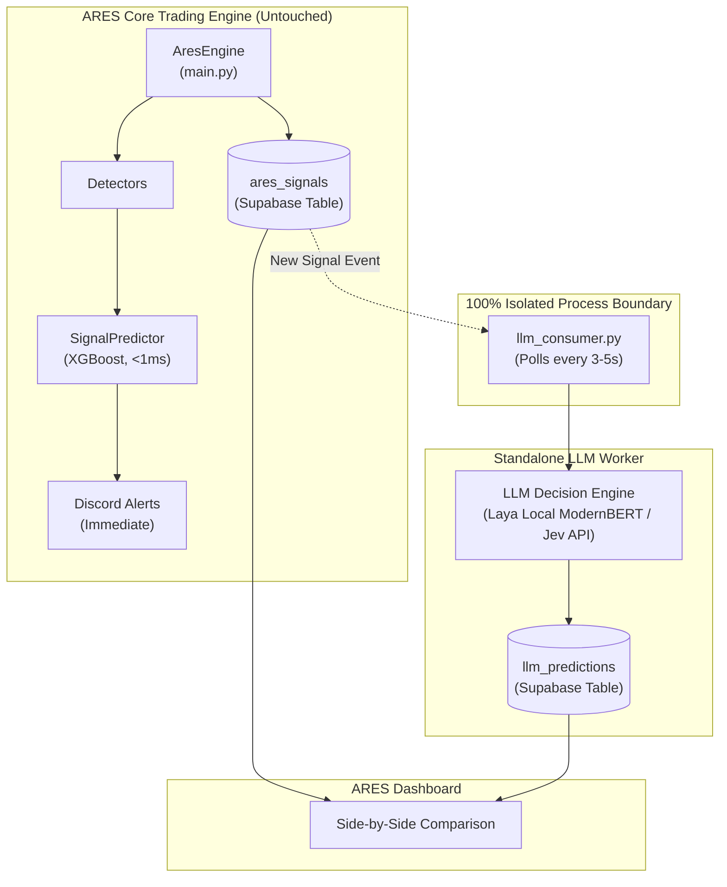

# TASK-210: Standalone LLM / System One Prediction Pipeline (`llm_predictions`)

**Date:** 2026-09-24  
**Status:** PARKED / SCHEDULED NEXT WEEK (Initial Backend: Laya)  
**Priority:** Medium (Research & Evaluation)  
**Related Components:** `ml_signal/llm_consumer.py`, `schema.sql`, Supabase (`llm_predictions`), Dashboard (Phase 2)  
**Obsidian Ref:** `[[LLM & System One ARES Integration]]`

---

## 1. Objective

Integrate a modern **System One / LLM Decision Engine** (Laya open-weights ModernBERT or TypeSafe Jev) as a **100% decoupled, standalone background consumer**. 

### Core Design Rules
1. **Completely Independent of XGBoost:** Zero code modifications to `main.py` or `SignalPredictor`.
2. **Dedicated Table:** Writes predictions to `llm_predictions` (model-agnostic naming).
3. **Event-Driven Isolation:** Runs as an independent process (`llm_consumer.py`), polling `ares_signals` or listening to Supabase events.
4. **Zero Impact on Trading:** Trading, orders, and Discord alerts execute immediately ($<1\text{ ms}$) without waiting for or depending on this consumer.

---

## 2. Architecture: Zero-Touch Isolation



---

## 3. Scope of Work

### Component 1: `ml_signal/llm_context.py` (Hard Relative Quant Pre-Processor)
Python pre-computes exact mathematical relationships before passing to LLM to prevent fuzzy arithmetic:
- **Geometry & R:R:** Target 1/2 distance, SL distance, exact Reward-to-Risk ratio.
- **Structural Runway:** Distance to opposing barrier minus T1 distance (`path_to_t1_clear`, `runway_margin_beyond_t1_pts`).
- **OI Wall Alignment:** `target_blocked_by_oi_wall` (evaluates whether target is trapped behind an institutional wall).
- **IV Dynamic:** IV change rate, acceleration, categorized behavior (`CRUSHING`, `SPIKING`, `STABLE`).
- **Flow Alignment:** Evaluates whether PCR change and OI bias confirm the trade direction.
- **Volume & Wick Rejection:** Volume ratio to 20-bar avg, wick dominance profile (`HEAVY_OVERHEAD_SUPPLY`, `STRONG_BUYING_TAIL`).

### Component 2: `ml_signal/llm_consumer.py` (Standalone Background Worker)
- Runs independently of `main.py` (via Fly process `[processes.llm_worker]` or separate container).
- Polls `ares_signals` every 3–5 seconds for signals that haven't been evaluated yet.
- Calls `build_llm_quant_context()`, dispatches to configured backend (Laya or Jev), and persists to `llm_predictions`.

### Component 3: `ml_signal/llm_engine.py` (Pluggable Backend Adapter)
- **Backend A (Laya):** Local ModernBERT encoder via `onnxruntime` or PyTorch (runs in ~25–35ms on CPU, $0 API cost, zero network roundtrip).
- **Backend B (Jev):** Hosted API via `typesafe-sdk` or OpenRouter (`typesafe/jev-latest`).
- Standardizes output schema:
  - `t1_hit_prob` (float $[0, 1]$)
  - `t2_hit_prob` (float $[0, 1]$)
  - `sl_hit_prob` (float $[0, 1]$)
  - `regime` (`strong_trend`, `weak_trend`, `range_bound`, `choppy`, `volatile_event`)
  - `setup_quality` (0–10 score)
  - `is_trap_prob` (float $[0, 1]$)

### Component 3: Database Schema Migration (`llm_predictions`)
```sql
CREATE TABLE IF NOT EXISTS llm_predictions (
    id                  uuid PRIMARY KEY DEFAULT gen_random_uuid(),
    created_at          timestamptz DEFAULT now(),
    signal_id           text,
    signal_uuid         uuid,
    display_id          text,
    
    -- Target & Stop Loss Hit Probabilities
    t1_hit_prob         numeric NOT NULL,
    t2_hit_prob         numeric NOT NULL,
    sl_hit_prob         numeric NOT NULL,
    
    -- Regime Classification
    regime              text NOT NULL,            -- 'trending', 'choppy', etc.
    regime_confidence   numeric,
    regime_distribution jsonb,                    -- Probabilities per regime class
    
    -- Diagnostic Scores & Confluences
    setup_quality       numeric,                  -- 0.0 to 10.0
    is_trap_prob        numeric,
    iv_supports_prob    numeric,
    volume_confirms_prob numeric,
    oi_confirms_prob    numeric,
    candle_conviction_prob numeric,
    structure_aligned_prob numeric,
    stop_hunt_risk_prob numeric,
    
    -- Engine Metadata
    engine_name         text NOT NULL,            -- 'laya-modernbert' | 'jev-1.13'
    latency_ms          integer,
    raw_state           jsonb,
    raw_response        jsonb
);

CREATE INDEX IF NOT EXISTS idx_llm_predictions_signal_uuid ON llm_predictions(signal_uuid);
CREATE INDEX IF NOT EXISTS idx_llm_predictions_created_at ON llm_predictions(created_at DESC);
CREATE INDEX IF NOT EXISTS idx_llm_predictions_regime ON llm_predictions(regime);
CREATE INDEX IF NOT EXISTS idx_llm_predictions_engine ON llm_predictions(engine_name);
```

---

## 4. Discord Alert Representation (Option 3 Layout)

When rendered in Discord alerts (`alerts.py`), XGBoost and the LLM engine appear as distinct, complementary prediction fields:

```text
🤖 XGBoost Prediction
30% (proxy model, v9)

🧠 LLM Decision Engine
T1: 68% | T2: 35% | SL: 22% · 🟢 TRENDING · Quality: 7.5/10 (laya)
```

---

## 5. Acceptance Criteria

1. **Absolute Decoupling:** `main.py` has 0 imports from `llm_consumer` or `llm_engine`. If the LLM process crashes, runs out of memory, or fails, the core ARES engine remains 100% operational.
2. **Zero In-Process Contention:** No additional memory allocated to `main.py` VM.
3. **Database Consistency:** `signal_uuid` in `llm_predictions` maps 1:1 to `ares_signals.signal_uuid`.
4. **SL Coverage:** Both Target (T1, T2) and Stop Loss (SL) probabilities are predicted and stored.
5. **Unit Tests:** Full mock test coverage for `llm_consumer.py` and `llm_engine.py`.

---

## 6. Deployment Options on Fly.io

- **Option A (Multi-process in `fly.toml`):**
  ```toml
  [processes]
    app = "python main.py"
    llm = "python -m ml_signal.llm_consumer"
  ```
- **Option B (Separate dedicated Fly machine):**
  A separate lightweight VM (`ares-llm-worker`) that shares only the Supabase database.
