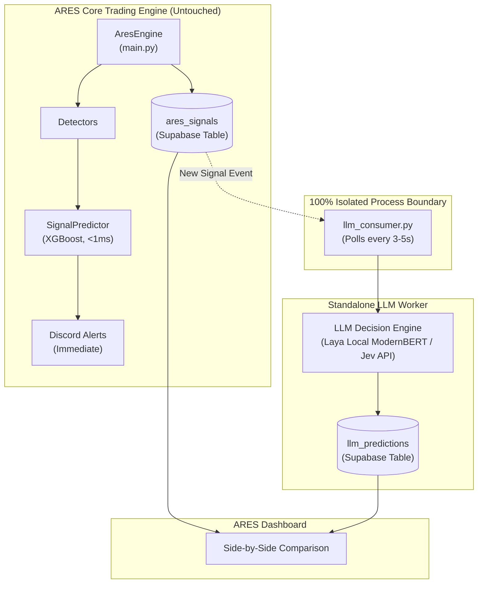

# TASK-210: Standalone LLM / System One Prediction Pipeline (`llm_predictions`)

**Date:** 2026-09-24  
**Status:** PARKED / SCHEDULED NEXT WEEK (Initial Backend: Laya)  
**Priority:** Medium (Research & Evaluation)  
**Related Components:** `ml_signal/llm_consumer.py`, `schema.sql`, Supabase (`llm_predictions`), Dashboard (Phase 2)  
**Obsidian Ref:** `[[LLM & System One ARES Integration]]`

---

## 1. Objective

Integrate a modern **System One / LLM Decision Engine** (Laya open-weights ModernBERT or TypeSafe Jev) as a **100% decoupled, standalone background consumer**. 

### Core Design Rules
1. **Completely Independent of XGBoost:** Zero code modifications to `main.py` or `SignalPredictor`.
2. **Dedicated Table:** Writes predictions to `llm_predictions` (model-agnostic naming).
3. **Event-Driven Isolation:** Runs as an independent process (`llm_consumer.py`), polling `ares_signals` or listening to Supabase events.
4. **Zero Impact on Trading:** Trading, orders, and Discord alerts execute immediately ($<1\text{ ms}$) without waiting for or depending on this consumer.

---

## 2. Architecture: Zero-Touch Isolation


```mermaid
flowchart TD
    subgraph Core_Trading ["ARES Core Trading Engine (Untouched)"]
        ENG["AresEngine\n(main.py)"] --> DET["Detectors"]
        DET --> XGB["SignalPredictor\n(XGBoost, <1ms)"]
        XGB --> DISCORD["Discord Alerts\n(Immediate)"]
        ENG --> DB_SIG[("ares_signals\n(Supabase Table)")]
    end

    subgraph Decoupled_Boundary ["100% Isolated Process Boundary"]
        DB_SIG -. "New Signal Event" .-> CONSUMER
    end

    subgraph LLM_Pipeline ["Standalone LLM Worker"]
        CONSUMER["llm_consumer.py\n(Polls every 3-5s)"]
        CONSUMER --> ENGINE["LLM Decision Engine\n(Laya Local ModernBERT / Jev API)"]
        ENGINE --> DB_LLM[("llm_predictions\n(Supabase Table)")]
    end

    subgraph Future_Dashboard ["ARES Dashboard"]
        DB_SIG --> DASH["Side-by-Side Comparison"]
        DB_LLM --> DASH
    end
```

---

## 3. Scope of Work

### Component 1: `ml_signal/llm_context.py` (Hard Relative Quant Pre-Processor)
Python pre-computes exact mathematical relationships before passing to LLM to prevent fuzzy arithmetic:
- **Geometry & R:R:** Target 1/2 distance, SL distance, exact Reward-to-Risk ratio.
- **Structural Runway:** Distance to opposing barrier minus T1 distance (`path_to_t1_clear`, `runway_margin_beyond_t1_pts`).
- **OI Wall Alignment:** `target_blocked_by_oi_wall` (evaluates whether target is trapped behind an institutional wall).
- **IV Dynamic:** IV change rate, acceleration, categorized behavior (`CRUSHING`, `SPIKING`, `STABLE`).
- **Flow Alignment:** Evaluates whether PCR change and OI bias confirm the trade direction.
- **Volume & Wick Rejection:** Volume ratio to 20-bar avg, wick dominance profile (`HEAVY_OVERHEAD_SUPPLY`, `STRONG_BUYING_TAIL`).

### Component 2: `ml_signal/llm_consumer.py` (Standalone Background Worker)
- Runs independently of `main.py` (via Fly process `[processes.llm_worker]` or separate container).
- Polls `ares_signals` every 3–5 seconds for signals that haven't been evaluated yet.
- Calls `build_llm_quant_context()`, dispatches to configured backend (Laya or Jev), and persists to `llm_predictions`.

### Component 3: `ml_signal/llm_engine.py` (Pluggable Backend Adapter)
- **Backend A (Laya):** Local ModernBERT encoder via `onnxruntime` or PyTorch (runs in ~25–35ms on CPU, $0 API cost, zero network roundtrip).
- **Backend B (Jev):** Hosted API via `typesafe-sdk` or OpenRouter (`typesafe/jev-latest`).
- Standardizes output schema:
  - `t1_hit_prob` (float $[0, 1]$)
  - `t2_hit_prob` (float $[0, 1]$)
  - `sl_hit_prob` (float $[0, 1]$)
  - `regime` (`strong_trend`, `weak_trend`, `range_bound`, `choppy`, `volatile_event`)
  - `setup_quality` (0–10 score)
  - `is_trap_prob` (float $[0, 1]$)

### Component 3: Database Schema Migration (`llm_predictions`)
```sql
CREATE TABLE IF NOT EXISTS llm_predictions (
    id                  uuid PRIMARY KEY DEFAULT gen_random_uuid(),
    created_at          timestamptz DEFAULT now(),
    signal_id           text,
    signal_uuid         uuid,
    display_id          text,
    
    -- Target & Stop Loss Hit Probabilities
    t1_hit_prob         numeric NOT NULL,
    t2_hit_prob         numeric NOT NULL,
    sl_hit_prob         numeric NOT NULL,
    
    -- Regime Classification
    regime              text NOT NULL,            -- 'trending', 'choppy', etc.
    regime_confidence   numeric,
    regime_distribution jsonb,                    -- Probabilities per regime class
    
    -- Diagnostic Scores & Confluences
    setup_quality       numeric,                  -- 0.0 to 10.0
    is_trap_prob        numeric,
    iv_supports_prob    numeric,
    volume_confirms_prob numeric,
    oi_confirms_prob    numeric,
    candle_conviction_prob numeric,
    structure_aligned_prob numeric,
    stop_hunt_risk_prob numeric,
    
    -- Engine Metadata
    engine_name         text NOT NULL,            -- 'laya-modernbert' | 'jev-1.13'
    latency_ms          integer,
    raw_state           jsonb,
    raw_response        jsonb
);

CREATE INDEX IF NOT EXISTS idx_llm_predictions_signal_uuid ON llm_predictions(signal_uuid);
CREATE INDEX IF NOT EXISTS idx_llm_predictions_created_at ON llm_predictions(created_at DESC);
CREATE INDEX IF NOT EXISTS idx_llm_predictions_regime ON llm_predictions(regime);
CREATE INDEX IF NOT EXISTS idx_llm_predictions_engine ON llm_predictions(engine_name);
```

---

## 4. Discord Alert Representation (Option 3 Layout)

When rendered in Discord alerts (`alerts.py`), XGBoost and the LLM engine appear as distinct, complementary prediction fields:

```text
🤖 XGBoost Prediction
30% (proxy model, v9)

🧠 LLM Decision Engine
T1: 68% | T2: 35% | SL: 22% · 🟢 TRENDING · Quality: 7.5/10 (laya)
```

---

## 5. Acceptance Criteria

1. **Absolute Decoupling:** `main.py` has 0 imports from `llm_consumer` or `llm_engine`. If the LLM process crashes, runs out of memory, or fails, the core ARES engine remains 100% operational.
2. **Zero In-Process Contention:** No additional memory allocated to `main.py` VM.
3. **Database Consistency:** `signal_uuid` in `llm_predictions` maps 1:1 to `ares_signals.signal_uuid`.
4. **SL Coverage:** Both Target (T1, T2) and Stop Loss (SL) probabilities are predicted and stored.
5. **Unit Tests:** Full mock test coverage for `llm_consumer.py` and `llm_engine.py`.

---

## 6. Deployment Options on Fly.io

- **Option A (Multi-process in `fly.toml`):**
  ```toml
  [processes]
    app = "python main.py"
    llm = "python -m ml_signal.llm_consumer"
  ```
- **Option B (Separate dedicated Fly machine):**
  A separate lightweight VM (`ares-llm-worker`) that shares only the Supabase database.

---

## 7. 2026-09-30 POC revision for review

**Status:** Draft addendum pending directive approval. The [POC assessment](../reports/research/TASK-210_system-one-poc-assessment.md) documents evidence, risks, event definitions, and an illustrative Jev request. This section supersedes the conflicting paths, alert placement, and deployment choices above for the first POC.

### Goal

Prove an independent System One predictor can evaluate fired ARES signals from a separate process, persist T1/T2/SL and regime estimates, and send a separate follow-up Discord message without importing, editing, or delaying the existing trading and XGBoost code.

### Confirmed requirements

- Keep all new application code under a new `system_one_worker/` unit; do not add files under `ml_signal/` or modify `main.py`, `SignalPredictor`, `storage.py`, `alerts.py`, or the main Fly configuration.
- Use an independent signal-time market-data collector. The user selected the same Dhan account for the pilot, with conservative request pacing and a stop-on-rate-limit policy. This choice cannot prove zero provider-level contention while the core also uses that account.
- Run the POC on its own Fly app/machine, with its own Docker image, dependencies, memory budget, secrets, and failure handling.
- Read `ares_signals` through its persisted UUID identity; write only worker-owned snapshots, status, and `llm_predictions`. The connected database currently uses bridge mode: `ares_signals.signal_uuid` is unique and `ares_signals.id` is bigint. The planned UUID cutover has not been applied there.
- Produce one prediction per signal UUID using one active backend at a time. Record the resolved model/checkpoint name and versioned context/question contracts.
- Send a distinct follow-up Discord message keyed by signal `display_id` after a successful prediction; the original alert remains immediate and unchanged.
- Use Python for exact arithmetic and missing-data handling. Jev supplies typed judgments only; its market probabilities remain shadow estimates until validated against ARES-specific outcomes.

### Proposed POC acceptance criteria

1. A static import/diff check confirms no new cross-unit code dependency and no edits to core ARES files.
2. A worker crash, model outage, or OOM leaves the core signal, order, and original Discord paths operational.
3. For signals with a valid signal-time snapshot and valid geometry, the separate table contains T1, T2, SL, regime, model identity, input coverage, and latency. Invalid/missing cases have a durable failure record rather than fabricated percentages.
4. The follow-up message is sent only after persistence, identifies the original signal, and is idempotent across worker restarts.
5. New-unit tests cover context math, signal-time snapshot selection, backend response mapping, probability invariants, database idempotency, errors, and alert retries using mocks. The ticket's 100% unit coverage target applies to this new unit.
6. A real Jev call and cost/latency measurement require a server-side `TYPESAFE_API_KEY`. No live API result is claimed by this draft.
7. A live collector using shared Dhan credentials may enter a pilot only after the provider-access and rate-limit plan is reviewed; strict zero provider contention requires separate credentials or another source.

### Inputs and unresolved product decisions

- Confirm the proposed virtual spot-entry label horizon: from the signal's database `created_at` observation cutoff until that trading session's close, with same-bar competing barrier touches excluded from calibration. The stored signal `timestamp` is the detector candle timestamp and may differ from dispatch time.
- Confirm the Discord destination for the independent follow-up message (existing channel or research channel).
- Confirm Dhan Data Plan access and the exact futures/options instruments used for volume and OI/IV snapshots.

**Workflow gate:** Per the user's Global Development Pipeline, this revised directive needs explicit review and approval before an ADR or implementation begins.
