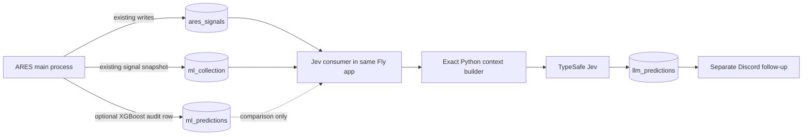

# TASK-210: Parallel Jev forward prediction POC

**Date:** 2026-10-02
**Status:** Implemented POC; review fixes verified locally
**Priority:** Medium (Research & Evaluation)
**Obsidian ref:** `[[TypeSafe JEV & ARES ML Integration]]`

## Goal

Run a Jev forward predictor alongside the ARES trading process in the **existing Fly app**. When any of ARES's four trade setups fires from live market data, use that signal's market snapshot to estimate T1, T2, and SL outcomes and market regime, save the result to `llm_predictions`, and send a separate follow-up Discord alert. Jev's output is observational: it must not gate orders or change the XGBoost forecast.

**Inference only:** Jev is a hosted model called for each new live signal. There is no Jev training, offline fitting, retraining schedule, or local model artifact. Retain its live predictions in Supabase alongside the existing ML prediction records for evaluation and future offline training of an ARES model or ensemble. Collecting these records does not start a training run or change the existing predictor.

## Boundaries

- Keep Jev application code in its own `system_one/` package. It must not import `ml_signal`, `main.py`, `SignalPredictor`, `storage.py`, or `alerts.py`; those modules must not import Jev code.
- Reuse persisted data, not a second Dhan collector. The signal-bound `ml_collection` row contains candle, volume, IV, OI, structure, Greeks, raw candle/ATM OI, and signal UUID from the same live fetch cycle used by the existing predictor. `ares_signals` supplies direction, setup, entry, targets, stop, and detector reasons. An available `ml_predictions.feature_snapshot` may be paired for exact XGBoost-input comparison, but Jev must not depend on an XGBoost result being present.
- Run the lightweight Jev consumer in a second **process group of the current Fly app**, on its own Machine and memory allocation. The shared `fly.toml` must define both `app` and `jev` commands. Do not put the Jev process on the 768 MB trading Machine.
- Keep the first Discord alert unchanged. Send Jev's result in a separate, identifiable follow-up message after successful persistence.
- Give the Jev process no Dhan calls. It reads existing Supabase rows and calls TypeSafe. The shared database contract is intentional; there is no shared application-code reference.

## Live trigger contract

The four supported setup types are `FAILED_BREAKOUT`, `OI_WALL_REJECTION`, `EXHAUSTION_REVERSAL`, and `TREND_CONTINUATION`. Each enters the same signal path with the current one-minute candle, option chain/ATM context, structural levels, IV, and detector reasons. Jev receives one signal-time snapshot for the fired setup, plus its entry, targets, and stop. It must not predict on every market-data cycle or wait for a training run.

The existing `MLCollector` persists that live snapshot after the signal fires. The separate Jev process reads it promptly by `signal_uuid`; this database handoff preserves the no-import boundary. It introduces a measurable write/poll delay, so the POC must report signal-to-Jev latency rather than assume that Jev's short model response time is the entire wait.

## Data flow

```mermaid
flowchart LR
  A[ARES main process] -->|existing writes| S[(ares_signals)]
  A -->|existing signal snapshot| M[(ml_collection)]
  A -->|optional XGBoost audit row| X[(ml_predictions)]
  S --> J[Jev consumer in same Fly app]
  M --> J
  X -.->|comparison only| J
  J --> C[Exact Python context builder]
  C --> T[TypeSafe Jev]
  T --> P[(llm_predictions)]
  P --> D[Separate Discord follow-up]
```

The consumer polls for eligible signal-bound `ml_collection` rows at a short, measured interval, initially one second, and joins each row to `ares_signals` by canonical UUID. Eligibility requires the persisted rollout cutoff and freshness rules below, not merely absence from `llm_predictions`. The existing main loop persists the snapshot after the signal and original alert path, so the Jev result is necessarily a follow-up. Record signal-to-snapshot, queue, TypeSafe, and end-to-end latency. Jev's API speed alone is not the full delay.

## Live eligibility and restart contract

- Convert Discord `retry_after` to a deadline inside `mark_jev_alert_retryable`, using database wall time after locking the matching SENDING attempt. Reject invalid delays and stale tokens; never persist a worker-clock retry deadline. Poll/process fresh signals before alert recovery and handle at most one saved delivery per loop, then return to signal polling.

- Alert recovery uses `poll_jev_alert_jobs`, filtering database-time backoff, session, event freshness and eligible delivery status before its limit. Sort eligible work by expiry then job ID. Recovery selection does not authorize delivery: each attempt still needs a fresh acknowledged atomic send marker.

- Poll through `poll_jev_signals`: use database wall time and the persisted age/cutoff policy to filter expired, future and blocked-job rows before limiting to ten distinct signals. Recover only matching uninvoked claims whose lease expired. Canonical UUID columns are resolved from the catalog for polling, signal reads and claims, supporting bridge/greenfield schemas and a later cutover without shared ML imports.

- The `jev` Machine remains running between sessions, checking the clock every 30 seconds outside 09:15–15:30 IST without database polling or external prediction/delivery requests after bootstrap. It resumes at the next session using the persisted rollout state. Scope Fly's `always` restart policy to `jev` and `never` to `app`; the existing Machine-ID-specific start/stop cron targets only `app`. Jev incurs overnight/non-trading-day running charges. Verify its running state at rollout and explicitly start it if an operator previously stopped it.
- Before the first live start, explicitly bootstrap one `llm_consumer_state` row for this consumer, with `live_from` set to database time and `max_signal_age_seconds = 60` for the POC. Insert it atomically without replacing an existing row. Workers must load this persisted state before polling and fail closed if it is missing; a restart, redeploy, or model change must never reset `live_from`.
- Pin `event_at` to the matching signal-bound `ml_collection.timestamp`: `main.py` captures this market-cycle time before fetching, detection, and awaited options sizing, and the collector persists that same value. It is a conservative lower bound on detection time, not the database insert time or the candle timestamp in `ares_signals.timestamp`. Preserve its normalized UTC value and source snapshot UUID in the job. No change to `main.py` is needed for this existing timestamp contract.
- Select only signals with a matching snapshot and `live_from <= event_at <= database_now < expires_at`, where `expires_at = event_at + 60 seconds`, during the current trading session. At exactly `expires_at` the signal is expired. Missing, invalid, future-dated, or unverified event timestamps fail closed; never fall back to `created_at`, snapshot insert time, or worker receipt time. Pin event time and expiry across retries/restarts. A cycle started before rollout remains excluded even if detection/insertion happens later. Slow pre-insert work consumes the age window and cannot renew it. Measure coverage because this conservative cycle-start clock also includes fetch time; an exact detection clock would require a separately reviewed capture change.
- On restart, recover unfinished eligible jobs within this age window. Mark expired jobs that were never invoked `EXPIRED`; retain the invocation status for jobs already dispatched. Recheck freshness before Jev dispatch and immediately before **every Discord delivery attempt**, including the first send, same-process retries after backoff, and restart retries. Never reuse a cached freshness decision. If the database check fails, do not send; a later attempt must pass a new check. Persist a late valid response for audit, but suppress its stale follow-up. Historical evaluation runs are separate explicit runs with live Discord delivery disabled.
- Once a pending alert reaches expiry or session close, persist terminal `alert_status = SUPPRESSED_EXPIRED` and stop its delivery attempts across restarts. Keep the successful prediction and inference status for audit. Route all delivery retries through this gate; disable hidden SDK/transport retries that bypass it. Record attempt-start time and bound each request by the remaining freshness window. The gate governs when a request may start; a request already accepted by Discord cannot be recalled if its acknowledgment arrives after expiry.

## Durable Discord delivery contract

- Result completion creates one delivery record in the existing job with `alert_status = PENDING`. Before every webhook request, atomically transition an eligible `PENDING` or `RETRYABLE` alert to `SENDING`, pin the payload/destination and record a unique attempt token, owner, and start time. Recheck event-time expiry/session in this transition and immediately before transport. Send only after an acknowledged transition; an uncertain database acknowledgment permits no send. Competing workers cannot take over a `SENDING` attempt, even if its owner dies or lease expires.
- Execute the webhook with `wait=true` and hidden retries disabled. A confirmed created message transitions that token to `SENT` and records its Discord message ID. If recording success fails, retry persistence of the same acknowledgment, never the webhook. A matching late acknowledgment may reconcile that original attempt without sending another message. `wait=true` returns confirmation; it is not an idempotency key. [Discord webhook API](https://docs.discord.com/developers/resources/webhook#execute-webhook).
- Timeout, connection loss, ambiguous server error, lost response, or crash after the marker becomes terminal `DELIVERY_UNKNOWN` once the attempt's bounded deadline elapses. This includes a marker committed before a crash that happened before transport: recovery cannot prove whether sending occurred. Never automatically retry `SENDING` or `DELIVERY_UNKNOWN`. This deliberately allows a missing follow-up to avoid duplicates; the prediction remains archived.
- Retry only after a documented response proves no message was created, such as an explicit Discord rate-limit rejection. The matching attempt may then transition to `RETRYABLE` with its rejection/backoff recorded. Permanent rejections become `DELIVERY_FAILED`. Every permitted retry uses a new acknowledged marker and a new freshness check; generic transient/network errors are not sufficient evidence to retry. Expired pending/retryable alerts become `SUPPRESSED_EXPIRED`; an uncertain attempted send stays `DELIVERY_UNKNOWN`, with expiry recorded separately so it is never misreported as known unsent.
- There is no exactly-once delivery guarantee and no assumed webhook idempotency mechanism. Concurrent delivery claims require real local database tests. Changes to this retry policy need a documented provider guarantee and review.

## Durable claim before inference

- Add `llm_prediction_jobs` with one unique row per signal UUID. Before any Jev request, atomically claim the signal in the database, pin its snapshot and context/model versions, and store an owner token and lease expiry. Concurrent workers must not use a read-then-write claim.
- Immediately before dispatch, atomically change the owned, unexpired `CLAIMED` job to `INVOKING`, recording `invocation_started_at`. Dispatch only after an acknowledged successful transition. Pin a dispatch deadline to the earliest event expiry, lease expiry, or session close. Subtract the full acknowledgment round trip from that database-derived window and recheck monotonic time after SDK setup, immediately before the request. The signal must still satisfy the live cutoff and freshness predicates. An expired lease prevents dispatch; a superseded owner token prevents both dispatch and result publication. After dispatch, a late response is checked against the immutable invocation token, not against the pre-dispatch lease.
- Permit **at most one automatic Jev dispatch per signal**, with a bounded deadline and SDK/transport retries disabled. RetryPolicy must use `max_retries=0`; a unique prediction row alone cannot deduplicate external calls. An explicit API rejection is `FAILED`; an ambiguous timeout, lost response, or crash after the invocation marker is `UNKNOWN`. Neither is automatically re-invoked. This may leave a signal without a prediction; it does not promise exactly-once successful inference.
- Recover an expired `CLAIMED` job only when `invocation_started_at` is null, using an atomic ownership change and a new token while the signal remains fresh. A stale `INVOKING` job becomes `UNKNOWN`, never a fresh claim. A late result can complete the original invocation only with its matching token; persistence retries reuse that response and never call Jev again. Keep the invocation marker across redeploys and model changes.
- Do not assume TypeSafe provides request idempotency. A future retry policy requires a documented provider guarantee and explicit review; passing a UUID header by itself is insufficient.

## POC scope

1. `system_one/context.py`: Validate direction and barrier geometry. Use Python for exact T1/T2/SL distances, reward-to-risk, structural runway, OI wall position, IV behavior, PCR/OI alignment, volume ratio, and candle wick profile. Derive only what the persisted rows support; represent absent evidence as missing, never as zero.
2. `system_one/consumer.py`: Load the persisted rollout state, select fresh live snapshots, and obtain a durable database claim before invoking Jev. Apply the ownership, timeout, and stale-claim rules above. Retry database operations safely; reuse an obtained response when retrying persistence, and never automatically replay an uncertain Jev request.
3. `system_one/jev.py`: Batch narrow TypeSafe questions over one compact state. Map typed responses into `t1_hit_prob`, `t2_hit_prob`, `sl_hit_prob`, `regime`, `setup_quality`, `is_trap_prob`, resolved `engine_name`, and raw response. Version both context and question contracts.
4. `system_one/discord.py`: Send a separate follow-up alert with the original signal display ID and model version. Apply the durable `PENDING`/`RETRYABLE` to `SENDING` marker and acknowledgment/unknown recovery rules above. Retry only proven non-deliveries, through a fresh event-time cutoff, expiry, and session check. Never rerun Jev or replay a confirmed or uncertain delivery.
5. Supabase migration: Add `llm_predictions`, linked one-to-one to the current bridge-mode `ares_signals.signal_uuid`, with 0–1 probability checks, model/version metadata, input provenance, latency, and raw state/response. Add `llm_consumer_state` and `llm_prediction_jobs` for the rollout cutoff and durable claim/status contract. Restrict all three tables and the claim operation to server-side access. Account for the planned UUID primary-key cutover.
6. Fly configuration: Add a `jev` process group to the **existing** app, retaining the `app` process group and its 768 MB Machine. Size and lifecycle of the Jev Machine are measured before deployment. No second Fly app or market-data collector is part of this POC.

## Latency measurement contract

Measure `ml_collection` query time in the poller and linked signal lookup separately. Record null snapshot-read time if the caller did not observe the query. Keep TypeSafe, context preparation, persistence acknowledgment, and delivery-processing durations as separate stages. The database records event-to-prediction age at archive time; this is distinct from commit acknowledgment.

Finalize `latency_total_ms` only after acknowledged prediction persistence and confirmed Discord delivery/status. Derive it from the pinned event and database wall clock, including write/queue/restart age; preserve the first confirmed sample. Leave successful-alert latency null for suppressed, failed, or uncertain delivery and report those counts when interpreting percentiles. Metrics failures must never trigger another Jev call or webhook. Apply the same finalization after restart delivery. The metric includes finalization request overhead.

CI must enforce 100% line and branch coverage for the complete `system_one` Python package. SQL gates are verified separately with the local migration harness; runtime coverage does not establish provider calibration or deployment isolation.

## Deployment and error contract

- Provision `SUPABASE_URL`, `SUPABASE_SERVICE_ROLE_KEY`, `TYPESAFE_API_KEY`, and `DISCORD_WEBHOOK_URL` before enabling the configured Jev process group. The dedicated service-role key is required for its protected tables and RPCs; the worker does not assume the trading process's `SUPABASE_KEY` has that role. See README and `.env.example`.
- Context version `v1.2` derives runway from the saved collector distance fields and snapshot spot, relative to the frozen signal entry. Select the nearest saved forward level and compare it with T1; do not infer `levels_above`/`levels_below` counts or unrestricted clearance from absent data. Question version remains `v1.1`.
- Persist definite auth/validation/rate-limit HTTP rejections and local SDK configuration errors as `FAILED`. Keep connection/timeouts, HTTP 408/5xx, and unusable or unexpected outcomes `UNKNOWN`. Both are terminal for automatic inference, with no follow-up and no invented prediction.

## Output semantics

- Define `t1_hit_prob` as T1 touched before the original SL by session close; `sl_hit_prob` as the original SL touched before T1 by close; remaining mass means neither. After T1, ARES moves the stop to the trade's entry price. Compute T2 as T1-first probability multiplied by Jev's conditional probability of T2 after T1 and before that **post-T1 breakeven stop** or session close. This keeps `T2 ≤ T1` and `T1 + SL ≤ 1`; `sl_hit_prob` does not include a later breakeven exit.
- Freeze the spot entry price in the context (`signal.entry_price`) from `ares_signals.spot_at_signal`, matching the spot passed to `PositionManager.add_trade`. Preserve `trigger_price` separately. Use the same entry price for the post-T1 breakeven barrier in both the Jev question and evaluation labels. A return to entry after T1 ends the T2 attempt; a subsequent T2 touch is not success. Exclude bars with unknown ordering of T1/original-SL, T1/return-to-entry, or post-T1 T2/breakeven touches.
- Regime is a typed choice (trending, range-bound/choppy, volatile event, or insufficient evidence), with distribution and confidence. Setup quality combines three ordinal scores scaled to 0–10: 40% price action, 40% structural clarity, and 20% volume/IV/OI confluence. The current question batch has three Choices, three Scores, and one Noul (seven questions).
- Treat all Jev numbers as shadow estimates until evaluated against ARES-specific barrier labels. Do not present them as empirically calibrated market probabilities merely because the API returns probabilities.

## Acceptance criteria

1. One Fly app runs `app` and `jev` on separate Machines. A Jev failure/OOM does not stop the trading Machine. No Jev import or direct call is added to `main.py`, `SignalPredictor`, `ml_signal`, `storage.py`, or `alerts.py`.
2. Each of the four live setup types is eligible for at most one automatic Jev dispatch from its existing signal-bound ML snapshot and signal record. Jev makes zero Dhan requests, does not wait for XGBoost or training, and records snapshot provenance and all measured latency stages. The XGBoost result may be joined for evaluation but is not a prerequisite.
3. Successful inference on valid inputs produces non-null T1, T2, SL, and regime in `llm_predictions`; invalid, missing, expired, failed, or uncertain cases produce an auditable job status instead of invented percentages. One chosen Jev result is stored per signal UUID.
4. Every Discord delivery attempt for a successful persisted result passes a fresh database-time eligibility check. Pre-rollout signals and attempts at or after expiry/session close are suppressed, including retries in the same process or after restart. The original alert and trade path remain unaffected.
5. New-unit tests use mocked TypeSafe/Supabase/Discord boundaries and cover geometry, source selection, probability invariants, missing data, first-start historical exclusion, restart freshness, concurrent claim ownership, crashes before/after dispatch, ambiguous timeouts, persistence retries, and stale-alert suppression. Include a proven Discord rejection at event age 59 seconds followed by a proposed retry at age 60 seconds, with and without restart: no second request is sent. Test a market cycle delayed over 60 seconds before signal insertion: zero Jev calls/alerts despite a fresh `created_at`; also cover pre-rollout cycles inserted afterward, invalid/future timestamps, and UTC normalization. Test Discord accepted-but-response-lost, crash before/after send, uncertain marker acknowledgment, stale owner, and simultaneous senders: no automatic second webhook, with inference results retained. Also cover database-gate failures and session close during backoff. Test atomic inference and delivery claims against a real local database as well; mocks alone cannot prove concurrent ownership. Target 100% coverage for the new unit.
6. Measure a real Jev call and end-to-end signal-to-alert latency with a server-side `TYPESAFE_API_KEY` before claiming this POC meets its speed goal. No live call or deployment is claimed by this PR review.
7. Retain successful Jev results independently of Discord delivery, with the source snapshot, question/model versions, and response/availability timestamps required for future training exports. Verify the offline join keeps signals with missing XGBoost or Jev results and never treats a prediction as an outcome label or as available before it was persisted.

## Supabase retention for future training

- Keep existing XGBoost records in `ml_predictions` and Jev records in `llm_predictions` within the same Supabase project. Link them through `ares_signals.signal_uuid`; in the current bridge schema, `ml_predictions.signal_id` contains this UUID as text. Do not overwrite XGBoost rows or add live application-code dependencies between the two predictors.
- Save all successful Jev responses, including those whose Discord alert is suppressed or fails. Retain input snapshot identity, exact prepared state, full response (including the conditional T2 probability), engine/context/question versions, source observation times, signal timestamp, invocation start, response receipt, and database persistence time. `available_at` records database transaction time; a future training export must establish conservative commit/read visibility before using it as feature availability. Do not backdate it to signal time.
- Define a future read-only offline export joining the signal, its market snapshot, the chosen Jev result, applicable XGBoost prediction records, and separately derived realized barrier outcomes. Deduplicate model records by an explicit version/source policy and retain their identifiers. Use left joins and missingness flags so unavailable predictions do not silently remove signals or become zero probabilities.
- Predictions are candidate input features, never ground-truth labels. Derive T1/original-SL/T2-before-breakeven labels from the ordered future price path using the output semantics above, record label resolution time/version, and exclude ambiguous or unresolved outcomes from supervised examples. Keep production trade outcomes available as a separate comparison.
- Future training may consume Jev probabilities, regime distribution, quality/trap scores, and market features to train an ARES model or ensemble. Use chronological splits with outcome-window purging and ensure base-model predictions are prospective or out of fold. Evaluate only features available at the intended decision time: a delayed Jev response cannot train a model claimed to act at signal creation, and a response received after a target/stop resolves is retained for audit but excluded as an input to that decision.
- This POC collects reusable records; training/export implementation and any adoption by the existing ML module require their own reviewed design. Jev itself continues to run inference without a training dependency.

## Review gate

The user has authorized implementation and review fixes in the existing PR. This directive and the [POC assessment](../reports/research/TASK-210_system-one-poc-assessment.md) now describe that implemented POC. Review evidence and outstanding operational checks are in the assessment; deployment and empirical calibration are not established by unit tests.
