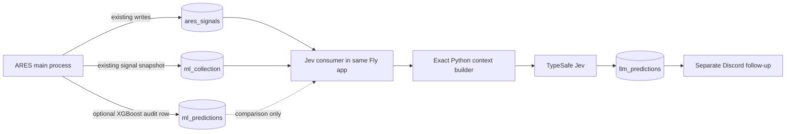

# TASK-210: Parallel Jev forward prediction POC

**Date:** 2026-09-30
**Status:** Ready for design review
**Priority:** Medium (Research & Evaluation)
**Obsidian ref:** `[[TypeSafe JEV & ARES ML Integration]]`

## Goal

Run a Jev forward predictor alongside the ARES trading process in the **existing Fly app**. When any of ARES's four trade setups fires from live market data, use that signal's market snapshot to estimate T1, T2, and SL outcomes and market regime, save the result to `llm_predictions`, and send a separate follow-up Discord alert. Jev's output is observational: it must not gate orders or change the XGBoost forecast.

**Inference only:** Jev is a hosted model called for each new live signal. There is no Jev training, offline fitting, retraining schedule, training dataset, or local model artifact. Historical outcomes may later be used to *evaluate* its probabilities, not to train Jev in this POC.

## Boundaries

- Keep Jev application code in its own `system_one/` package. It must not import `ml_signal`, `main.py`, `SignalPredictor`, `storage.py`, or `alerts.py`; those modules must not import Jev code.
- Reuse persisted data, not a second Dhan collector. The signal-bound `ml_collection` row contains candle, volume, IV, OI, structure, Greeks, raw candle/ATM OI, and signal UUID from the same live fetch cycle used by the existing predictor. `ares_signals` supplies direction, setup, entry, targets, stop, and detector reasons. An available `ml_predictions.feature_snapshot` may be paired for exact XGBoost-input comparison, but Jev must not depend on an XGBoost result being present.
- Run the lightweight Jev consumer in a second **process group of the current Fly app**, on its own Machine and memory allocation. The shared `fly.toml` must define both `app` and `jev` commands. Do not put the Jev process on the 768 MB trading Machine.
- Keep the first Discord alert unchanged. Send Jev's result in a separate, identifiable follow-up message after successful persistence.
- Give the Jev process no Dhan calls. It reads existing Supabase rows and calls TypeSafe. The shared database contract is intentional; there is no shared application-code reference.

## Live trigger contract

The four supported setup types are `FAILED_BREAKOUT`, `OI_WALL_REJECTION`, `EXHAUSTION_REVERSAL`, and `TREND_CONTINUATION`. Each enters the same signal path with the current one-minute candle, option chain/ATM context, structural levels, IV, and detector reasons. Jev receives one signal-time snapshot for the fired setup, plus its entry, targets, and stop. It must not predict on every market-data cycle or wait for a training run.

The existing `MLCollector` persists that live snapshot after the signal fires. The separate Jev process reads it promptly by `signal_uuid`; this database handoff preserves the no-import boundary. It introduces a measurable write/poll delay, so the POC must report signal-to-Jev latency rather than assume that Jev's short model response time is the entire wait.

## Data flow

```mermaid
flowchart LR
  A[ARES main process] -->|existing writes| S[(ares_signals)]
  A -->|existing signal snapshot| M[(ml_collection)]
  A -->|optional XGBoost audit row| X[(ml_predictions)]
  S --> J[Jev consumer in same Fly app]
  M --> J
  X -.->|comparison only| J
  J --> C[Exact Python context builder]
  C --> T[TypeSafe Jev]
  T --> P[(llm_predictions)]
  P --> D[Separate Discord follow-up]
```

The consumer polls for signal-bound `ml_collection` rows at a short, measured interval, initially one second, and joins each row to `ares_signals` by canonical UUID. The existing main loop persists the snapshot after the signal and original alert path, so the Jev result is necessarily a follow-up. Record signal-to-snapshot, queue, TypeSafe, and end-to-end latency. Jev's API speed alone is not the full delay.

## POC scope

1. `system_one/context.py`: Validate direction and barrier geometry. Use Python for exact T1/T2/SL distances, reward-to-risk, structural runway, OI wall position, IV behavior, PCR/OI alignment, volume ratio, and candle wick profile. Derive only what the persisted rows support; represent absent evidence as missing, never as zero.
2. `system_one/consumer.py`: Read new signal-bound ML snapshots and their signal rows, invoke Jev with bounded timeout and retries, and persist results idempotently by signal UUID. Keep failure state separate from successful predictions.
3. `system_one/jev.py`: Batch narrow TypeSafe questions over one compact state. Map typed responses into `t1_hit_prob`, `t2_hit_prob`, `sl_hit_prob`, `regime`, `setup_quality`, `is_trap_prob`, resolved `engine_name`, and raw response. Version both context and question contracts.
4. `system_one/discord.py`: Send a separate follow-up alert with the original signal display ID and model version. Retry delivery without rerunning Jev or duplicating an already confirmed alert.
5. Supabase migration: Add `llm_predictions`, linked one-to-one to the current bridge-mode `ares_signals.signal_uuid`, with 0–1 probability checks, model/version metadata, input provenance, latency, raw state/response, and service-role-only access. Account for the planned UUID primary-key cutover.
6. Fly configuration: Add a `jev` process group to the **existing** app, retaining the `app` process group and its 768 MB Machine. Size and lifecycle of the Jev Machine are measured before deployment. No second Fly app or market-data collector is part of this POC.

## Output semantics

- Define `t1_hit_prob` as T1 touched before the original SL by session close; `sl_hit_prob` as the original SL touched before T1 by close; remaining mass means neither. After T1, ARES moves the stop to the trade's entry price. Compute T2 as T1-first probability multiplied by Jev's conditional probability of T2 after T1 and before that **post-T1 breakeven stop** or session close. This keeps `T2 ≤ T1` and `T1 + SL ≤ 1`; `sl_hit_prob` does not include a later breakeven exit.
- Freeze the spot entry price in the context (`signal.entry_price`) from `ares_signals.spot_at_signal`, matching the spot passed to `PositionManager.add_trade`. Preserve `trigger_price` separately. Use the same entry price for the post-T1 breakeven barrier in both the Jev question and evaluation labels. A return to entry after T1 ends the T2 attempt; a subsequent T2 touch is not success. Exclude bars with unknown ordering of T1/original-SL, T1/return-to-entry, or post-T1 T2/breakeven touches.
- Regime is a typed choice (trending, range-bound/choppy, volatile event, or insufficient evidence), with distribution and confidence. Setup quality is a documented ordinal score scaled to 0–10.
- Treat all Jev numbers as shadow estimates until evaluated against ARES-specific barrier labels. Do not present them as empirically calibrated market probabilities merely because the API returns probabilities.

## Acceptance criteria

1. One Fly app runs `app` and `jev` on separate Machines. A Jev failure/OOM does not stop the trading Machine. No Jev import or direct call is added to `main.py`, `SignalPredictor`, `ml_signal`, `storage.py`, or `alerts.py`.
2. Each of the four live setup types can trigger one Jev inference from its existing signal-bound ML snapshot and signal record. Jev makes zero Dhan requests, does not wait for XGBoost or training, and records snapshot provenance and all measured latency stages. The XGBoost result may be joined for evaluation but is not a prerequisite.
3. Valid snapshots produce non-null T1, T2, SL, and regime in `llm_predictions`; invalid or missing inputs produce an auditable failure state instead of invented percentages. One chosen Jev result is stored per signal UUID.
4. A successful persisted result leads to one separate, signal-identifiable Discord follow-up. The original alert and trade path remain unaffected.
5. New-unit tests use mocked TypeSafe/Supabase/Discord boundaries and cover geometry, source selection, probability invariants, missing data, idempotency, failure/retry paths, and alert behavior. Target 100% coverage for the new unit.
6. Measure a real Jev call and end-to-end signal-to-alert latency with a server-side `TYPESAFE_API_KEY` before claiming this POC meets its speed goal. No live call or deployment is claimed by this design document.

## Review gate

This directive and the [POC assessment](../reports/research/TASK-210_system-one-poc-assessment.md) are the reviewable design proposal. The Global Development Pipeline requires directive approval and then ADR approval before implementation. The ready-for-review PR does not claim a working integration.
