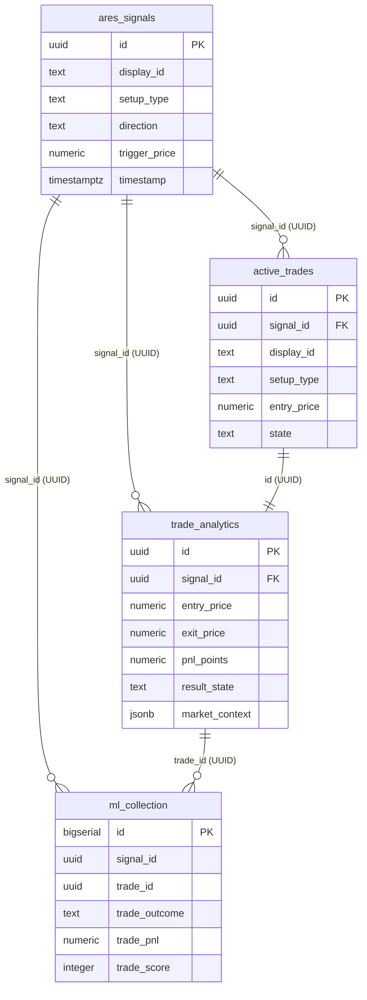

# ADR-150: Canonical Signal-to-Trade UUID Joins and Safe Historical Backfill Plan

- **Status**: Proposed (Supersedes MANM-151)
- **Date**: 2026-09-12
- **Task ID**: MANM-150
- **Author**: Software Architect Agent (`d2d4e328-096d-4658-8d90-44aa7b51ed05`)

---

## 1. Executive Summary & Root Cause Analysis

### Problem Statement
In production, `trade_analytics.signal_id` is populated for 232 rows, but none join to `ares_signals.id`. Furthermore, `active_trades.signal_id` is populated for all 233 rows with four-digit display strings (e.g. `"4829"`). Relational queries joining `ares_signals`, `active_trades`, `trade_analytics`, and `ml_collection` fail completely because the systems store mismatched identifier types without a single canonical primary/foreign key contract.

### Flaw in Previous Approach (MANM-151)
ADR-151 proposed standardizing the schema on the 4-digit display code (`signal_id text`). This approach is fundamentally flawed and must be superseded:
1. **Collision Risk (Birthday Paradox)**: The domain of a 4-digit string is only 10,000 values ($[0000, 9999]$). Across 233 trades, collision probability exceeds 93.4%. By 1,000 trades, collisions are virtually guaranteed. Using non-unique display strings as relational join keys corrupts `ml_collection` outcomes by overwriting multiple trades that share the same display ID.
2. **Missing Primary Key on `ares_signals`**: `ares_signals.id` was defined as `bigserial primary key` (integers $1, 2, \dots$). Standardizing downstream tables on 4-digit display strings left them completely disconnected from `ares_signals.id` (0 of 232 rows joined).
3. **No Foreign Key Integrity**: 4-digit display strings provide zero referential integrity and cannot support database constraints.

### Root Cause of Join Disconnect
1. **Server-Side BigSerial Latency & Race Conditions**:
   - `ares_signals.id` was generated server-side by PostgreSQL `BIGSERIAL` upon insert.
   - `storage.log_signal()` executed the insert asynchronously inside an executor thread (`run_in_executor`).
   - When signals were generated in `main.py`, `signal.db_id` remained `None` until Supabase responded.
   - Fast-executing downstream consumers (`position_manager.add_trade`, `trade_analytics.log_entry`, `ml_collector.snapshot`) raced the database insert. When `signal.db_id` was `None`, code either recorded `NULL` or fell back to `signal.signal_id` (the 4-digit display code `f"{random.randint(0, 9999):04d}"`).
2. **Type Discrepancies Across Tables**:
   - `ares_signals.id`: `bigserial` (PostgreSQL bigint)
   - `active_trades.signal_id`: `text` (holding 4-digit random display codes)
   - `trade_analytics.signal_id`: `bigint` (holding 4-digit display codes cast to integer, or NULL)
   - `ml_collection.signal_id`: `text` (holding either 4-digit display codes or integer string representations)

---

## 2. Decision & Architectural Specification

### 2.1 Canonical Client-Generated UUID Primary Key
We establish a client-generated UUID as the single canonical join key across all signal and trade tables:
- **Generation In-Memory at Creation**: `AresSignal` generates a unique UUID `signal.id = str(uuid.uuid4())` synchronously upon instantiation.
- **Zero Race Conditions**: Because `signal.id` is available immediately in memory before any I/O begins, all downstream components (`position_manager.add_trade`, `storage.log_signal`, `AnalyticsLogger.log_entry`, `MLCollector.snapshot`) receive the identical canonical key synchronously. Network latency or async executor delays can never result in `NULL` or mismatched foreign keys.
- **Globally Unique**: UUIDv4 provides $2^{122}$ bits of entropy, guaranteeing 0% collision probability across distributed processes, restarts, backtests, and parallel runners.

### 2.2 Preservation of 4-Digit Display ID for UX/Alerts
To preserve concise human-readable tags in Discord alerts, console banners, and UI telemetry:
- `AresSignal` maintains a separate `display_id: str = field(default_factory=lambda: f"{random.randint(0, 9999):04d}")`.
- Stored in a dedicated `display_id text` column across tables where human inspection is required.
- **Strict Separation of Concerns**: Display IDs are never used for joins, foreign keys, or ML label attribution.

### 2.3 Target Schema Contract

| Table | Primary Key | Signal Join Key Column | Display Column | Notes |
|---|---|---|---|---|
| `ares_signals` | `id uuid PRIMARY KEY DEFAULT gen_random_uuid()` | `id` (PK) | `display_id text` | Canonical source of truth for signals |
| `active_trades` | `id uuid PRIMARY KEY` | `signal_id uuid REFERENCES ares_signals(id)` | `display_id text` | Active in-memory and persisted positions |
| `trade_analytics` | `id uuid PRIMARY KEY` | `signal_id uuid REFERENCES ares_signals(id)` | In `market_context` | Analytical trade performance records |
| `ml_collection` | `id bigserial PRIMARY KEY` | `signal_id uuid` | `signal_display_id text` | Feature snapshots and post-hoc trade outcomes |



---

## 3. Alternatives Considered & Rationale

| Option | Pros | Cons | Verdict |
|---|---|---|---|
| **A. 4-Digit Display ID as Join Key (MANM-151)** | Easy to type, already in some columns | 93.4% collision rate, corrupts ML labels, no referential integrity, no PK match | **REJECTED** (Superseded) |
| **B. Server-Side BigSerial with Synchronous I/O** | Retains numeric integer IDs | Adds 100–300ms blocking HTTP roundtrip to tick loop; trade entry fails if DB lags | **REJECTED** (Performance risk) |
| **C. Client-Side UUID Primary Key (Chosen)** | Microsecond generation, zero race conditions, 0% collision, clean separation of concerns | 36-char string vs 4 digits (solved by dedicated `display_id` column) | **ADOPTED** |

---

## 4. Transition & Safe Historical Backfill Plan

Per PM directive and issue acceptance criteria:
> "Historical data is left untouched until backfill is fully planned and unambiguous."
> "Formulate a safe read-only validation query and a separately documented historical backfill plan."

### 4.1 Read-Only Validation Query
Before applying any data mutations, execute the following read-only SQL validation query in the Supabase SQL Editor to audit the current state of joins and identify orphan categories:

```sql
-- Read-Only Audit: Inspect join fidelity and identify legacy ID formats
SELECT 
    ta.id AS trade_id,
    ta.signal_id AS trade_analytics_signal_id,
    at.signal_id AS active_trades_signal_id,
    sig.id AS ares_signals_id,
    sig.setup_type AS signal_setup_type,
    ta.setup_type AS trade_setup_type,
    ta.entry_timestamp,
    sig.timestamp AS signal_timestamp,
    CASE 
        WHEN ta.signal_id IS NULL THEN 'ORPHAN_NULL_KEY'
        WHEN ta.signal_id::text ~ '^[0-9]{1,4}$' THEN 'LEGACY_4DIGIT_OR_INT'
        WHEN ta.signal_id::text ~ '^[0-9a-fA-F-]{36}$' THEN 'CANONICAL_UUID'
        ELSE 'OTHER_FORMAT'
    END AS signal_id_classification,
    CASE 
        WHEN sig.id IS NOT NULL THEN 'JOIN_VALID'
        ELSE 'JOIN_BROKEN'
    END AS join_status
FROM trade_analytics ta
LEFT JOIN active_trades at ON ta.id = at.id
LEFT JOIN ares_signals sig ON ta.signal_id::text = sig.id::text
ORDER BY ta.entry_timestamp DESC;
```

### 4.2 Database Schema Transition (Backward Compatible)
To support both historical rows and new UUID records safely without locking production tables:

```sql
-- Migration: Add UUID column and display_id to ares_signals
-- 1. Ensure pgcrypto extension is active for UUID generation
CREATE EXTENSION IF NOT EXISTS "pgcrypto";

-- 2. Add signal_uuid to ares_signals if id is currently bigserial
-- In greenfield / new tables: id uuid PRIMARY KEY DEFAULT gen_random_uuid()
ALTER TABLE ares_signals ADD COLUMN IF NOT EXISTS signal_uuid uuid DEFAULT gen_random_uuid();
ALTER TABLE ares_signals ADD COLUMN IF NOT EXISTS display_id text;

-- 3. Add display_id to active_trades and ensure signal_id can accept UUID text/type
ALTER TABLE active_trades ADD COLUMN IF NOT EXISTS display_id text;

-- 4. Alter trade_analytics and ml_collection signal_id columns to text/uuid compatible type
ALTER TABLE trade_analytics ALTER COLUMN signal_id TYPE text USING signal_id::text;
ALTER TABLE ml_collection ALTER COLUMN signal_id TYPE text USING signal_id::text;
```

### 4.3 Safe Historical Backfill Procedure
We define a separate, idempotent reconciliation script: `scripts/backfill_signal_uuids.py`.

#### Backfill Phasing
1. **Phase 1: Deterministic UUID Population on `ares_signals`**:
   - Ensure every legacy `ares_signals` row has a persistent, non-null `signal_uuid`.
   - Populate `display_id` from legacy reasons or format if available.
2. **Phase 2: Exact Match Reconciliation**:
   - For any `trade_analytics` row where `signal_id` holds a legacy integer `ares_signals.id` (e.g. `297`), map directly to that signal's `signal_uuid`.
3. **Phase 3: Heuristic Matching for 4-Digit Display IDs & Orphans**:
   - For rows holding 4-digit display IDs (or NULL `signal_id`), candidate signals are searched within a temporal window:
     $$|\text{entry\_timestamp} - \text{signal\_timestamp}| \le 120\text{ seconds}$$
     matching `setup_type` and `direction`.
   - **Ambiguity Guard**:
     - If **exactly 1** candidate signal matches: Link safely.
     - If **0** or **>1** candidate signals match: **DO NOT UPDATE**. Flag as `AMBIGUOUS_UNRESOLVED` in the audit log.
4. **Phase 4: ML Collection Outcome Re-attribution**:
   - Re-attribute `trade_id`, `trade_outcome`, and `trade_pnl` on `ml_collection` rows using the verified canonical `signal_uuid`.

---

## 5. Implementation Task Assignment for Code Generator Agent

The Code Generator Agent will implement MANM-150 following human approval of this ADR.

### Task Breakdown & Component Boundaries

#### 1. `models.py` (`AresSignal`)
- Add `id: str = field(default_factory=lambda: str(uuid.uuid4()))` as the primary identifier.
- Rename/preserve display code as `display_id: str = field(default_factory=lambda: f"{random.randint(0, 9999):04d}")`.
- Add backward-compatible property:
  ```python
  @property
  def signal_id(self) -> str:
      """Backward compatibility: returns display_id for UX/alerts or id for joins."""
      return self.display_id
  ```
- Deprecate `db_id: Optional[int]`.

#### 2. `storage.py` (`Storage` & `AnalyticsLogger`)
- **`Storage.log_signal`**:
  - Insert `{"id": signal.id, "display_id": signal.display_id, ...}` into `ares_signals`.
  - Remove dependency on capturing auto-increment response for `signal.db_id`.
- **`AnalyticsLogger.log_entry`**:
  - Write `"signal_id": signal.id` (canonical UUID) to `trade_analytics`.
  - Store `"display_id": signal.display_id` inside `market_context`.
- **`AnalyticsLogger.log_exit`**:
  - Update `ml_collection` using `signal_id = record["signal_id"]` (canonical UUID).

#### 3. `position_manager.py` (`PositionManager`)
- In `add_trade`:
  - Store `"signal_id": signal.id` (canonical UUID) in `trade_data`.
  - Store `"display_id": signal.display_id` (4-digit string) in `trade_data`.
  - Push both fields to `active_trades`.

#### 4. `ml_signal/collector.py` (`MLCollector`)
- In `snapshot`:
  - Record `signal_id = signal.id` (canonical UUID) when `signal` is present.
  - Record `signal_display_id = signal.display_id`.

#### 5. `schema.sql` & Migrations
- Create migration script `migrations/2026-09-12-task150-canonical-signal-uuid.sql`.
- Update `schema.sql` and `README.md` to reflect canonical UUID join keys and `display_id` columns.

#### 6. Safe Backfill Script (`scripts/backfill_signal_uuids.py`)
- Standalone CLI utility with `--dry-run` default and `--apply` flag.
- Incorporates ambiguity guards and detailed reconciliation reporting.

#### 7. Test Suite Updates (`tests/`)
- Add `tests/unit/test_task150_signal_uuid_joins.py`:
  - Verify synchronous UUID propagation: `AresSignal.id` $\to$ `active_trades.signal_id` $\to$ `trade_analytics.signal_id` $\to$ `ml_collection.signal_id`.
  - Verify `display_id` preservation across console formatting and alerts.
  - Verify backfill script skips ambiguous rows and handles dry-run correctly.
- Update legacy test assertions in `tests/unit/test_storage.py`, `tests/unit/test_position_manager.py`, and `tests/unit/test_task194_ml_labels_and_oi_distribution.py` to expect UUID string formats.

---

## 6. Definition of Done & Acceptance Criteria

- [ ] ADR-150 drafted, reviewed, and approved by human operator.
- [ ] No product code modified prior to human ADR approval.
- [ ] Canonical UUID join key contract established across `ares_signals`, `active_trades`, `trade_analytics`, and `ml_collection`.
- [ ] 4-digit display IDs isolated to dedicated `display_id` columns for UX/alerts.
- [ ] Read-only validation query documented and verified.
- [ ] Historical backfill plan documented with mandatory ambiguity guard (no uncorroborated updates).
- [ ] Implementation assignments specified with exact file paths and contracts for Code Generator Agent.
- [ ] Test suite pass rate remains 100% (all 521+ tests passing).
