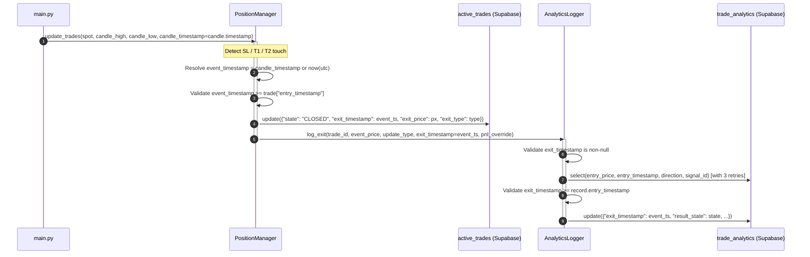

# ADR-152: Trade Exit Timestamp Validation, Anomaly Flagging, and Lifecycle Invariants

- **Status**: Proposed
- **Date**: 2026-09-12
- **Task ID**: MANM-152
- **Author**: Software Architect Agent (`d2d4e328-096d-4658-8d90-44aa7b51ed05`)

---

## 1. Executive Summary & Forensic Investigation

### 1.1 Problem Statement
The 2026-09-11 Supabase backtesting audit revealed that trade exit timestamp tracking is compromised:
1. One closed trade in the database possesses an invalid, inverted exit timestamp preceding its entry timestamp, yielding a negative hold duration of $-13.3$ hours ($-47,932.86$ seconds).
2. Missing, NULL, or chronologically inverted exit timestamps invalidate trade duration and hold-time analysis, distort daily P&L attribution windows, and corrupt annualized Sharpe ratio calculations.
3. Neither PostgreSQL table schemas nor application services enforce that a finalized trade has a non-null, valid exit timestamp satisfying $\text{exit\_timestamp} \ge \text{entry\_timestamp}$.

### 1.2 Database Forensic Findings
A systematic audit across all 233 records in `trade_analytics` and `active_trades` isolated the anomalous record:

- **Trade ID**: `d7713f41-7173-4da1-8d67-8c489609e23c`
- **Table**: `trade_analytics`
- **Result State**: `SL_HIT` (Closed)
- **Setup Type**: `OI_WALL_REJECTION` (`BEARISH`)
- **Recorded Entry Timestamp**: `2026-09-07T03:55:00+00:00` (Monday 09:25:00 IST)
- **Recorded Exit Timestamp**: `2026-09-06T14:36:07.143249+00:00` (Sunday 20:06:07 IST)
- **Calculated Hold Duration**: $-47,932.86$ seconds ($-13.31$ hours)
- **Recorded Entry Price**: $24,050.00$ | **Stop Loss / Exit Price**: $24,066.00$ | **P&L**: $-16.00$ pts
- **Signal ID Link**: `NULL` (orphaned from `ares_signals` and unlinked in `ml_collection`)
- **Corresponding `active_trades` Row**: `state = 'CLOSED'`, `created_at = '2026-09-06T14:36:06.260721+00:00'`, `added_time_ist = '20:06:06'`. Notably, `active_trades` contains no `exit_timestamp` column.

### 1.3 External Cross-Reference & Unrecoverability Determination
Investigation of external application logs, git commit history, and historical exchange market data confirms:
1. **Market Price Disconnect**: On Monday, 2026-09-07, actual NIFTY spot prices traded strictly within the range of $[23,742.40, 23,837.85]$. NIFTY was never near $24,050.00$ or $24,066.00$ on that trading day.
2. **Git Commit Correlation**: On Sunday evening, 2026-09-06 (commits `59cb218`, `4eb2144`, `949ce2a`, `a489a38`), developers implemented and tested the MANM-73 / TASK-188 decoupled OI wall entry filter using synthetic test fixtures.
3. **Leaked Synthetic Fixture**: The test script used simulated candle timestamps for Monday morning (`2026-09-07T03:55:00+00:00`), but ran against the live Supabase database on Sunday evening at `14:36:06 UTC`.
4. **The Mechanism of Inversion**: `position_manager.add_trade` used the candle's simulated future timestamp as `entry_timestamp`. When the trade exited during the test execution, `AnalyticsLogger.log_exit` stamped `datetime.now(timezone.utc)` (the wall-clock time on Sunday `2026-09-06T14:36:07.143249+00:00`). This resulted in the exit timestamp preceding the entry timestamp by $13.3$ hours.
5. **Conclusion**: True market exit timestamp recovery is **physically impossible** because this trade never existed on the exchange; it is a leaked synthetic test fixture. In accordance with acceptance criteria, this record must be explicitly flagged and permanently excluded from duration and temporal metrics.

---

## 2. Root Cause Analysis of Systemic Vulnerabilities

The investigation revealed four architectural defects that permit invalid or missing exit timestamps:

```mermaid
flowchart TD
    subgraph Defect1["Defect 1: Wall-Clock Stamping"]
        PM["PositionManager.update_trades"] -->|"No candle timestamp passed"| AL["AnalyticsLogger.log_exit"]
        AL -->|"Hardcodes datetime.now(utc)"| TA["trade_analytics.exit_timestamp"]
        note1["Replays, backtests, or lagging processing invert or distort timestamps"]
    end

    subgraph Defect2["Defect 2: Schema Deficit"]
        TA2["trade_analytics"] -->|"exit_timestamp timestamptz NULL"| DB[(Supabase Postgres)]
        note2["No CHECK constraint requiring exit_timestamp >= entry_timestamp<br/>No CHECK requiring closed trades to have exit_timestamp"]
    end

    subgraph Defect3["Defect 3: Async Race & Swallowed Errors"]
        PM2["add_trade() (async executor)"] -.->|"raced by"| UT["update_trades() (async executor)"]
        UT -->|"log_exit fails if entry not written"| SW["Swallows error; trade remains OPEN with NULL exit"]
    end

    subgraph Defect4["Defect 4: Missing Telemetry in active_trades"]
        AT["active_trades"] -->|"Only stores state and stop_loss"| NO_EXIT["Lacks exit_timestamp and exit_price columns"]
    end
```



1. **Decoupling of Event-Time from Wall-Clock Time**:
   - `PositionManager.update_trades(spot_price, candle_high, candle_low)` receives candle extremes from `main.py`, but neither `main.py` nor `update_trades` passes the candle's event timestamp (`candle.timestamp`).
   - `AnalyticsLogger.log_exit` does not accept an `exit_timestamp` parameter; it hardcodes `datetime.now(timezone.utc).isoformat()`.
   - In any environment where processing does not occur strictly in synchronous real time (e.g. historical replays, backtests, network pauses, or simulated batches), the exit timestamp drifts from the candle timeline, risking negative hold times.

2. **Absence of Database Integrity Constraints**:
   - `schema.sql` defines `exit_timestamp timestamptz` as nullable without constraints.
   - There is no PostgreSQL constraint enforcing chronological validity: `CHECK (exit_timestamp IS NULL OR exit_timestamp >= entry_timestamp)`.
   - There is no constraint enforcing terminal state completeness: `CHECK (result_state = 'OPEN' OR exit_timestamp IS NOT NULL)`.
   - There is no dedicated boolean column to flag anomalous or synthetic records excluded from analysis.

3. **Asynchronous Insert-vs-Exit Race Conditions & Swallowed Exceptions**:
   - In fast intraday price action or single-candle stop-outs, `log_entry` and `log_exit` are dispatched concurrently to executor threads.
   - If `log_exit` queries `trade_analytics` before `log_entry` commits, `log_exit` silently exits:
     ```python
     response = self.supabase.table("trade_analytics").select(...).eq("id", trade_id).execute()
     if not response.data:
         return  # Silently dropped!
     ```
   - This leaves `trade_analytics` permanently in `result_state = 'OPEN'` with `exit_timestamp = NULL`, while `active_trades` indicates `CLOSED`.

4. **Missing Terminal Telemetry in `active_trades`**:
   - When a trade closes, `PositionManager.update_trades` updates only `{"state": trade["state"], "stop_loss": trade["stop_loss"]}` in `active_trades`.
   - `active_trades` does not store `exit_timestamp`, `exit_price`, or `exit_type`, preventing independent reconciliation if `trade_analytics` fails.

5. **Downstream Reporting Fragility**:
   - `reports.py` (`fetch_closed_trades`) queries `.gte("exit_timestamp", start_utc).lte("exit_timestamp", end_utc)`. Any closed trade with `exit_timestamp IS NULL` is silently omitted from weekly and monthly performance reports.
   - `_sharpe_metrics` in `ml_signal/train_offline.py` only flags `timestamps.isna()`, failing to catch inverted timestamps where $\text{exit} < \text{entry}$.

---

## 3. Decision & Architectural Specification

To guarantee 100% data integrity, eliminate inverted durations, and enforce strict trade finalization invariants across all components:

### 3.1 Database Migration & Anomaly Flagging
Create migration `migrations/2026-09-12-task152-exit-timestamp-validation-and-flagging.sql`:

1. **Add Flagging Column to `trade_analytics`**:
   ```sql
   ALTER TABLE trade_analytics
   ADD COLUMN IF NOT EXISTS time_metrics_excluded boolean NOT NULL DEFAULT false;
   ```

2. **Flag and Isolate the Unrecoverable Trade (`d7713f41-7173-4da1-8d67-8c489609e23c`)**:
   ```sql
   UPDATE trade_analytics
   SET time_metrics_excluded = true,
       market_context = jsonb_set(
           coalesce(market_context, '{}'::jsonb),
           '{anomaly}',
           '{"flag": "INVALID_NEGATIVE_DURATION", "reason": "Leaked synthetic test fixture with exit preceding entry", "investigation": "MANM-152"}'::jsonb
       )
   WHERE id = 'd7713f41-7173-4da1-8d67-8c489609e23c';
   ```

3. **Add Chronological & Completeness Constraints to `trade_analytics`**:
   ```sql
   -- Invariant 1: Exit timestamp must never precede entry timestamp
   ALTER TABLE trade_analytics
   ADD CONSTRAINT chk_trade_analytics_exit_chronology
   CHECK (exit_timestamp IS NULL OR exit_timestamp >= entry_timestamp);

   -- Invariant 2: Terminal states require exit_timestamp unless explicitly flagged as an excluded anomaly
   ALTER TABLE trade_analytics
   ADD CONSTRAINT chk_trade_analytics_closed_requires_exit
   CHECK (result_state = 'OPEN' OR exit_timestamp IS NOT NULL OR time_metrics_excluded = true);
   ```

4. **Expand `active_trades` Schema for Redundant Telemetry**:
   ```sql
   ALTER TABLE active_trades
   ADD COLUMN IF NOT EXISTS exit_timestamp timestamptz,
   ADD COLUMN IF NOT EXISTS exit_price numeric,
   ADD COLUMN IF NOT EXISTS exit_type text;

   -- Invariant 3: Closed active trades require exit_timestamp
   ALTER TABLE active_trades
   ADD CONSTRAINT chk_active_trades_closed_requires_exit
   CHECK (state NOT IN ('CLOSED', 'STOPPED_OUT') OR exit_timestamp IS NOT NULL);
   ```

### 3.2 Event-Time Propagation Pipeline
Propagate candle timestamps through the entire execution and persistence chain:



1. **`main.py`**:
   - Update call: `await position_manager.update_trades(spot, candle_high=candle.high, candle_low=candle.low, candle_timestamp=candle.timestamp)`.

2. **`PositionManager.update_trades`**:
   - Signature:
     ```python
     async def update_trades(
         self,
         spot_price: float,
         candle_high: Optional[float] = None,
         candle_low: Optional[float] = None,
         candle_timestamp: Optional[datetime] = None,
     ) -> List[Tuple[str, str]]:
     ```
   - Normalization & Validation:
     - Determine event timestamp: `event_ts = to_utc_iso(candle_timestamp) if candle_timestamp else datetime.now(timezone.utc).isoformat()`.
     - In-memory trade dict stores `trade["entry_timestamp"]`.
     - Validate that `event_ts >= trade["entry_timestamp"]`. If violated, clamp to `trade["entry_timestamp"]` and log a structured warning.
   - Persistence:
     - Update payload for `active_trades` on close includes `exit_timestamp`, `exit_price`, and `exit_type`.
     - Pass `exit_timestamp=event_ts` to `self.analytics.log_exit`.

3. **`AnalyticsLogger.log_exit`**:
   - Signature:
     ```python
     def log_exit(
         self,
         trade_id: str,
         exit_price: float,
         final_state: str,
         exit_timestamp: Optional[datetime | str] = None,
         pnl_points_override: Optional[float] = None,
     ) -> None:
     ```
   - Validation & Retry Invariants:
     - Require `exit_timestamp`: if omitted, fallback to `datetime.now(timezone.utc).isoformat()`. Ensure UTC ISO normalization.
     - Exponential backoff retry (3 attempts, $100\text{ms}$ initial delay) when querying `trade_analytics` by `trade_id` to eliminate race conditions with `log_entry`.
     - Cross-validate: Parse `entry_timestamp` from the queried record. Assert `exit_timestamp >= entry_timestamp`. If violated, raise `ValueError` (or set `time_metrics_excluded = True` with anomaly flag) to prevent silent corruption.
     - Persist `exit_timestamp` in `trade_analytics`.

### 3.3 Analytics & Reporting Exclusion
Update all downstream analysis consumers to ignore records flagged with `time_metrics_excluded = true` or invalid chronological ordering:

1. **`reports.py` (`fetch_closed_trades`)**:
   - Add `.eq("time_metrics_excluded", False)` filter.
   - Sanity check: Ensure `exit_timestamp >= entry_timestamp` before computing durations or aggregate metrics.

2. **`ml_signal/train_offline.py` (`_sharpe_metrics`)**:
   - Filter out rows where `time_metrics_excluded == True`.
   - Update `pnl_valid` and timestamp validation:
     ```python
     valid_chronology = (exit_dt >= entry_dt)
     metrics["sharpe_invalid_chronology_count"] = int((~valid_chronology).sum())
     ```
   - Exclude any row where hold duration $< 0$ from trading-day P&L aggregation.

---

## 4. Component Boundaries & File-Level Task Assignments

Implementation of ticket **MANM-152** is assigned to the **Code Generator Agent** across the following files:

### Task Breakdown for Code Generator

1. **`migrations/2026-09-12-task152-exit-timestamp-validation-and-flagging.sql`**:
   - Add `time_metrics_excluded boolean DEFAULT false` to `trade_analytics`.
   - Update `d7713f41-7173-4da1-8d67-8c489609e23c` setting `time_metrics_excluded = true` and recording anomaly context in `market_context`.
   - Add CHECK constraints:
     - `chk_trade_analytics_exit_chronology`: `exit_timestamp IS NULL OR exit_timestamp >= entry_timestamp`.
     - `chk_trade_analytics_closed_requires_exit`: `result_state = 'OPEN' OR exit_timestamp IS NOT NULL OR time_metrics_excluded = true`.
   - Add `exit_timestamp timestamptz`, `exit_price numeric`, and `exit_type text` to `active_trades`.
   - Add CHECK constraint on `active_trades`:
     - `chk_active_trades_closed_requires_exit`: `state NOT IN ('CLOSED', 'STOPPED_OUT') OR exit_timestamp IS NOT NULL`.

2. **`schema.sql` & `README.md`**:
   - Update `active_trades` table definition in `schema.sql` and `README.md` to include `exit_timestamp timestamptz`, `exit_price numeric`, and `exit_type text`.
   - Update `trade_analytics` table definition in `schema.sql` and `README.md` to include `time_metrics_excluded boolean DEFAULT false` and document the check constraints.

3. **`storage.py` (`AnalyticsLogger`)**:
   - Update `log_exit` signature:
     ```python
     def log_exit(
         self,
         trade_id: str,
         exit_price: float,
         final_state: str,
         exit_timestamp: Optional[datetime | str] = None,
         pnl_points_override: Optional[float] = None,
     ) -> None:
     ```
   - Implement retry logic (3 attempts with 100ms backoff) for querying `trade_analytics`.
   - Normalize `exit_timestamp` via `to_utc_iso`.
   - Validate `exit_timestamp >= record["entry_timestamp"]`. Raise `ValueError("Exit timestamp cannot precede entry timestamp")` if invalid in strict mode, or flag with `time_metrics_excluded = true`.
   - Update query to select `entry_timestamp` alongside `entry_price, direction, signal_id`.

4. **`position_manager.py` (`PositionManager`)**:
   - Update `add_trade`: ensure `trade_data["entry_timestamp"]` stores the ISO UTC timestamp from `signal.timestamp`.
   - Update `update_trades` signature to accept `candle_timestamp: Optional[datetime] = None`.
   - On trade exit (`CLOSED`, `STOPPED_OUT`):
     - Compute `event_ts = to_utc_iso(candle_timestamp) if candle_timestamp else datetime.now(timezone.utc).isoformat()`.
     - Invariant check: ensure `event_ts >= trade["entry_timestamp"]`.
     - Include `exit_timestamp: event_ts`, `exit_price: event_price`, `exit_type: update_type` in `active_trades` update payload.
     - Pass `exit_timestamp=event_ts` to `self.analytics.log_exit`.

5. **`main.py`**:
   - Update call at line 351:
     ```python
     trade_events = await position_manager.update_trades(
         spot, candle_high=candle.high, candle_low=candle.low, candle_timestamp=candle.timestamp
     )
     ```

6. **`reports.py` & `ml_signal/train_offline.py`**:
   - `reports.py`: filter out `time_metrics_excluded = true` in `fetch_closed_trades`.
   - `ml_signal/train_offline.py`: in `_sharpe_metrics`, exclude records flagged with `time_metrics_excluded = true` or having inverted duration ($\text{exit} < \text{entry}$).

7. **Regression Test Suite (`tests/unit/test_task152_exit_timestamp_validation.py`)**:
   - Test 1: `log_exit` requires and validates `exit_timestamp`.
   - Test 2: Inverted timestamp ($\text{exit} < \text{entry}$) is rejected or flagged as excluded.
   - Test 3: `position_manager.update_trades` passes candle timestamp through to `log_exit` and persists `exit_timestamp` into `active_trades`.
   - Test 4: `log_exit` retry mechanism successfully catches raced records.
   - Test 5: Reporting and Sharpe calculations cleanly exclude `time_metrics_excluded` records.
   - Test 6: Verify full test suite passes with 100% coverage on new validation logic.

---

## 5. Definition of Done & Acceptance Criteria

- [ ] Forensic root cause and unrecoverability of trade `d7713f41-7173-4da1-8d67-8c489609e23c` documented.
- [ ] Database migration script created adding `time_metrics_excluded` and CHECK constraints on `trade_analytics` and `active_trades`.
- [ ] Record `d7713f41-7173-4da1-8d67-8c489609e23c` marked with `time_metrics_excluded = true` and structured anomaly metadata.
- [ ] `schema.sql` and `README.md` updated with new columns and constraints.
- [ ] `PositionManager.update_trades` accepts `candle_timestamp` and propagates it to `log_exit` and `active_trades`.
- [ ] `AnalyticsLogger.log_exit` accepts `exit_timestamp`, retries queries, and validates $\text{exit\_timestamp} \ge \text{entry\_timestamp}$.
- [ ] `reports.py` and `ml_signal/train_offline.py` exclude flagged records from duration/Sharpe metrics.
- [ ] Comprehensive regression test suite added in `tests/unit/test_task152_exit_timestamp_validation.py`.
- [ ] All unit and integration tests in the repository pass (`pytest`).
- [ ] Zero breaking changes to live trading loop execution.
