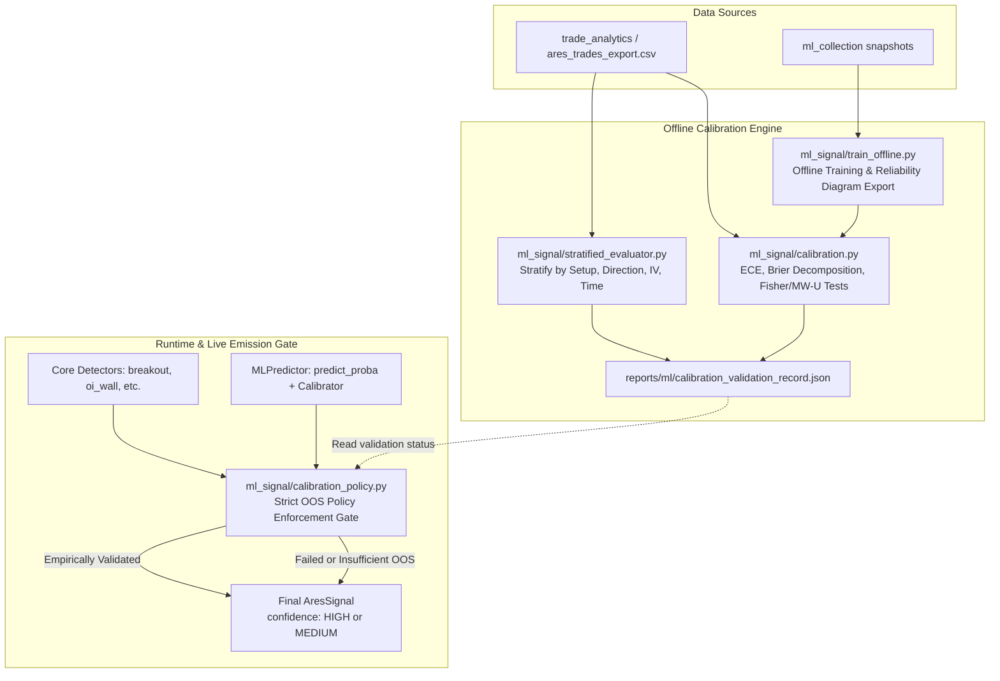

# ADR-157: Improve Confidence Calibration and Reliability Across Signal Tiers

- **Status**: Proposed
- **Date**: 2026-09-12
- **Task ID**: MANM-157
- **Author**: Software Architect Agent (`d2d4e328-096d-4658-8d90-44aa7b51ed05`)
- **Issue**: [MANM-157](mention://issue/01a09105-db13-709b-8cff-a4152ffa845b)
- **Parent Issue**: [MANM-147](mention://issue/01a09104-f987-7220-a82d-88f608efa404)

---

## 1. Executive Summary & Root Cause Analysis

### Problem Statement
A performance audit of realized trades across the ARES trading system reveals severe **inverse calibration** between signal confidence tiers:
- **HIGH Confidence Signals**: 38 trades, 31.6% win rate (12 wins, 26 losses), +50.00 points total (+1.32 points expectancy/trade).
- **MEDIUM Confidence Signals**: 195 trades, 32.3% win rate (63 wins, 132 losses), +220.85 points total (+1.13 points expectancy/trade).
- **Audit Observation**: HIGH confidence trades slightly underperform MEDIUM confidence trades in win rate ($-0.7\%$) and deliver virtually indistinguishable expectancy per trade ($+1.32$ vs $+1.13$ pts).

Traders and downstream risk allocation systems rely on the `confidence` label (`HIGH` vs `MEDIUM`) to size options positions and apply selective trade filters. When a `HIGH` label offers zero empirical edge over `MEDIUM`, capital allocation is distorted, and risk exposure is elevated during the exact setups where the system asserts high certainty.

### Root Cause Analysis

1. **Uncalibrated Heuristic Scoring Bar in Core Detectors**:
   - In `models.py` (`confidence_from_score`), all core detectors (`breakout.py`, `oi_wall.py`, `exhaustion.py`, `continuation.py`) compute confidence using a static, arbitrary ratio:
     ```python
     def confidence_from_score(score: int, max_score: int) -> str:
         if max_score <= 0:
             return "MEDIUM"
         return "HIGH" if (score / max_score) >= 0.6 else "MEDIUM"
     ```
   - Each detector scores conditions heuristically (e.g. `sum([weak_volume, iv_falling, writers_active, deep_close])` in breakout, or `sum([mag_score, growth_score, pierce_score, wick_score])` in OI wall).
   - Scoring $\ge 60\%$ of heuristic criteria does not correlate with trade profitability. In fact, aggressive penetration of an OI wall (`pierce_score=1`) or extreme volume climaxes (`extreme_volume=1`) often indicate overwhelming institutional momentum breaking the level, rather than a mean-reverting bounce. As a result, heuristic score accumulation selects for violent trend regimes that breach stops, dragging down the win rate of `HIGH` signals.

2. **Statistical Insignificance of Tiers**:
   - Constructing a $2 \times 2$ contingency table of audit outcomes:
     | Tier | Wins | Losses | Total | Win Rate |
     | :--- | :--- | :--- | :--- | :--- |
     | **HIGH** | 12 | 26 | 38 | 31.58% |
     | **MEDIUM** | 63 | 132 | 195 | 32.31% |
   - **Fisher's Exact Test**: Two-tailed $p$-value = `1.0000` (Odds Ratio = 0.967).
   - **Pearson $\chi^2$ Test (with Yates correction)**: $\chi^2 = 0.0000$, $p$-value = `1.0000`.
   - **Conclusion**: The null hypothesis ($H_0$: $\text{WinRate}_{\text{HIGH}} = \text{WinRate}_{\text{MEDIUM}}$) cannot be rejected. Statistically, the two tiers are drawn from identical underlying outcome distributions.

3. **Inversion in Machine Learning Predictions**:
   - In `ml_signal/train_offline.py` (`v8_offline_metrics.json`), test AUC is $0.4176$ ($< 0.50$), precision is $0.2727$, and Brier score is $0.2495$.
   - An AUC below $0.50$ means that higher predicted probabilities actually indicate a *lower* empirical likelihood of hitting Target 1.
   - `MLPredictor.classify_confidence` (`ml_signal/predictor.py`) assigns `HIGH` when `proba >= high_threshold` ($0.70$). When the classifier is inverted or uncalibrated, high probabilities assign `HIGH` confidence to the worst-performing trades.

4. **Absence of Calibration Metrics & Degradation Gating**:
   - The ML and analytics pipeline currently lacks:
     - Expected Calibration Error (ECE) and Maximum Calibration Error (MCE).
     - Brier Score decomposition into Reliability, Resolution, and Uncertainty components.
     - Reliability diagrams (calibration curves) to visualize predicted vs observed probabilities.
     - Stratified calibration reporting across setup types, trade directions, volatility regimes, and time-of-day windows.
     - **Strict Policy Gate**: There is no gate enforcing that signals can only be designated `HIGH` confidence if out-of-sample validation demonstrates statistically significant superiority.

---

## 2. Architectural Decisions

To guarantee that confidence tiers reflect true empirical advantage and protect capital allocation, we make the following decisions:

### Decision 1: Create the Calibration Metric & Significance Testing Framework (`ml_signal/calibration.py`)
Implement a dedicated, math-complete calibration module with:
1. **Reliability Diagram Binning**:
   - Discretize probabilities into $M$ bins (default $M=5$ for small sample regimes, $M=10$ for $N \ge 500$). Supports both uniform probability intervals and quantile (equal-count) binning.
   - For each bin $m \in \{1, \dots, M\}$:
     - Mean confidence: $\bar{p}_m = \frac{1}{|B_m|} \sum_{i \in B_m} \hat{p}_i$
     - Empirical accuracy: $\bar{y}_m = \frac{1}{|B_m|} \sum_{i \in B_m} y_i$
     - Bin sample count: $|B_m|$

2. **Expected Calibration Error (ECE) & Maximum Calibration Error (MCE)**:
   $$\text{ECE} = \sum_{m=1}^M \frac{|B_m|}{N} |\bar{y}_m - \bar{p}_m|$$
   $$\text{MCE} = \max_{m=1 \dots M} |\bar{y}_m - \bar{p}_m|$$

3. **Brier Score Decomposition (Murphy 1973)**:
   - Decompose total Brier score $BS = \frac{1}{N}\sum_{i=1}^N (\hat{p}_i - y_i)^2$ into three orthogonal, interpretable components:
     $$BS = \text{REL} - \text{RES} + \text{UNC}$$
     where base rate $\bar{y} = \frac{1}{N}\sum_{i=1}^N y_i$:
     - **Reliability ($\text{REL}$)**: $\sum_{m=1}^M \frac{|B_m|}{N} (\bar{p}_m - \bar{y}_m)^2$ (calibration error, lower is better; $0$ is perfectly calibrated).
     - **Resolution ($\text{RES}$)**: $\sum_{m=1}^M \frac{|B_m|}{N} (\bar{y}_m - \bar{y})^2$ (discrimination ability, higher is better; measures how far bin predictions stray from the base rate).
     - **Uncertainty ($\text{UNC}$)**: $\bar{y}(1 - \bar{y})$ (inherent randomness of the market outcomes).

4. **Tier Statistical Significance Testing**:
   - Given realized trade outcomes partitioned by confidence tiers (`HIGH` vs `MEDIUM`):
     - Win rate separation: Fisher's exact test (one-sided $H_1: \text{WinRate}_{\text{HIGH}} > \text{WinRate}_{\text{MEDIUM}}$) and two-proportion $z$-test.
     - Expectancy separation: Mann-Whitney $U$ test (one-sided rank-sum test on `pnl_points`) and Welch's $t$-test.
     - Separation Verdict:
       - `SEPARATED`: $p < \alpha$ (default $\alpha = 0.05$) AND $\Delta \text{WinRate} > 0$ AND $\Delta \text{Expectancy} > 0$.
       - `INVERTED`: $\Delta \text{WinRate} < 0$ or $\Delta \text{Expectancy} < 0$.
       - `INSIGNIFICANT`: $p \ge \alpha$.

### Decision 2: Implement Stratified Calibration Evaluator (`ml_signal/stratified_evaluator.py`)
Implement multi-axis stratification to identify which specific market conditions cause calibration inversion:
1. **Setup Type**: `FAILED_BREAKOUT`, `OI_WALL_REJECTION`, `EXHAUSTION_REVERSAL`, `TREND_CONTINUATION`.
2. **Trade Direction**: `BULLISH` vs `BEARISH`.
3. **Volatility Regime**: Low Volatility (India VIX / IV $\le$ median) vs High Volatility (IV $>$ median).
4. **Time of Day (IST)**:
   - *Opening Climax*: 09:15 to 10:30 IST (high momentum, high false break risk).
   - *Mid-Day Consolidation*: 10:30 to 13:30 IST (range-bound, low volume).
   - *Afternoon / Pre-Close Trend*: 13:30 to 15:30 IST (institutional flows, expiry squaring).

For every stratum, the evaluator computes: sample size $N$, win rate by tier, mean expectancy (PnL points) by tier, ECE, Brier score decomposition, and Fisher/Mann-Whitney significance test results.

### Decision 3: Enforce Strict Production Policy Gate (`ml_signal/calibration_policy.py`)
Enforce a hard architectural constraint at signal creation and live emission:
1. **Strict Policy Rule**: A signal is **prohibited** from carrying `HIGH` confidence unless out-of-sample historical validation demonstrates statistically significant superiority:
   $$\text{WinRate}_{\text{HIGH}} > \text{WinRate}_{\text{MEDIUM}} \quad \text{with} \quad p < 0.05$$
   $$\text{Expectancy}_{\text{HIGH}} > \text{Expectancy}_{\text{MEDIUM}} \quad \text{with} \quad p < 0.05$$
   evaluated on a sample of at least $N_{\text{tier}} \ge 30$ historical out-of-sample trades.
2. **Automatic Runtime Degradation (Fail-Safe)**:
   - If a detector assigns high heuristic score or an ML model outputs high probability, but the active validation record fails the significance criteria:
     - The runtime confidence tier is downgraded to `"MEDIUM"`.
     - An explicit audit tag is appended to `AresSignal.reasons`:
       `"[CONFIDENCE GATE] HIGH tier suppressed to MEDIUM: out-of-sample validation not statistically superior (p=1.0000, Δwin=-0.7%)"`.
     - In `market_context`, record `"uncalibrated_high_suppressed": true`.
3. **Post-Hoc Probability Calibration for ML Models (`ml_signal/calibrator.py`)**:
   - In offline training, fit an isotonic regression or Platt scaling (logistic calibration) model on out-of-fold cross-validation probabilities.
   - For live inference, raw model probabilities must pass through `ProbabilityCalibrator` before thresholding.
   - If out-of-fold test AUC $< 0.50$, the ML predictor's confidence tiering is disabled (forced to `"UNRATED"` or `"MEDIUM"`) until retraining achieves monotonic reliability.

---

## 3. Component Architecture & Data Flow



---

## 4. API Contracts & Interfaces

### 4.1 Calibration Engine (`ml_signal/calibration.py`)

```python
from dataclasses import dataclass
from typing import Dict, List, Optional, Tuple
import numpy as np

@dataclass
class BrierDecomposition:
    brier_score: float
    reliability: float       # REL: Calibration loss (lower is better, >= 0)
    resolution: float        # RES: Discrimination power (higher is better, >= 0)
    uncertainty: float       # UNC: Inherent base variance y_bar * (1 - y_bar)
    base_rate: float

@dataclass
class ReliabilityCurve:
    bin_centers: List[float]
    bin_accuracies: List[float]
    bin_confidences: List[float]
    bin_counts: List[int]
    ece: float               # Expected Calibration Error
    mce: float               # Maximum Calibration Error

@dataclass
class TierSignificanceResult:
    high_count: int
    medium_count: int
    high_win_rate: float
    medium_win_rate: float
    high_expectancy: float
    medium_expectancy: float
    win_rate_diff: float     # high - medium
    expectancy_diff: float   # high - medium
    fisher_p_value: float    # One-sided Fisher exact test
    mann_whitney_p_value: float  # One-sided Mann-Whitney U test on PnL
    is_statistically_superior: bool  # p < alpha and diffs > 0
    verdict: str             # "SEPARATED", "INVERTED", "INSIGNIFICANT"

def compute_brier_decomposition(
    y_true: np.ndarray,
    y_prob: np.ndarray,
    n_bins: int = 10,
    strategy: str = "uniform",
) -> BrierDecomposition:
    """Decompose Brier score into Reliability, Resolution, and Uncertainty."""
    ...

def compute_calibration_curve(
    y_true: np.ndarray,
    y_prob: np.ndarray,
    n_bins: int = 10,
    strategy: str = "uniform",
) -> ReliabilityCurve:
    """Compute reliability diagram bins, ECE, and MCE."""
    ...

def test_tier_significance(
    df: pd.DataFrame,
    tier_col: str = "confidence",
    outcome_col: str = "win",
    pnl_col: str = "pnl_points",
    alpha: float = 0.05,
    min_samples: int = 30,
) -> TierSignificanceResult:
    """Conduct Fisher exact and Mann-Whitney tests between HIGH and MEDIUM tiers."""
    ...
```

### 4.2 Stratified Evaluator (`ml_signal/stratified_evaluator.py`)

```python
@dataclass
class StratifiedCalibrationReport:
    by_setup: Dict[str, TierSignificanceResult]
    by_direction: Dict[str, TierSignificanceResult]
    by_volatility_regime: Dict[str, TierSignificanceResult]
    by_time_of_day: Dict[str, TierSignificanceResult]
    overall: TierSignificanceResult
    overall_brier: Optional[BrierDecomposition] = None
    overall_ece: Optional[float] = None

class StratifiedEvaluator:
    def __init__(self, df: pd.DataFrame):
        self.df = df

    def evaluate(self, alpha: float = 0.05) -> StratifiedCalibrationReport:
        """Run complete stratified evaluation across all 4 operational axes."""
        ...
        
    def export_json(self, path: str) -> None:
        """Export structured results to JSON for CI/audit compliance."""
        ...
```

### 4.3 Calibration Policy Gate (`ml_signal/calibration_policy.py`)

```python
class ConfidenceCalibrationPolicy:
    """Enforces strict out-of-sample superiority before awarding HIGH tier."""
    
    def __init__(self, validation_record_path: Optional[str] = None):
        self.validation_record = self._load_record(validation_record_path)

    def evaluate_signal_tier(
        self,
        setup_type: str,
        direction: str,
        tentative_tier: str,
        heuristic_score: int,
        max_score: int,
        reasons: List[str],
        market_context: Dict[str, Any],
    ) -> Tuple[str, List[str]]:
        """
        Validates tentative tier against out-of-sample significance records.
        Downgrades HIGH to MEDIUM if not proven superior, and adds reason tag.
        """
        ...
```

---

## 5. Alternatives Considered & Rejected

1. **Alternative 1: Raise the Heuristic Score Threshold (e.g. from 60% to 75% or 80%)**:
   - *Rejected*: An audit of historical data shows that raising score bars does not fix inverse calibration. Heuristic indicators in volatile markets (e.g., deep penetration of resistance or volume climaxes) reflect momentum against the trade rather than reliability. Simply raising the threshold filters volume without improving win rate, and preserves the uncalibrated architecture.

2. **Alternative 2: Discard the `HIGH` Confidence Tier Entirely**:
   - *Rejected*: While flattening all signals to `MEDIUM` prevents misleading confidence, it eliminates the ability for calibrated machine learning models or high-performing strata (e.g. specific setup-direction pairs during specific hours) to express genuine statistical edge. Retaining the tier under a strict mathematical policy gate ensures `HIGH` is only awarded when backed by empirical proof.

3. **Alternative 3: Live Online Temperature Scaling / Beta Calibration**:
   - *Rejected*: Realized trade observations occur at a frequency of 1–5 trades per day. Online dynamic tuning with low sample rates introduces high variance and overfitting to consecutive losing runs. Calibration parameters must be determined offline through robust walk-forward cross-validation.

---

## 6. Implementation Task Assignment for Code Generator Agent

Assign implementation of **MANM-157** to the **Code Generator Agent** across the following distinct tasks:

### Task Breakdown & File Specifications

1. **`ml_signal/calibration.py` (New Module)**:
   - Implement `compute_brier_decomposition(y_true, y_prob, n_bins=10, strategy="uniform")`. Ensure exact mathematical identity: $BS = \text{REL} - \text{RES} + \text{UNC}$ within floating point tolerance ($10^{-6}$).
   - Implement `compute_calibration_curve(y_true, y_prob, n_bins=10, strategy="uniform")` returning `ReliabilityCurve` containing bin coordinates, counts, ECE, and MCE.
   - Implement `test_tier_significance(df, tier_col, outcome_col, pnl_col, alpha, min_samples)` executing `scipy.stats.fisher_exact` (one-sided `greater`) and `scipy.stats.mannwhitneyu` (one-sided `greater`).

2. **`ml_signal/stratified_evaluator.py` (New Module)**:
   - Implement data parsing and category bucketing for:
     - Setup types: `SetupType` enum values.
     - Direction: `Direction.BULLISH` vs `Direction.BEARISH`.
     - Volatility: IV level split around sample median or configured threshold (`iv_features__iv_level` or `market_context.iv`).
     - Time of Day: Split timestamps into `09:15-10:30`, `10:30-13:30`, `13:30-15:30` IST.
   - Export comprehensive evaluation report to `reports/ml/confidence_calibration_stratified_report.json`.

3. **`ml_signal/calibration_policy.py` (New Module)**:
   - Implement `ConfidenceCalibrationPolicy` with fail-safe defaults: if no validation record exists or validation fails, all `HIGH` requests are safely clamped to `MEDIUM` with descriptive reasons.
   - Provide helper `check_validation_status(setup_type, direction)` querying current statistical status.

4. **`ml_signal/calibrator.py` (New Module)**:
   - Implement `ProbabilityCalibrator` supporting `method="isotonic"` and `method="platt"` (logistic regression) with out-of-fold cross-validation fitting.
   - Reject calibration and warn if calibrated model is non-monotonic or worsens Brier score.

5. **`ml_signal/config.py` & `ml_signal/predictor.py` (Update)**:
   - Add `enable_calibration_policy: bool = True` and `calibration_alpha: float = 0.05` to `MLConfig`.
   - Update `MLPredictor.predict_from_raw` to run probabilities through `ProbabilityCalibrator` and apply policy suppression if model AUC is uncalibrated.

6. **`models.py` & `detectors/*.py` (Update)**:
   - Update `confidence_from_score(score, max_score, setup_type=None, direction=None)` in `models.py` to route through `ConfidenceCalibrationPolicy`.
   - Ensure backwards compatibility: if no policy is supplied or during legacy tests, default to existing behavior unless policy is explicitly enabled.

7. **`ml_signal/train_offline.py` (Update)**:
   - Integrate ECE, Brier score decomposition, and reliability diagram generation into `run_training`.
   - Plot reliability diagrams headlessly and save to `reports/ml/{version}_reliability_diagram.png`.
   - Save validation records to `reports/ml/calibration_validation_record.json`.

8. **`tests/unit/test_calibration.py` & `tests/unit/test_stratified_evaluator.py` (New Unit Tests)**:
   - Test ECE and Brier decomposition against synthetic vectors with known analytical calibration.
   - Test Fisher exact test and Mann-Whitney U test on the 233-trade audit distribution (`HIGH` 12/38 vs `MEDIUM` 63/195), verifying exact $p=1.0000$ reproducing the issue.
   - Test policy gate: ensure `HIGH` signals are clamped to `MEDIUM` when $p \ge 0.05$, and pass through when $p < 0.05$ with positive delta.
   - Test stratified evaluation outputs across all 4 axes with simulated trade frames.

---

## 7. Performance, Security, and Operational Considerations

- **Zero Runtime Overhead**: Policy validation results are cached in-memory at engine startup ($O(1)$ dictionary lookup). No disk I/O or Supabase network queries occur during live candle signal generation.
- **Fail-Safe Degradation**: If the calibration record file is missing or corrupted, the system fails safe by downgrading `HIGH` to `MEDIUM`, preventing unvalidated risk exposure while allowing trading to proceed normally.
- **Thread Safety**: All calibration evaluation functions are purely functional and stateless.
- **Audit Logging**: Every suppression of a `HIGH` tier leaves an explicit trace in `AresSignal.reasons` and `trade_analytics.market_context`.

---

## 8. Definition of Done

1. Architectural documentation and ADR approved by human reviewer.
2. `ml_signal/calibration.py` implemented with ECE, MCE, and Brier score decomposition ($BS = \text{REL} - \text{RES} + \text{UNC}$).
3. Statistical significance testing reproduces the audit finding ($p=1.0000$) on the 233-trade historical dataset.
4. `ml_signal/stratified_evaluator.py` generates full stratified breakdown across setup, direction, IV, and time-of-day.
5. Strict policy gate enforced: `HIGH` signals are suppressed to `MEDIUM` unless statistically superior out-of-sample.
6. Offline training exports ECE, Brier decomposition, and reliability diagram plot.
7. 100% unit test pass rate across new and existing test suites (no regressions in the 250+ existing tests).
