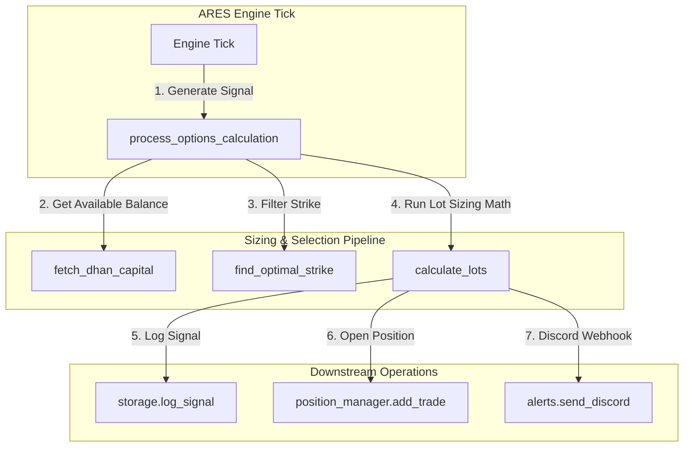

# Architecture Decision Record — TASK-010: Lot Sizing & Delta Strike Selection

## Problem
Integrate risk-managed lot sizing calculations and delta-based strike selection into the ARES signaling engine, utilizing available account balance from Dhan, and persisting option suggestion metrics to Supabase and Discord.

## Decision
We will build a modular options math and sizing utility (`options_math.py`), extend configuration profiles, and modify the main processing cycle to intercept the signal.



---

## Component Boundaries & File Locations

### 1. `config_profiles.py`
Add settings to `TuningConfig` and configure their defaults:
```python
@dataclass
class TuningConfig:
    # ...
    risk_per_trade_pct: float = 10.0
    nifty_lot_size: int = 65
    default_capital: float = 100000.0
```

### 2. `models.py`
Add greek delta/vega to `OptionRow` and options suggestion fields to `AresSignal`:
```python
@dataclass
class OptionRow:
    # ...
    delta: float = 0.0
    vega: float = 0.0

@dataclass
class AresSignal:
    # ...
    suggested_lots: Optional[int] = None
    option_sl: Optional[float] = None
    option_target: Optional[float] = None
    capital: Optional[float] = None
    option_delta: Optional[float] = None
    option_premium: Optional[float] = None
    risk_pct: Optional[float] = None
```

### 3. `fetchers/oi_fetcher.py`
* Correctly parse `delta`, `vega`, `gamma`, and `theta` from the nested `greeks` dictionary inside option contracts.
* Include `ce_delta` and `pe_delta` in the `full_chain` records returned by `fetch_chain()`.

### 4. `options_math.py` (New Module)
Implement core calculations and select strike with delta absolute value closest to 0.45:
```python
def calculate_risk_amount(capital: float, risk_pct: float) -> float
def calculate_points(entry: float, exit: float) -> float
def translate_to_premium(points: float, delta: float) -> float
def calculate_lots(risk_amt: float, sl_points: float, lot_size: int) -> int
def calculate_affordable_lots(capital: float, premium: float, lot_size: int) -> int
async def fetch_dhan_capital(dhan_client: Any) -> float
def find_optimal_strike(direction: str, full_chain: list) -> Tuple[Optional[int], Optional[str], Optional[float], Optional[float]]
async def process_options_calculation(signal: AresSignal, full_chain: list, dhan_client: Any) -> None
```

### 5. `main.py`
* Import `process_options_calculation` from `options_math.py`.
* Call `await process_options_calculation(signal, full_chain, price_fetcher.dhan)` right after signal generation.
* Modify `format_signal_console` to display option sizing metrics on the terminal.

### 6. `storage.py`
* Store options sizing metrics inside the `market_context` dictionary under the `options_sizing` key when `AnalyticsLogger.log_entry` is called.

### 7. `alerts.py`
* Modify `format_signal` to append a clean, beautifully formatted "📐 Option Sizing Calculator" block to the Discord message containing capital, premium, delta, lots, option SL, and option TP1 target.

---

## Definition of Done & Test Checklist
- [ ] Create unit tests in `tests/unit/test_options_math.py` verifying calculations and strike selection.
- [ ] Ensure all unit tests pass (`PYTHONPATH=. pytest tests/unit/`).
- [ ] Ensure DB inserts and Discord notifications format properly.
