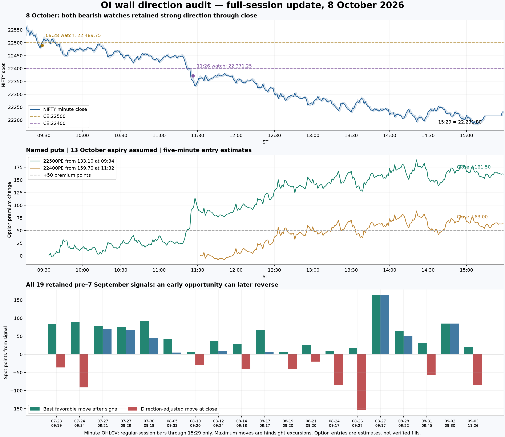

# TASK-011 — Full-session OI-wall direction and reversal audit

**Updated:** 8 October 2026 after market close, using a fresh Dhan retrieval at approximately17:18 IST and fresh Supabase telemetry. This extends the earlier12:46 cutoff report. No application code, configuration, database records or orders changed.

## Answer

Today is a strong supporting example for the user's proposed use of the watch as directional context. Both bearish watch episodes were substantially favorable at the end of the regular session. Older data also contain meaningful moves after signals and after recorded system exits, but a substantial fraction of those moves reverse before the day ends. The existence of an opportunity and persistence of direction are different measurable outcomes.

## Today's complete session

Supabase now contains43 wall-context rows for today and still only **two distinct RETEST_READY episodes**. No additional afternoon ready-watch episode was recorded. Last spot snapshot is22,231.80 at15:29:51; Dhan15:29 bar closes at the same value. Use this as the recorded session endpoint, not a claim about official exchange settlement.

| Watch / direction | Spot at watch | Best favorable spot movement | Favorable movement at15:29 | Maximum initial/full-session adverse spot movement |
|---|---:|---:|---:|---:|
| 09:28 CE:22500 bearish | 22489.75 | 309.85 | 257.95 | 35.80 |
| 11:26 CE:22400 bearish | 22371.25 | 191.35 | 139.45 | 11.50 |

Both reached their maximum favorable spot excursion at15:09, with spot low22,179.90. Neither returned to its watch spot after first moving50 points favorably. They did have earlier back-and-forth movement: after the first25-point favorable excursion, both later revisited watch spot, then resumed lower. The first wall was crossed above before the sustained decline; the second did not require an exact post-alert wall touch.

### Named option contracts

Nearest expiry13 October2026 is assumed, as in the earlier report. Dhan IDs44613 (22500PE) and44604 (22400PE). Entries below are first whole-minute opens after a five-minute wait from watch; they are not verified user fills. No trailing logic reconstructed.

| Contract | Estimated entry / IST | +50 first touch | Maximum premium gain |15:29 premium | Premium gain at close |
|---|---|---|---:|---:|---:|
| 22500PE | 133.10 / 09:34 | 11:22 | 191.80 | 294.60 | 161.50 |
| 22400PE | 159.70 / 11:32 | 12:33 | 91.30 | 222.70 | 63.00 |

Both premium peaks occur at14:21. Both remain above their estimated entries after reaching+50. These are observed price changes, not a broker P&L calculation. Costs and fill differences are excluded. No stop-loss configuration is recommended or changed.

## What counts as "worked, then reversed"?

To make a count possible without introducing a trading rule:

- Reference = spot recorded when watch/signal was generated.
- "Worked by25/50" = later minute high/low reached25/50 spot points in predicted direction, at any time that session.
- "Reversed after working" = a **later** candle touched or crossed back to original reference. This need not be permanent; price may recover again.
- End-of-day failure is reported separately. A small pullback is not automatically counted as a full reversal.
- These thresholds describe spot paths. They are **not** the user's+50 option-premium target.

| Cohort | Reached25+ | Then returned to reference | Reached50+ | Then returned to reference | Ended unfavorable among50+ cases |
|---|---:|---:|---:|---:|---:|
|7 watch-ready episodes |6 |5/6 |5 |2/5 |1/5 |
|19 pre–September7 trade signals |14 |12/14 |9 |6/9 |2/9 |

No threshold/return same-candle ambiguities occur in these two cohorts. At the25-point threshold, one legacy return was wick-only;11 of12 also had a subsequent close at/beyond reference. All50-point returns in these cohorts are corroborated by later candle closes.

### The two watch reversals after50+ spot points

- **October1, CE22600 bearish:** reached+50 at09:25, returned to watch reference at09:30, later resumed sharply lower; ended+137.10. A full intraday reversal, followed by recovery in original direction.
- **October7, PE22600 bullish:** reached+50 spot at10:18, returned to watch reference at10:37, subsequently rallied again to a higher peak, finally ended−23.45. The earlier report's12:57 return concerns the **22600CE premium entry estimate**, not spot reference. Different reference prices and instruments explain the different times.

September18 is an additional worked-then-reversed case under the25-point definition: maximum+34.70, returned at09:40, ended−25.10. September28 is a direct failure: maximum+1.65, ended−185.95; it is not a case that first produced a substantial favorable move.

With today's complete data, watch cohort is5/7 positive at1h,6/7 at2h,4/7 at close. These are only seven observations across six dates; today's two share one market trend. Before today, four of five were positive at2h but their average was just+0.10 points.

## All retained signals before7 September

Fresh reads of ares_signals, active_trades and trade_analytics establish **19 matching genuine signal records on18 dates, July23–September3**. All19 stored reasons explicitly mention an OI wall and follow-through confirmation. No earlier OI-wall signal/trade records were returned in these current tables. Missing older retention cannot establish that no earlier events occurred.

Signal reference is recorded spot. Path begins at first whole minute after matched active-record creation to avoid counting pre-signal portions of its candle. Wall strikes below come from stored reason text; they are not the selected option strike.

| Date / IST | Actual wall | Direction | Best favorable spot move | First+50 IST | Returned to reference after+50 | Spot move at close |
|---|---|---|---:|---|---|---:|
| 2026-07-23 09:19 | 23900 PE | BULLISH | 83.05 | 10:03 | 12:30 | -36.00 |
| 2026-07-24 09:34 | 23700 CE | BEARISH | 89.65 | 09:48 | 11:47 | -91.05 |
| 2026-07-27 09:21 | 23900 PE | BULLISH | 77.90 | 14:03 | — | +69.95 |
| 2026-07-27 09:29 | 23900 PE | BULLISH | 75.40 | 14:03 | — | +67.45 |
| 2026-07-30 09:18 | 24200 PE | BULLISH | 92.20 | 12:32 | 13:13 | +45.85 |
| 2026-08-05 09:33 | 24600 PE | BULLISH | 43.15 | — | — | +5.20 |
| 2026-08-10 09:20 | 24600 PE | BULLISH | 5.30 | — | — | -29.80 |
| 2026-08-12 09:24 | 24400 PE | BULLISH | 37.10 | — | — | +9.55 |
| 2026-08-14 09:18 | 24350 CE | BEARISH | 28.00 | — | — | -41.20 |
| 2026-08-17 09:17 | 24300 CE | BEARISH | 67.05 | 10:42 | 12:32 | +6.35 |
| 2026-08-19 09:20 | 24100 PE | BULLISH | 6.70 | — | — | -40.30 |
| 2026-08-21 09:20 | 24250 CE | BEARISH | 25.45 | — | — | -19.75 |
| 2026-08-24 09:17 | 24300 PE | BULLISH | 10.25 | — | — | -83.70 |
| 2026-08-26 09:27 | 24350 PE | BULLISH | 16.85 | — | — | -154.00 |
| 2026-08-27 09:17 | 24300 CE | BEARISH | 163.30 | 09:28 | — | +163.30 |
| 2026-08-28 09:22 | 24100 PE | BULLISH | 63.70 | 10:16 | 11:29 | +51.05 |
| 2026-08-31 09:45 | 24050 CE | BEARISH | 30.25 | — | — | -56.55 |
| 2026-09-02 09:30 | 23800 PE | BULLISH | 84.70 | 10:22 | 11:12 | +84.70 |
| 2026-09-03 11:26 | 23950 PE | BULLISH | 19.60 | — | — | -84.95 |

Nine gave50+ spot points: July23, July24, both July27 signals, July30, August17, August27, August28 and September2. Six returned to signal reference afterward: **July23, July24, July30, August17, August28, September2**. Of these six, four later recovered sufficiently to close favorable; only July23 and July24 closed against original direction. Thus a reversal count is not the same as an end-of-day failure count.

The other ten never reached50 favorable spot points in the remaining session; five of those did reach25. Three of the nine50-point cases reached that magnitude only after more than two hours (both July27 signals and July30). They should not be described as uniformly immediate or early-morning successes.

Legacy cohort:7/19 positive at1h (mean−1.80),9/19 at2h (mean−5.63),9/19 at close (mean−7.05). At least25 points of temporary favorable opportunity occurred in14/19; a50-point move occurred in9/19. Each answers a different question about detection quality.

### Does the data support "system exited, but direction later worked"?

Yes, in specific cases. Of13 pre–September7 records marked SL_HIT, **8 later/over the full post-signal path offered25+ favorable spot points,5 offered50+, and6 ended favorable**. Example August27: recorded system exit was SL_HIT; subsequent post-signal path reached+163.30 and ended there. Conversely, August26 bullish signal offered only+16.85 and ended−154.00. Tight exits cannot explain all unsuccessful historical signals. This audit evaluates the price path independently of recorded exits; it does not simulate a replacement stop rule.

## Why were OI-wall trades generated before September7?

**The detector existed long before the new watch system.** Local Git history:

| Code-history date | Commit | Verified behavior |
|---|---|---|
|April29 |202ecfe |Initial commit already includes OIWallDetector, scanning substantial/growing CE/PE OI near spot and emitting rejection/bounce trade signals. |
|July2 |6ece4d8 |Adds candidate candle followed by next-candle confirmation. |
|July17 |f635354 |Removes mandatory deep-wick gate while retaining directional wall interaction and next-candle follow-through. This is the historical implementation preceding the retained July/August signals. |
|September5–6 |59cb218 and follow-ups |Separates OIWallBias from OIWallEntryFilter; adds lifecycle/persistence/retest/watch telemetry and oi_wall_context storage. |
|September7 |First retained telemetry date |Start of available non-null wall-context records, not invention of wall detection. |
|September30 |c7b852a |Changes oi_wall_enable_watchlist_alert from false to true in default and both profiles; improves delivery retry and alert clarity. |

Commit dates prove code history, not exact deployed dates. Actual stored reasons independently confirm that all19 earlier trade signals used OI-wall logic. Earlier RETEST_READY records are telemetry states, not proof Discord alerts were enabled/delivered then.

## Trending-day interpretation

Today clearly supports a strong bearish directional observation. The detector does not exclusively identify a trend in the correct direction: September28 had a strong downward session while its watch was bullish; August26 and September3 also produced bullish signals before substantial declines. September18's relatively small range and low net movement show that watches are not exclusive to large one-way sessions. No matched control-group study establishes a general trend-day forecasting edge.

The supported conclusion is narrower and useful: **selected watches have repeatedly identified a meaningful directional opportunity, sometimes despite no final system entry. Many earlier signals also offered a favorable interval, but it often did not persist uninterrupted.** This is compatible with using a watch as context alongside the user's own analysis, without assuming every wall will ultimately be right.

## Data quality and verification

- Fresh Dhan response includes a spot row at17:17 and option rows15:30–15:39 despite requested session endpoint. All rows after15:29 excluded. Final spot bars contain a run of identical values; no post-close rows used to manufacture further gains. Last regular-session spot value agrees with Supabase.
- Minute09:15 is missing from the fresh single-day spot response but exists in earlier ranged pull; retained for whole-day context. Post-alert conclusions start later and are unaffected.
- Original and refreshed overlapping candles agree except for the last then-live candle, which subsequently completed. The original partial-candle mismatch was already excluded by prior12:46 cutoff.
- An extra active/analytics row with entrySeptember7 but creation/exitSeptember6 and time_metrics_excluded=true is not a genuine auditable observation and is excluded. All19 preSeptember7 records match across signal and analytics tables.
- Independent review recomputed threshold/reversal counts and EOD option/spot changes from raw candle data. No historical option-premium success rate is inferred from spot points.
- Sources: Supabase projectmgenubvjbatpcpntlgav; Dhan minute OHLCV ([API documentation](https://dhanhq.co/docs/v2/historical-data/)); local Git objects listed above. Scratch extracts and analysis remain under/private/tmp/ares_*.

