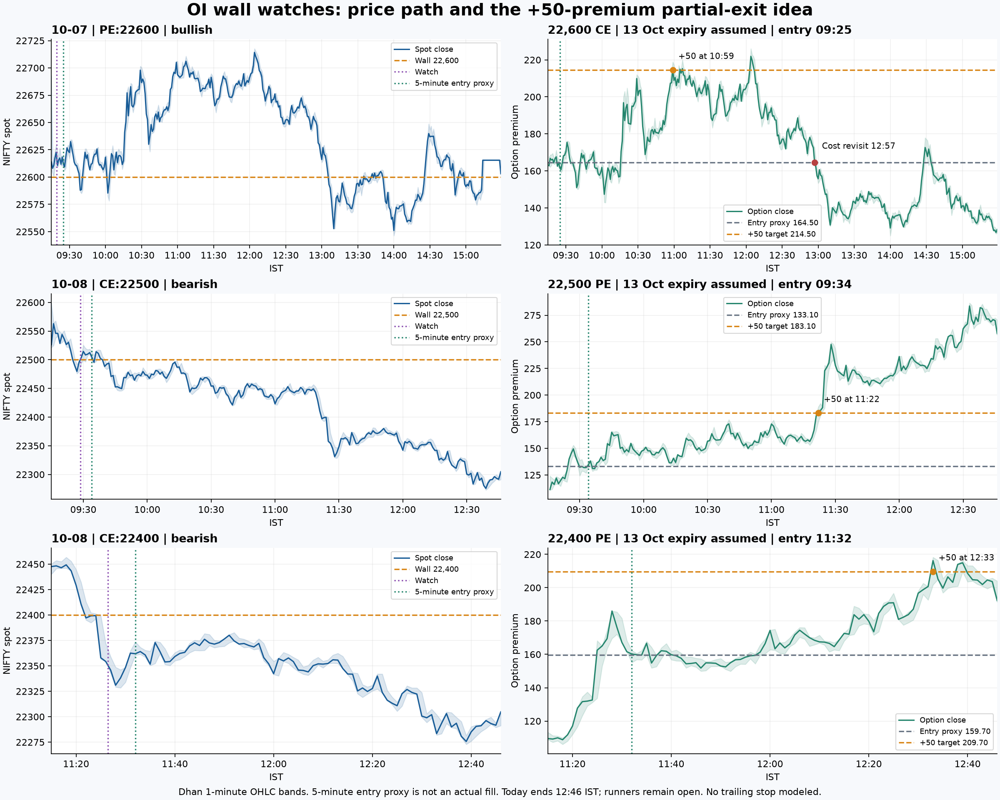
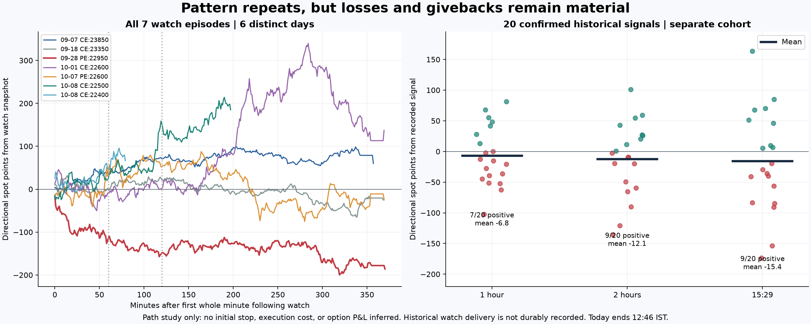

# TASK-011 — OI wall directional-pattern audit

**Audit date:** 8 October 2026. **Today’s frozen candle cutoff:** 12:46 IST (the 12:46–12:47 bar). Historical sessions end at the 15:29 bar. Research only; no production code, configuration, orders, or database records changed.

## Assessment

The recent examples support a useful observation: a watch can identify directional context even when the final entry filter never qualifies. A pullback can improve entry substantially, and taking most size off before a reversal can preserve gains. This is observable in the three named contracts, under the nearest-expiry assumption below.

The evidence does **not** establish that any OI wall should be traded or held through invalidation. Seven reconstructed watch-ready episodes contain a major failure. Before today, four of five episodes were positive after two hours, yet their mean was just **+0.10 spot points**. Older confirmed signals have negative mean forward returns. Entry selection, loss control and partial exits are material, rather than incidental details.

## User’s observation, restated accurately

1. Receive OI wall watch; use supplied direction as context.
2. Wait roughly five minutes for a better pullback entry, rather than automatically entering at alert.
3. Buy corresponding option: today 22,500 PE / 22,400 PE; yesterday 22,600 CE.
4. Trail stop; book 80% after approximately **50 option-premium points** of profit.
5. Retain 20% runner; yesterday the runner exited at cost.

The initial 1–2-hour description is a typical holding interval, not a fixed exit rule. This audit retains 1h/2h spot returns as diagnostics only. The user did not provide exact fills, expiry, initial stop, trailing method, or exact time when runner protection moved to cost; actual trading performance cannot be reconstructed from candles alone.

## Data and cohort construction

- Supabase project **Trading signal data**, ref `mgenubvjbatpcpntlgav`: `ml_collection`, `ares_signals`, `active_trades`. Queried read-only. 463 non-null wall telemetry rows, starting 7 September; 12 `RETEST_READY` rows collapse to **7 episodes on 6 dates**.
- Episode key: IST date + wall key + initial interaction timestamp. Repeated minutes are not separate opportunities. October 8 episodes match both supplied Discord messages and spots exactly.
- Historical Discord delivery is not persisted. Therefore these are **watch-ready telemetry episodes**, not seven proven delivered Discord alerts. Delivery/cancellation state is process memory. Missing telemetry is not proof no wall existed.
- **20 confirmed OI_WALL_REJECTION signals on 19 dates**, 23 July–28 September. Nineteen predate wall telemetry; they are a separate cohort. Each signal uniquely matches an active row by entry timestamp, direction and entry price; the September 28 row also matches canonical UUID.
- One additional active-trade-only row excluded: created/exited on September 6, but entry timestamp September 7, with no matching signal. It has invalid chronology and is not a valid historical observation.
- Dhan returned **20,114 one-minute spot OHLCV rows** across July 23–October 8. Filtering to regular-session timestamps and the frozen cutoff retains 20,086 rows. Option data fetched for security IDs **44613 (22500 PE), 44604 (22400 PE), 44616 (22600 CE)**.
- Dhan expiry list confirms **13 October 2026** as nearest current expiry; chain resolves the three contracts. That expiry is an **assumption for the user’s trades**, consistent with recorded DTE, not verified broker fills.
- Original Supabase snapshots can contain an unfinished current candle: their close differs from Dhan’s subsequently completed same-minute close. Recorded spot is kept as the alert reference; subsequent paths use Dhan. It is not assumed that an alert-price fill was available.

## Three named options: reproduce the opportunity

A deterministic proxy enters at the first whole-minute open on or after alert time + five minutes. This is reproducible but does not model discretionary pullback selection. A +50 target touch uses subsequent candle highs. Adverse excursion uses all lows through the target candle, so it is conservative where intrabar order is unknown.

| Date | Contract | Proxy entry IST | Premium entry | +50 target | First target touch | Adverse premium move before target |
| --- | --- | --- | --- | --- | --- | --- |
| 2026-10-08 | 22500 PE | 09:34 | 133.10 | 183.10 | 11:22 | 4.55 |
| 2026-10-08 | 22400 PE | 11:32 | 159.70 | 209.70 | 12:33 | 9.80 |
| 2026-10-07 | 22600 CE | 09:25 | 164.50 | 214.50 | 10:59 | 21.65 |

**Yesterday, 22,600 CE:** proxy entry 164.50 at 09:25; target 214.50 touched at 10:59. Premium later peaked at 226.05 at 12:04, revisited entry at 12:57, and closed at 128.35. Thus the precise story is early gain, later recovery to a higher peak, then sustained reversal—not a permanent reversal starting at 11:00. With 80% filled at +50 and 20% exited at cost, gross result would be **+40 premium points per original unit**. Holding 100% to close instead would be **−36.15**. This is a conditional candle simulation, not the user’s verified P&L. A fixed 20-premium-point initial stop would not survive the full 21.65-point adverse move before target.

**Today, 22,500 PE:** 133.10 proxy entry at 09:34; +50 at 11:22; maximum subsequent gain 153.40 premium points at 12:33. At cutoff premium 257.75, so a hypothetical 80% partial and still-open 20% runner mark to **+64.93 premium points per original unit**, before costs.

**Today, 22,400 PE:** 159.70 proxy entry at 11:32; +50 at 12:33; maximum subsequent gain 58.55 premium points. At cutoff premium 192.25; same hypothetical sizing marks to **+46.51**. Neither today value is a final or wholly realized return.

No initial or trailing SL has been simulated: those rules are unknown. Runner cost protection is assumed to begin only after the partial, with subsequent entry-price touch exiting the runner. In these three target candles, lows were above entry, avoiding same-candle target/cost ambiguity. Quotes, spread, slippage, fees, lot rounding and actual fill availability remain outside this candle study.

**Timing sensitivity:** at three minutes after the second alert, 22,400 PE proxy entry is 178.30; maximum gain only 39.95 by cutoff, so +50 is not reached. At five minutes, entry is 159.70 and +50 is reached. Across 0/3/5/7/10-minute proxies, the first PE and yesterday’s CE all reach +50, but with different drawdowns and timing. This small predeclared sensitivity set illustrates fill dependence; it does not identify an optimal delay.

## All watch-ready episodes

Positive values mean movement in suggested direction. These are **spot points**, not premium points. “1h/2h” uses the close of the last full candle in the 60/120-minute window beginning at the first whole minute after the stored watch timestamp. EOD means 15:29 bar close, not the official settlement value. Today’s unfinished horizons are left blank.

| Date / IST | Wall | Direction | 1h | 2h | EOD | Best favorable move* | Worst adverse move* |
| --- | --- | --- | --- | --- | --- | --- | --- |
| 2026-09-07 09:31 | CE:23850 | BEARISH | +35.45 | +73.65 | +59.95 | +101.20 | 6.55 |
| 2026-09-18 09:19 | CE:23350 | BEARISH | +1.75 | +25.70 | -25.10 | +34.70 | 67.85 |
| 2026-09-28 09:18 | PE:22950 | BULLISH | -120.55 | -151.60 | -185.95 | +1.65 | 204.00 |
| 2026-10-01 09:19 | CE:22600 | BEARISH | -9.70 | +0.85 | +137.10 | +341.75 | 51.55 |
| 2026-10-07 09:19 | PE:22600 | BULLISH | +29.65 | +51.90 | -23.45 | +91.15 | 80.20 |
| 2026-10-08 09:28 | CE:22500 | BEARISH | +21.25 | +158.75 | — | +216.85 | 35.80 |
| 2026-10-08 11:26 | CE:22400 | BEARISH | +48.55 | — | — | +98.35 | 11.50 |

*Full available post-watch session, ending 12:46 today. Best excursion is hindsight potential, not achievable booked profit; full-session adverse excursion can occur after profits were already available.

- 1h: **5/7 positive**, mean **+0.91**, median **+21.25**.
- 2h: **5/6 complete positive**, mean **+26.54**, median **+38.80**. Today’s second watch has not reached two hours.
- Before today only: **4/5 positive at 2h, mean +0.10**. This is why win rate alone is misleading.
- Completed EOD: **2/5 positive**, mean **−7.49**.
- September 28 bullish watch: only **+1.65** maximum favorable spot excursion, then **−151.60** at two hours and **−185.95** at close. System’s subsequent confirmed trade hit its 16-point stop. This is a real failure, not merely a stop that prevented eventual success.
- October 1: immediate direction initially offered ~51 points, then reversed; watch +2h almost flat, later much larger bearish move. Five-minute delayed entry suffers ~98 spot points of full-session adverse excursion before the eventual +50-point opportunity. “Correct later” can still be difficult to trade.

### Five-minute clock-entry sensitivity

Same seven events, entering at next whole-minute open after a five-minute wait:

| Date / wall | Entry spot | 1h | 2h | EOD |
| --- | --- | --- | --- | --- |
| 2026-09-07 CE:23850 | 23843.60 | +47.75 | +80.00 | +64.45 |
| 2026-09-18 CE:23350 | 23328.00 | +21.30 | +26.30 | -18.40 |
| 2026-09-28 PE:22950 | 22926.60 | -82.55 | -112.65 | -146.35 |
| 2026-10-01 CE:22600 | 22512.65 | -47.90 | -22.70 | +90.70 |
| 2026-10-07 PE:22600 | 22619.55 | +47.85 | +64.80 | -16.50 |
| 2026-10-08 CE:22500 | 22513.15 | +69.50 | +149.05 | — |
| 2026-10-08 CE:22400 | 22365.90 | +66.90 | — | — |

1h mean +17.55; 2h mean +30.80 on six complete windows, with 4/6 positive; completed EOD mean −5.22. Before today, five-event 2h mean +7.15. Some entries improve while others worsen. This supports testing an explicit pullback condition, not assuming a five-minute timer is sufficient.

## Does the wall get crossed before the move?

- **October 8, 22,500 CE:** yes. At 09:30 spot high was **22,525.55**, 25.55 points above wall. Later low **22,272.90** at 12:39. This is the clearest example of the proposed cross/reversal sequence.
- **October 8, 22,400 CE:** no post-alert touch of 22,400 by cutoff. Spot remained below wall; later pullback was below the original strike. Direction worked without an exact wall sweep.
- **October 7, 22,600 PE:** crossed below wall at 09:39, later rallied. From watch price it went 48.25 points adverse before first +50-spot-point move. Option behavior is quantified separately above.
- September 7 worked without a post-watch wall cross. September 28 crossed its put wall and continued the wrong way.

OHLCV and aggregate OI show price sequence and concentration, not who initiated trades or whether stops/dealer hedges caused movement. “Liquidity taken” is a plausible interpretation of some examples, not a mechanism proved by these records.

## Older confirmed signals: separate check

All 20, including losses; no filtering by final outcome. Reference is recorded signal spot. Forward path begins at the first whole minute **after matched active-row creation**, avoiding pre-signal highs/lows from the signal’s minute. These are diagnostic paths if the position were held without its original stop, not executable strategy returns.

| Date / IST | Direction | Recorded system exit | 1h | 2h | EOD |
| --- | --- | --- | --- | --- | --- |
| 2026-07-23 09:19 | BULLISH | STOPPED_OUT_AT_BE | +48.05 | +54.40 | -36.00 |
| 2026-07-24 09:34 | BEARISH | T2_HIT | +81.05 | +42.60 | -91.05 |
| 2026-07-27 09:21 | BULLISH | SL_HIT | -12.80 | +11.15 | +69.95 |
| 2026-07-27 09:29 | BULLISH | SL_HIT | -21.00 | +25.70 | +67.45 |
| 2026-07-30 09:18 | BULLISH | T2_HIT | -2.45 | +26.90 | +45.85 |
| 2026-08-05 09:33 | BULLISH | SL_HIT | -39.55 | -20.10 | +5.20 |
| 2026-08-10 09:20 | BULLISH | SL_HIT | -36.60 | -9.45 | -29.80 |
| 2026-08-12 09:24 | BULLISH | STOPPED_OUT_AT_BE | -51.60 | -121.10 | +9.55 |
| 2026-08-14 09:18 | BEARISH | SL_HIT | -15.45 | +0.50 | -41.20 |
| 2026-08-17 09:17 | BEARISH | SL_HIT | +27.75 | +58.90 | +6.35 |
| 2026-08-19 09:20 | BULLISH | SL_HIT | -52.50 | -65.65 | -40.30 |
| 2026-08-21 09:20 | BEARISH | STOPPED_OUT_AT_BE | -0.25 | -19.70 | -19.75 |
| 2026-08-24 09:17 | BULLISH | SL_HIT | -27.85 | -90.40 | -83.70 |
| 2026-08-26 09:27 | BULLISH | SL_HIT | -62.80 | -59.70 | -154.00 |
| 2026-08-27 09:17 | BEARISH | SL_HIT | +67.65 | +100.80 | +163.30 |
| 2026-08-28 09:22 | BULLISH | STOPPED_OUT_AT_BE | +41.45 | +20.20 | +51.05 |
| 2026-08-31 09:45 | BEARISH | SL_HIT | +12.75 | -2.75 | -56.55 |
| 2026-09-02 09:30 | BULLISH | SL_HIT | +55.00 | -9.70 | +84.70 |
| 2026-09-03 11:26 | BULLISH | SL_HIT | -45.00 | -49.65 | -84.95 |
| 2026-09-28 09:19 | BULLISH | SL_HIT | -102.60 | -135.90 | -173.85 |

- Recorded exits: **14 SL_HIT, 4 STOPPED_OUT_AT_BE, 2 T2_HIT**. These labels do not reconstruct partial-exit P&L.
- Holding-path 1h: **7/20 positive**, mean **−6.84**.
- Holding-path 2h: **9/20 positive**, mean **−12.15**.
- Holding-path EOD: **9/20 positive**, mean **−15.39**.
- Some stopped trades later recover (for example August 27); other stopped trades continue sharply against the original direction. Removing stops is not supported by this cohort.

## Why watch information can be useful

Current local logic selects substantial, growing OI, then requires a rejection candle near wall, repeated persistence, and a later excursion before marking RETEST_READY. It already embeds OI **and price action**. Final trade needs an additional subsequent retest. Therefore directional information can exist without an executable system entry.

A qualifying interaction may occur within 20 spot points of wall; exact touch is not required. Favorable excursion used by the filter is measured from wall strike, not hypothetical entry. Neither that excursion nor the pre-alert price move is counted as post-entry profit here.

Code changed during this history: local commits introduced decoupled filter September 5, modified qualification September 22, and adjusted directional retest/watch behavior September 30. Commit dates do not prove deployment dates. Old signals, earlier telemetry and today’s delivered watches are not interchangeable strategy versions.

## What remains unproven

Seven episodes on six days are too small and correlated for a stable edge estimate; today’s two bearish watches share the same market move. Three user-selected option examples are particularly vulnerable to selection bias. Historical exact-contract premium replay has not been completed for all seven watches or the 20 older signals. No same-time momentum or market-direction control group was tested; no independent incremental OI effect is established.

The evidence supports a **candidate watch + pullback + partial-exit method**, with explicit failure handling. It does not support changing config merely to tolerate wider losses. Next research step is to freeze observable pullback entry, chosen expiry/strike, initial risk, trailing rule, +50 partial and runner-cost activation; then replay every available event and record new events prospectively. No such strategy change is made or approved by this audit.

## Sources and verification

- Supabase tables and row IDs: watch first-ready IDs **18358, 21322, 23556, 24676, 25688, 26070, 26187**. Today's supplied cancellation IDs are not treated as trade exits.
- [Dhan historical OHLCV documentation](https://dhanhq.co/docs/v2/historical-data/) defines ranged minute candle access and timestamp fields; exact-contract data retrieved using the account’s existing loader. No credentials saved in artifacts.
- [Entry/watch implementation](../../detectors/oi_wall_entry.py), especially interaction/readiness around lines 264–305 and subsequent retest around 306–324.
- [Detector](../../detectors/oi_wall.py), candidate qualification around 104 onward.
- [Watch delivery persistence limitation](../../docs/oi-wall-watch-cancellation.md), line 31.
- Independent read-only review verified the three premium target/MAE calculations, unique signal-to-trade matching, event counts, sorted candle series and intrabar target/cost ordering. Review identified historical signal-minute timing contamination; corrected to first whole minute after matched record creation before final results.
- Analysis scripts and raw market extracts used scratch files under `/private/tmp/ares_*`; only this report and two charts added to research artifacts. Existing user edits left intact.
