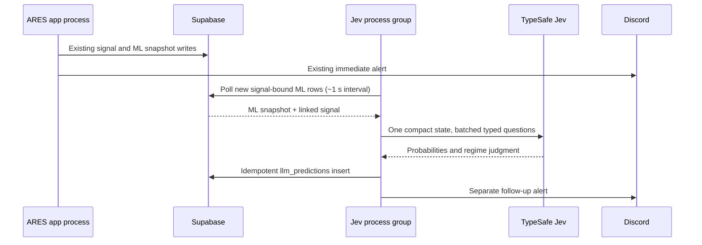

# TASK-210: Jev forward prediction POC assessment

**Date:** 2026-09-30
**Status:** Ready for design review; implementation not started

## Recommendation

Use Jev as a second forward predictor in the **existing ARES Fly app**, on a separate process-group Machine. When any of the four ARES trade setups fires, consume the live signal-time data ARES already writes to `ml_collection` and `ares_signals`; do not fetch the market again. Call Jev once for that signal, persist its estimates to `llm_predictions`, and post a separate follow-up Discord alert. Jev code lives in its own `system_one/` package, with no application-code imports in either direction between it and XGBoost.

Jev performs **inference only**. Unlike the XGBoost module, this POC has no offline training, fitting, retraining, or model artifact. Historical labels are for measuring whether Jev's live probabilities are reliable, not for training Jev.

This replaces the earlier proposal for a second Fly app and independent Dhan collector. The user's latest instruction is to run alongside the main app and reuse the ML data. A separate process group fits that requirement while giving the trading process its own 768 MB Machine. [Fly process-group documentation](https://fly.io/docs/launch/processes/).

## What the repository provides

The four live setup types are `FAILED_BREAKOUT`, `OI_WALL_REJECTION`, `EXHAUSTION_REVERSAL`, and `TREND_CONTINUATION` (`models.SetupType`). The engine evaluates them from the latest closed one-minute candle, option chain/ATM data, IV change, and structural levels, then returns a signal with entry, targets, stop, and reasons. The Jev POC runs only for a fired signal of one of these types; it is not a continuous every-bar forecaster.

| Existing record | Signal-time content | Role for Jev |
| --- | --- | --- |
| `ml_collection` signal row | Feature groups for candle, volume, IV, OI, Greeks, structure, and meta; raw candle/ATM OI; wall context; `signal_uuid`; created after the signal path | Primary shared market snapshot, derived from the same live candle, chain, levels, and histories used for ML. |
| `ares_signals` | UUID, setup, direction, entry, T1/T2/SL, reasons, candle timestamp, database creation time | Barrier geometry and detector narrative. |
| `ml_predictions` event row | XGBoost's model-input `feature_snapshot`, version, probability, and canonical UUID in `signal_id` | Optional paired comparison. Its insert is asynchronous, so waiting for it would delay or suppress Jev when the XGBoost logger is unavailable. |

`main.py` computes XGBoost from the current candle, option chain, levels, and MLCollector histories; later in the same signal cycle it awaits a signal-bound `MLCollector.snapshot()`. The `ml_collection` row is therefore the best independent handoff. It is **the same market-data cycle**, although its engineered feature dictionary is not guaranteed byte-for-byte identical to `ml_predictions.feature_snapshot`; record both versions when comparing forecasts. Neither `ares_signals` alone nor a second Dhan fetch has the full feature set. [Main signal path](../../main.py), [ML collector](../../ml_signal/collector.py), [ML predictor](../../ml_signal/predictor.py).

The live Supabase project observed in the prior assessment is in bridge mode: `ares_signals.id` is bigint and `signal_uuid` is unique UUID. `ml_collection.signal_uuid` is populated for signal rows; `ml_predictions.signal_id` stores the UUID as text. The future TASK-150 UUID cutover needs an explicit consumer-query adjustment. No schema change is part of this report.

## Proposed flow and timing



The worker has no Dhan calls, avoiding the rate contention created by the earlier collector proposal. It still shares Supabase reads, Fly app configuration, image, and app-level secrets; resource isolation applies to the Machines, not to those shared services. Fly's process groups are configured in one `fly.toml`, and each group runs on its own Machine. A deploy would create the Jev Machine after the configuration is merged, so deployment is a separate reviewed step. [Fly process-group documentation](https://fly.io/docs/launch/processes/).

Jev's model response may be fast, but total latency includes the existing live snapshot write, polling interval, database read, context building, API round trip, prediction insert, and Discord send. Start with a one-second poll and measure p50/p95 signal-to-prediction and signal-to-alert times for all four setup types. Do not claim a fixed ~200 ms result before a real account call. If polling dominates, evaluate an event-driven handoff later.

## Exact context and Jev question contract

Use Python to validate bullish/bearish barrier order, finite prices, and positive SL distance. Compute T1/T2/SL distances and reward-to-risk. Read runway, wall, IV trend, PCR/OI, volume, and wick values from the persisted feature groups and raw fields. Mark absent or stale values as missing, including structural levels or option-chain details that were not saved. Do not recreate missing facts from `reasons` text or silently replace null with zero.

Batch five independent questions in one TypeSafe call, using its typed `Choice`, `Noul`, and `Score` primitives:

| Question | Primitive | Output |
| --- | --- | --- |
| First barrier before session close | Choice: `t1_first`, `sl_first`, `neither_by_close` | `t1_hit_prob` and `sl_hit_prob` from one distribution |
| T2 after T1, given T1 first | Noul | `t2_hit_prob = P(t1_first) × P(t2_given_t1)` in Python |
| Market regime | Choice | Label, distribution, and confidence |
| Setup quality | Score | Defined ordinal levels scaled to 0–10 in Python |
| False-break trap risk | Noul | `is_trap_prob` |

Store the resolved API model name, raw response, context schema version, question-set version, and input provenance. TypeSafe describes `Noul` as a yes probability, `Choice` as a distribution over alternatives, and `Score` as an ordinal judgment. The model must not be asked to do arithmetic or infer unavailable market history. [TypeSafe API](https://docs.typesafe.ai/api), [Python SDK](https://docs.typesafe.ai/sdk/python), [Choice](https://docs.typesafe.ai/primitives/choice), [Noul](https://docs.typesafe.ai/primitives/noul), [Score](https://docs.typesafe.ai/primitives/score).

Illustrative Python request shape from the TypeSafe SDK documentation; it has **not** been executed with this account:

```python
from typesafe_sdk import Choice, Noul, Score, TypeSafeClient

questions = {
    "first_barrier": Choice(
        instructions="Which event occurs first for this spot-price signal before session close?",
        criteria={
            "t1_first": "Target 1 touches before stop loss.",
            "sl_first": "Stop loss touches before Target 1.",
            "neither_by_close": "Neither barrier touches before session close.",
        },
    ),
    "t2_given_t1": Noul(
        instructions="Assuming Target 1 touched first, does Target 2 touch before stop loss or session close?"
    ),
    "market_regime": Choice(
        instructions="Classify the observed signal-time market regime.",
        criteria={
            "trending": "Sustained directional movement with confirming participation.",
            "range_choppy": "Range-bound or reversing movement with weak follow-through.",
            "volatile_event": "Event volatility dominates the observed structure.",
            "insufficient_evidence": "The supplied snapshot does not support a classification.",
        },
    ),
    "setup_quality": Score(
        instructions="Rate the observed setup quality using only supplied evidence.",
        criteria=["Unusable", "Weak", "Mixed", "Strong", "Exceptional"],
    ),
    "is_trap": Noul(instructions="Does the supplied evidence indicate a false break or stop sweep?"),
}

with TypeSafeClient(model="jev-1.13.0") as client:
    response = client.system_one(state=exact_context, questions=questions)

p_t1 = response.choices["first_barrier"].probabilities["t1_first"]
p_sl = response.choices["first_barrier"].probabilities["sl_first"]
p_t2 = p_t1 * response.nouls["t2_given_t1"].noul
engine_name = response.model
```

The API's typed probabilities are **not yet calibrated ARES trade probabilities**. Define the barrier labels and observation horizon, then compare Jev with realized outcomes, base rates, and XGBoost using Brier score and reliability plots before interpreting percentages as calibrated. A same-bar T1/SL touch without tick order must be labeled ambiguous. The previous assessment's Laya CPU latency claim and the old Obsidian note's calibrated-example language were unsupported; Jev is the initial POC backend.

## Persistence and deployment contract

Create `llm_predictions` with `signal_uuid uuid NOT NULL UNIQUE REFERENCES ares_signals(signal_uuid)` in the current bridge schema, three checked 0–1 probabilities, regime/distribution/confidence, quality/trap scores, resolved engine name, input/source versions, latency, raw state/response, and timestamps. Keep a durable failure and alert-delivery status without writing fake 0% predictions. Enable RLS and grant only server-side access. Handle the later signal UUID column rename in queries. [Supabase API security guidance](https://supabase.com/docs/guides/api/securing-your-api).

The existing `fly.toml` would gain `[processes] app = "python main.py"` and `jev = "python -m system_one.consumer"`, plus a VM stanza for `jev` while retaining the existing `app` VM allocation. Do not apply this configuration or a database migration as part of the design PR. Fly deploys process groups together from the same image; app-level secrets are shared, so the Jev process should never initialize or call Dhan. If separate secret isolation later becomes necessary, the one-app constraint would need reconsideration. [Fly process-group documentation](https://fly.io/docs/launch/processes/).

## Verification before operational use

1. Mock TypeSafe, Supabase, and Discord at public boundaries; test exact context math, signal UUID joins, missing evidence, event mapping, probability invariants, retry/idempotency, and alert delivery. Aim for the ticket's 100% new-unit coverage target.
2. Static check for zero Jev imports or changed lines in `main.py`, `SignalPredictor`, and `ml_signal`. Kill the Jev Machine and confirm the trading Machine and original alert continue.
3. With a server-side `TYPESAFE_API_KEY`, run representative saved signals and record actual model version, response time, token cost, coverage, and end-to-end latency. This key was unavailable during the assessment; no live Jev result is claimed.
4. Build forward barrier labels from signal-time spot data, compare Jev and XGBoost against the same event definition, and inspect calibration by setup type and market regime. Neither model should influence trading until that review.

This is a **design POC for review**, not an implemented predictor. It now matches the requested one-app, shared-data architecture and is ready for directive review under the Global Development Pipeline.
