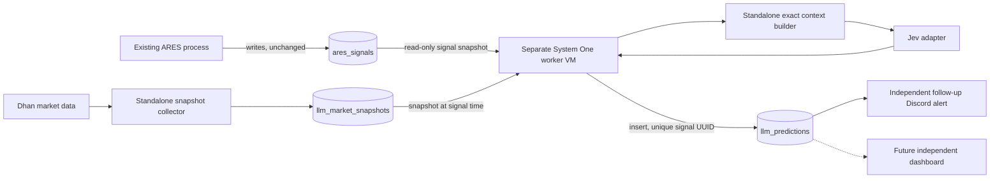

# TASK-210 System One predictor: POC assessment

**Date:** 2026-09-30
**Status:** Research POC / implementation contract proposed
**Scope:** Independent Jev shadow predictor. No production or database change is made by this report.

## Decision to review

Build a separate `system_one_worker/` package and deploy it as its own Fly app. Its only ARES integration is a read-only database contract with `ares_signals`; it writes only to its own `llm_market_snapshots`, `llm_predictions`, and worker-status tables. It must import no code from `main.py`, `ml_signal`, `SignalPredictor`, `storage.py`, or `alerts.py`; those files must import nothing from the new package. The worker never affects orders, risk limits, the original Discord alert, or the XGBoost prediction. The user selected a standalone market-data collector and a separate follow-up Discord alert for the POC.

This interprets “no common references” as **no shared application code or process dependencies**. A shared signal identifier in Supabase is necessary to evaluate fired signals and to satisfy TASK-210's foreign-key requirement.



## Verified observations

1. The connected ARES Supabase project (`mgenubvjbatpcpntlgav`) is currently in **bridge mode**: `ares_signals.id` is a bigint primary key and `signal_uuid` is a UUID with a unique index. The repository's `2026-09-12-task150-cutover-signal-uuid.sql` would later rename `signal_uuid` to `id` and make that UUID the primary key. A foreign key created against today's `ares_signals(signal_uuid)` follows a PostgreSQL column rename, but the worker's read query must change from `signal_uuid` to `id` at cutover. The current `config.py` default is `signal_schema_mode="bridge"`; do not infer live schema from `schema.sql` alone.
2. All 308 live signal rows have entry, T1, T2, and SL fields, a non-null UUID, and `reasons`. Only **1/308** has `oi_wall_context`. `ares_signals` does not persist raw IV history, PCR/OI trend, 20-bar volume, candle OHLC/wicks, or nearby structural levels. Computing those fields from this table would fabricate evidence. The standalone worker needs its own timestamp-addressable market-data source and immutable signal-time snapshot for the full feature list. A geometry-only spike may use the existing rows, with absent fields marked `null` and input coverage recorded.
3. The Obsidian architecture note contains older fire-and-forget-in-`main.py` and `jev_predictions` examples. The newer TASK-210 directive supersedes those with a separate consumer and `llm_predictions`. The latest user instruction is stricter still: do not place new files under `ml_signal/` or alter the original alert path. The referenced `2026-09-24 01:10` build-log entry was not found in either the Obsidian or repository build log when searched for Jev, TypeSafe, System One, and the timestamp.
4. The Option 3 field cannot be in the **original** Discord embed without coupling the alert path to the later worker result. The user selected a **separate follow-up message** keyed by `display_id` after persistence. A future dashboard can read both tables without changing the trade process.
5. TypeSafe's current endpoint is `POST /v1/systemone`, with `state`, `model`, and a map of typed `questions`. `Noul` returns a yes probability; `Choice` returns a selected label, distribution, and distribution-derived confidence; `Score` returns a probability-weighted ordinal level. A `Score` accepts **at most 10 levels**, numbered 0 through N−1, so a 0–10 quality display requires an explicit scaling rule. The API response's versioned `model` value should be stored as `engine_name`, rather than the moving `jev-latest` alias. [API reference](https://docs.typesafe.ai/api), [Score](https://docs.typesafe.ai/primitives/score), [models](https://docs.typesafe.ai/models).
6. The older note's “calibrated 72% means 72% of ARES setups win” is unverified. Typed output and TypeSafe's general calibration claims do not establish calibration for intraday NIFTY barrier events. Jev's own limitations document says it struggles with numeric precision, large irrelevant state, and some structural invariants; arithmetic and event identities belong in Python. [Jev 1.13 limitations](https://docs.typesafe.ai/model-jaggedness/jev-1.13), [confidence](https://docs.typesafe.ai/confidence).
7. The quoted 25–35 ms **CPU** latency for Laya is unsupported by its model card. The card reports roughly 33–40 ms on a T4 GPU for one question, 193–464 ms on CPU for a preloaded router, and about 808 MB of English checkpoint weights before runtime overhead. Ten batched questions also take longer than one. Laya therefore requires its own measured RAM/latency budget and cannot share the current 768 MB trading VM. [Laya model card](https://huggingface.co/convaiinnovations/laya).
8. TypeSafe currently documents `jev-1.13.0`, `jev-latest`, and input pricing of $0.042 per million tokens, with rate limits subject to change. The stated ~$0.01/month depends on actual state/question token usage and must be measured. TypeSafe's Python SDK uses `typesafe-sdk`; its OpenRouter example uses model ID `~typesafe/jev-latest` with an alternate base URL, not the ticket's unprefixed example. [Models](https://docs.typesafe.ai/models), [Python SDK](https://docs.typesafe.ai/sdk/python), [gateway configuration](https://docs.typesafe.ai/sdk/python/usage).
9. A new public-schema Supabase table needs RLS and explicit least-privilege grants. The platform is moving away from automatic Data API exposure; put grants and RLS in the same migration. Keep the service-role key only in the worker's server-side secrets. The existing `ares_signals` RLS state is outside this POC. [Securing your API](https://supabase.com/docs/guides/api/securing-your-api), [Supabase changelog](https://supabase.com/changelog).
10. `TYPESAFE_API_KEY` is absent from this shell environment and the repository `.env`; no authenticated Jev result or end-to-end latency has been measured. The global TypeSafe skill was installed for supported agents; the installer reported PromptScript as the single agent without global-install support.
11. The existing ARES `OIFetcher` fetches Dhan option-chain data each core cycle. A new independent collector using the **same Dhan account** could still contend on the provider's account-level limits even though code and memory are separate. To uphold zero trading impact, prefer separately provisioned market-data credentials or another provider; otherwise a rate-coordination policy becomes an explicit shared dependency. Dhan documents one unique option-chain request per three seconds. [Dhan option-chain limits](https://dhanhq.co/docs/v2/option-chain/).
12. The existing ML documentation says XGBoost predicts T1-before-SL, while another historical continuous label means a fixed forward-point move and drops inconclusive chop. Its signal model also has its own calibration work in progress. Jev and XGBoost percentages can only be compared as forecasts if they use the **same** target, horizon, and label rules; the new unit will not import the old label code. The label definition in this report is independent and explicit.
13. Existing detectors set `AresSignal.timestamp` from the **one-minute candle's timestamp**, while `ares_signals.created_at` is the database insert time. A signal-time snapshot must distinguish those clocks. The collector should select observations received no later than `created_at`, record the lag from candle time to insert time, and validate Dhan's candle timestamp convention before claiming exact as-of-signal alignment. With no change to the main process, subsecond event-time exactness cannot be guaranteed.

## POC contract

### Inputs and exact preprocessing

Use the persisted UUID, `timestamp`, `direction`, `trigger_price`, `target_1`, `target_2`, `stop_loss`, `setup_type`, `reasons`, and optional `oi_wall_context`. Reject invalid geometry before inference: bullish targets must lie above entry and SL below; bearish targets below and SL above; all prices must be finite; SL distance must be positive. Compute signed and absolute T1/T2/SL distances, T1 and T2 reward-to-risk ratios, and trading-session time remaining in Python. Preserve full precision in stored `raw_state`; round only for display.

The user selected a **standalone** market-data collector. It subscribes to a Dhan market feed for NIFTY spot and a defined liquid options/futures instrument set, and polls the NIFTY option chain at a measured cadence no faster than Dhan's published unique-request limit of one request per three seconds. It stores compact timestamped bars, chain aggregates, source/expiry/instrument IDs, and receive times in `llm_market_snapshots` under the worker's ownership. The consumer freezes the newest snapshot received no later than `ares_signals.created_at` with an explicit maximum age, and records the lag from the signal candle timestamp; it never uses a later observation. From those observations, Python computes nearest opposing barrier, runway beyond T1, wall between entry and T1, IV change and acceleration, PCR/OI alignment, 20-bar volume ratio, and candle wick profile. Use option/futures volume with a documented instrument rather than assuming the NIFTY index's volume field is meaningful. For backfill, Dhan's historical intraday endpoint supplies OHLC/volume, while options IV/OI history requires a verified source or the collector's own stored snapshots. If an input is missing, retain `null` plus a `missing_inputs` list; do not convert missing data to zero or infer a number from prose. [Dhan option chain](https://dhanhq.co/docs/v2/option-chain/), [live market feed](https://dhanhq.co/docs/v2/live-market-feed/), [historical bars](https://dhanhq.co/docs/v2/historical-data/).

### Outcome definitions for the shadow test

Treat a signal as a hypothetical entry at `trigger_price` at the selected observation cutoff, provisionally `ares_signals.created_at`, using **spot** barriers because the saved targets and stop are spot levels. End observation at that trading session's close. T1-first, SL-first, and neither are mutually exclusive. T2 success means T1-first followed by T2 before SL or session close. A candle that touches competing barriers in the same bar without tick ordering has an ambiguous label and is excluded from calibration. These definitions are proposed for review; they do not claim to reproduce actual fills or trade P&L.

### One Jev request, five judgments

The context is a compact JSON object with the exact geometry, named qualitative facts, detector reasons, missing-input flags, and a clear spot-price/session definition. The five independent questions in one request are:

| Question key | Primitive | Meaning / mapping |
|---|---|---|
| `first_barrier` | Choice | `t1_first`, `sl_first`, or `neither_by_close`; use its distribution for `t1_hit_prob` and `sl_hit_prob`. |
| `t2_given_t1` | Noul | Explicit hypothetical: assuming T1 is touched first, will T2 touch before SL or session close? Set `t2_hit_prob = P(t1_first) × P(t2_given_t1)` in Python. |
| `market_regime` | Choice | Distinct rubrics for `strong_trend`, `weak_trend`, `range_bound`, `choppy`, `volatile_event`, and `insufficient_evidence`; store distribution and confidence. |
| `setup_quality` | Score | Five described levels from unusable to unusually strong; report the returned 0–4 score multiplied by 2.5 to display 0–10. |
| `is_trap` | Noul | Probability that price action is a false break/stop sweep, with exact criteria and no arithmetic request. |

The first-barrier distribution makes `P(T1 first) + P(SL first) ≤ 1`; the conditional product makes `P(T2) ≤ P(T1)`. Store the raw Jev answers and mapped values separately so the mapping is auditable. These are model estimates, **not** statistically validated market probabilities until the shadow evaluation passes. If a model cannot answer because inputs are insufficient, record a failure/coverage status separately rather than write invented non-null probabilities.

The adapter boundary accepts a versioned context object and returns a validated, backend-neutral prediction record. Jev, Laya, or a future provider must implement the same semantic event definitions, then report its own resolved model/checkpoint identity. Store `context_schema_version` and `question_set_version` alongside `engine_name` so results remain comparable after prompts, features, or models change. A backend swap is a worker configuration change plus verification; it never changes core ARES code. Different backends' raw probabilities should not be assumed equally calibrated.

Concrete Jev call shape, using TypeSafe's current Python SDK (illustrative, not executed):

```python
from typesafe_sdk import Choice, Noul, Score, TypeSafeClient

questions = {
    "first_barrier": Choice(
        instructions="For this spot-price signal, which event occurs first after `signal.observation_cutoff` and before today's market close?",
        criteria={
            "t1_first": "Target 1 is touched before the stop loss.",
            "sl_first": "Stop loss is touched before Target 1.",
            "neither_by_close": "Neither barrier is touched before market close.",
        },
    ),
    "t2_given_t1": Noul(
        instructions="Assume Target 1 was touched before stop loss. Would Target 2 then be touched before stop loss or market close?"
    ),
    "market_regime": Choice(
        instructions="Classify the signal-time price and flow regime from the provided evidence.",
        criteria={
            "strong_trend": "Sustained directional move with confirming participation.",
            "weak_trend": "Directional movement with mixed participation.",
            "range_bound": "Price oscillates inside defined support and resistance.",
            "choppy": "Repeated reversals and poor directional follow-through.",
            "volatile_event": "Event-driven volatility dominates structure.",
            "insufficient_evidence": "The supplied snapshot lacks the data needed to classify.",
        },
    ),
    "setup_quality": Score(
        instructions="Rate the quality of this signal-time setup, using the evidence supplied.",
        criteria=[
            "Unusable: invalid or severely conflicting evidence",
            "Weak: several meaningful risks or missing confirmations",
            "Mixed: plausible setup with material uncertainty",
            "Strong: clear structure and mostly confirming flow",
            "Exceptional: clear structure, runway, and multiple confirmations",
        ],
    ),
    "is_trap": Noul(
        instructions="Does the observed signal-time price action show a likely false break or stop sweep?"
    ),
}

with TypeSafeClient(model="jev-1.13.0") as client:
    response = client.system_one(state=exact_context, questions=questions)

p_t1 = response.choices["first_barrier"].probabilities["t1_first"]
p_sl = response.choices["first_barrier"].probabilities["sl_first"]
p_t2 = p_t1 * response.nouls["t2_given_t1"].noul
quality_0_to_10 = response.scores["setup_quality"].score * 2.5
engine_name = response.model
```

### Proposed table and worker behavior

For today's bridge schema, `llm_predictions.signal_uuid` should be `uuid NOT NULL UNIQUE REFERENCES public.ares_signals(signal_uuid)`. Include the three `numeric NOT NULL` probabilities with 0–1 checks, `regime`, distribution/confidence, setup quality with 0–10 check, trap probability, versioned `engine_name`, latency, `raw_state`, `raw_response`, and timestamps. `signal_id`/`display_id` may be retained as display/legacy metadata, but UUID is the only identity. Add `input_coverage` or equivalent audit metadata. Enable RLS and grant only the worker's server-side role. The unique UUID enforces **one chosen backend result per signal**; running Jev and Laya side-by-side for the same signal would require a different uniqueness contract.

Run one worker replica in a dedicated Fly app with its own Docker image and secrets, polling every 5 seconds during market hours and recovering missed signals after restart. It may read `ares_signals` and its own snapshot/prediction/status tables only. Use the UUID uniqueness constraint for idempotent writes. Capture retryable TypeSafe errors with bounded backoff and a durable failure state; a failed Jev call must never be represented as 0% or as a successful prediction. After a successful insert, its own Discord sender posts a follow-up alert with `display_id`, T1/T2/SL percentages, regime, quality, and model version; retry Discord independently from Jev and persist the send status to avoid duplicate messages. This POC does not add a trigger or change the core app's `fly.toml`.

The user chose the **same Dhan account** for the pilot. The collector must cap its option-chain request cadence well below Dhan's published limit, never retry aggressively, monitor `429`/`DH-904`, and stop its market-data calls on the first provider-limit signal. The main process has no knowledge of this worker and cannot participate in a shared rate lock, so this is conservative pacing rather than strict coordination. **Absolute zero provider contention remains unproven with shared credentials** and is a production gate, even if the POC works.

### Verification gates

1. Mock the TypeSafe response and Supabase I/O to prove exact geometry, direction rules, probability mapping, JSON validation, idempotency, retry handling, and missing-input behavior; satisfy TASK-210's 100% new-unit coverage target without mocking the context math itself.
2. Prove no imports or modified lines in `main.py`, `ml_signal/`, `storage.py`, `alerts.py`, or the core Fly config. Kill or OOM the worker in isolation and confirm the existing engine's signal and alert path is unaffected.
3. With a real key and a small budget cap, run Jev on representative saved signals; log actual model version, input token usage, latency, question responses, and coverage. Do not publish sample percentages as calibrated.
4. Build independent spot-barrier labels from historical signal-time data. Compare Jev against base rates and a simple geometry-only baseline with Brier score, log loss, reliability plots, and per-setup/period slices. Repeat per model version; use confidence intervals before any operational use.

## Open decisions before implementation

- **Market snapshot source:** The user chose a standalone collector using the same Dhan account for the pilot. Before implementation, verify Data Plan access, exact futures/options instruments, snapshot cadence, and what to do when the collector misses a signal. Strict provider isolation requires a separate account or provider later.
- **User-facing display:** The user chose a separate follow-up alert. Decide whether it posts to the existing Discord channel/webhook or an isolated research channel; the technical unit remains independent either way.
- **Backend sequence:** Start with Jev now that access is available, then bench Laya on a separate machine and promote it only if its domain accuracy, context limit, RAM, and latency meet the same evaluation gate.
- **Schema cutover:** Keep bridge-mode UUID reads until the deployed ARES database is migrated; change the worker's identity-column setting at the same cutover. The foreign key itself follows the rename.
- **Approval gate:** The user's Global Development Pipeline requires review and approval of the directive, then the ADR, before implementation. This report is the concrete POC proposal for that review; no integration code, migration, API call, or deployment has been performed.
