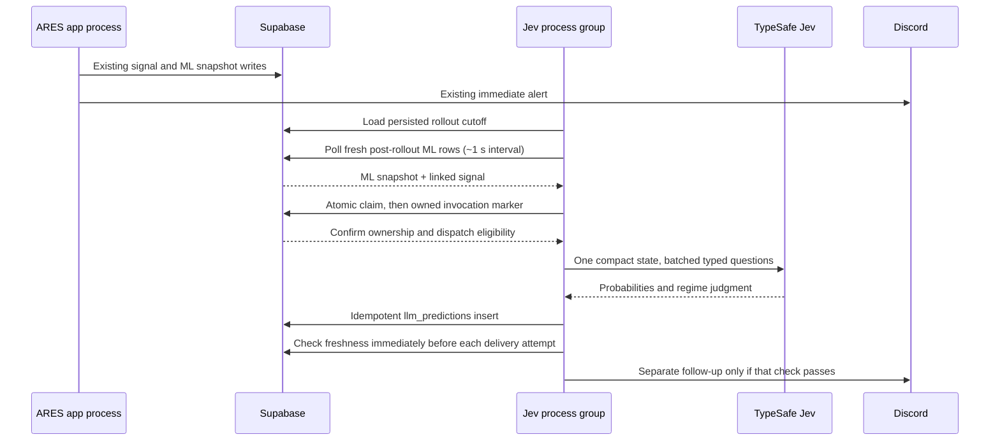

# TASK-210: Jev forward prediction POC assessment

**Date:** 2026-09-30
**Status:** Ready for design review; implementation not started

## Recommendation

Use Jev as a second forward predictor in the **existing ARES Fly app**, on a separate process-group Machine. When any of the four ARES trade setups fires, consume the live signal-time data ARES already writes to `ml_collection` and `ares_signals`; do not fetch the market again. Allow at most one automatic Jev dispatch for an eligible live signal, persist a successful result, and post a follow-up while the signal remains fresh. Jev code lives in its own `system_one/` package, with no application-code imports in either direction between it and XGBoost.

Jev performs **inference only**. Unlike the XGBoost module, this POC has no offline training, fitting, retraining, or model artifact. Historical labels are for measuring whether Jev's live probabilities are reliable, not for training Jev.

This replaces the earlier proposal for a second Fly app and independent Dhan collector. The user's latest instruction is to run alongside the main app and reuse the ML data. A separate process group fits that requirement while giving the trading process its own 768 MB Machine. [Fly process-group documentation](https://fly.io/docs/launch/processes/).

## What the repository provides

The four live setup types are `FAILED_BREAKOUT`, `OI_WALL_REJECTION`, `EXHAUSTION_REVERSAL`, and `TREND_CONTINUATION` (`models.SetupType`). The engine evaluates them from the latest closed one-minute candle, option chain/ATM data, IV change, and structural levels, then returns a signal with entry, targets, stop, and reasons. The Jev POC runs only for a fired signal of one of these types; it is not a continuous every-bar forecaster.

| Existing record | Signal-time content | Role for Jev |
| --- | --- | --- |
| `ml_collection` signal row | Feature groups for candle, volume, IV, OI, Greeks, structure, and meta; raw candle/ATM OI; wall context; `signal_uuid`; created after the signal path | Primary shared market snapshot, derived from the same live candle, chain, levels, and histories used for ML. |
| `ares_signals` | UUID, setup, direction, entry, T1/T2/SL, reasons, candle timestamp, database creation time | Barrier geometry and detector narrative. |
| `ml_predictions` event row | XGBoost's model-input `feature_snapshot`, version, probability, and canonical UUID in `signal_id` | Optional paired comparison. Its insert is asynchronous, so waiting for it would delay or suppress Jev when the XGBoost logger is unavailable. |

`main.py` computes XGBoost from the current candle, option chain, levels, and MLCollector histories; later in the same signal cycle it awaits a signal-bound `MLCollector.snapshot()`. The `ml_collection` row is therefore the best independent handoff. It is **the same market-data cycle**, although its engineered feature dictionary is not guaranteed byte-for-byte identical to `ml_predictions.feature_snapshot`; record both versions when comparing forecasts. Neither `ares_signals` alone nor a second Dhan fetch has the full feature set. [Main signal path](../../main.py), [ML collector](../../ml_signal/collector.py), [ML predictor](../../ml_signal/predictor.py).

The live Supabase project observed in the prior assessment is in bridge mode: `ares_signals.id` is bigint and `signal_uuid` is unique UUID. `ml_collection.signal_uuid` is populated for signal rows; `ml_predictions.signal_id` stores the UUID as text. The future TASK-150 UUID cutover needs an explicit consumer-query adjustment. No schema change is part of this report.

## Proposed flow and timing



The worker has no Dhan calls, avoiding the rate contention created by the earlier collector proposal. It still shares Supabase reads, Fly app configuration, image, and app-level secrets; resource isolation applies to the Machines, not to those shared services. Fly's process groups are configured in one `fly.toml`, and each group runs on its own Machine. A deploy would create the Jev Machine after the configuration is merged, so deployment is a separate reviewed step. [Fly process-group documentation](https://fly.io/docs/launch/processes/).

Jev's model response may be fast, but total latency includes the existing live snapshot write, polling interval, database read, context building, API round trip, prediction insert, and Discord send. Start with a one-second poll and measure p50/p95 signal-to-prediction and signal-to-alert times for all four setup types. Do not claim a fixed ~200 ms result before a real account call. If polling dominates, evaluate an event-driven handoff later.

## Rollout cutoff, ownership, and restart behavior

Before enabling the live consumer, bootstrap its `llm_consumer_state` row once with `live_from` taken from the database clock. Use an atomic insert that leaves an existing row unchanged; every worker start must load that row and stop if it is absent. Keep the same consumer identity and cutoff across restarts, deploys, and model changes. For the initial POC, `expires_at = ares_signals.created_at + 60 seconds`, and freshness requires `database_now < expires_at`; at the exact boundary the signal is expired. Poll only matching ML snapshots whose signal was created at or after `live_from`, remains fresh, and belongs to the active trading session. Snapshot insert time must not refresh the signal's age. Thus an empty prediction table at rollout cannot cause historical Jev calls or Discord alerts.

Persist one `llm_prediction_jobs` row per signal UUID. A database transaction must enforce claim ownership before any external request: atomically insert/claim the job with an owner token, lease expiry, pinned snapshot identity, model, and context/question versions. An owned, unexpired `CLAIMED` job can transition to `INVOKING` only once, setting `invocation_started_at`, while rechecking cutoff, age, and session eligibility. A worker can dispatch only after this transition is acknowledged; an uncertain database acknowledgment is not permission to send. Losing workers and expired owners cannot dispatch. Result persistence must verify the matching invocation token.

| Durable state | Recovery action |
| --- | --- |
| `CLAIMED`, no invocation marker, lease expired | Atomically transfer ownership to a new token only if the signal is still fresh. The old owner can no longer transition to `INVOKING`. |
| `INVOKING`, worker lost or request outcome uncertain | Mark `UNKNOWN` after the bounded request/lease deadline; never automatically re-invoke. |
| `UNKNOWN` | Retain the original invocation identity for audit or reconciliation. A late valid response with that token may complete the result; it cannot cause a second dispatch. |
| `COMPLETED` | Reuse the persisted result; immediately recheck database-time eligibility before every delivery attempt or retry without invoking Jev. |
| `FAILED` / `EXPIRED` | Retain the reason, issue no automatic Jev replay, and suppress live alerts. |

Recheck age immediately before Jev dispatch and immediately before **every Discord delivery attempt**, including the first send, retries after backoff in the same process, and retries after restart. Re-read eligibility with database time after waiting; do not reuse the first attempt's check or rely on the worker's clock. If the check fails or the database is unavailable, do not send. Once expiry or session close is reached, persist terminal `alert_status = SUPPRESSED_EXPIRED`, retaining the successful prediction/inference status, and never schedule another delivery attempt. A valid response arriving after expiry may be stored for audit with the same suppression. Historical evaluations require a separate explicit run with live Discord delivery disabled; they do not change the live cutoff or job ledger.

Disable delivery SDK/transport retries that bypass the application gate. Record each attempt's start time and bound its request duration by the remaining freshness window. The contract prevents starting stale requests; a request already accepted by Discord cannot be recalled if its acknowledgment arrives after expiry. A transient failure at age 59 seconds followed by a proposed retry at age 60 seconds must result in no second send, whether or not the worker restarted in between.

This is an **at-most-once automatic dispatch policy**, not an exactly-once successful inference guarantee. Persisting a unique prediction UUID after the request does not prevent duplicate calls. Disable application, SDK, and transport inference retries: TypeSafe documents `RetryPolicy(max_retries=0)`. The reviewed API documentation does not establish a provider idempotency guarantee, so a timeout or crash after the invocation marker must not be replayed merely with a UUID header. This deliberately favors avoiding duplicate requests over filling every result; any future replay policy requires explicit review of provider guarantees. [SDK retries](https://docs.typesafe.ai/sdk/python/api/retries), [HTTP API](https://docs.typesafe.ai/api).

## Exact context and Jev question contract

Use Python to validate bullish/bearish barrier order, finite prices, and positive SL distance. Compute T1/T2/SL distances and reward-to-risk. Read runway, wall, IV trend, PCR/OI, volume, and wick values from the persisted feature groups and raw fields. Mark absent or stale values as missing, including structural levels or option-chain details that were not saved. Do not recreate missing facts from `reasons` text or silently replace null with zero.

Freeze `signal.entry_price` from `ares_signals.spot_at_signal`, the same spot passed to `PositionManager.add_trade`; preserve the detector's `trigger_price` separately. Include `signal.original_stop_loss` and `signal.post_t1_stop_price = signal.entry_price` in the state. In production, T1 changes the stop to `entry_price` for both directions, so the conditional T2 event must use this breakeven barrier. [Trade entry and trailing-stop behavior](../../position_manager.py).

Batch five independent questions in one TypeSafe call, using its typed `Choice`, `Noul`, and `Score` primitives:

| Question | Primitive | Output |
| --- | --- | --- |
| First barrier before session close | Choice: T1 before original SL, original SL before T1, or neither | `t1_hit_prob` and `sl_hit_prob` from one distribution; breakeven exits after T1 are excluded from `sl_hit_prob` |
| T2 after T1, given T1 first, before the post-T1 breakeven stop or session close | Noul | `t2_hit_prob = P(t1_first) × P(t2_given_t1)` in Python |
| Market regime | Choice | Label, distribution, and confidence |
| Setup quality | Score | Defined ordinal levels scaled to 0–10 in Python |
| False-break trap risk | Noul | `is_trap_prob` |

Store the resolved API model name, raw response, context schema version, question-set version, and input provenance. TypeSafe describes `Noul` as a yes probability, `Choice` as a distribution over alternatives, and `Score` as an ordinal judgment. The model must not be asked to do arithmetic or infer unavailable market history. [TypeSafe API](https://docs.typesafe.ai/api), [Python SDK](https://docs.typesafe.ai/sdk/python), [Choice](https://docs.typesafe.ai/primitives/choice), [Noul](https://docs.typesafe.ai/primitives/noul), [Score](https://docs.typesafe.ai/primitives/score).

Illustrative Python request shape from the TypeSafe SDK documentation; it has **not** been executed with this account:

```python
from typesafe_sdk import Choice, Noul, RetryPolicy, Score, TypeSafeClient

questions = {
    "first_barrier": Choice(
        instructions="Which event occurs first for this spot-price signal before session close?",
        criteria={
            "t1_first": "Target 1 touches before the original stop loss.",
            "sl_first": "The original stop loss touches before Target 1.",
            "neither_by_close": "Neither barrier touches before session close.",
        },
    ),
    "t2_given_t1": Noul(
        instructions="Assuming Target 1 touched before the original stop loss, ARES then moves the stop to `signal.post_t1_stop_price` (the entry price). Does Target 2 touch before this post-T1 breakeven stop or session close? A touch of the breakeven stop ends the trade; ignore any later Target 2 touch."
    ),
    "market_regime": Choice(
        instructions="Classify the observed signal-time market regime.",
        criteria={
            "trending": "Sustained directional movement with confirming participation.",
            "range_choppy": "Range-bound or reversing movement with weak follow-through.",
            "volatile_event": "Event volatility dominates the observed structure.",
            "insufficient_evidence": "The supplied snapshot does not support a classification.",
        },
    ),
    "setup_quality": Score(
        instructions="Rate the observed setup quality using only supplied evidence.",
        criteria=["Unusable", "Weak", "Mixed", "Strong", "Exceptional"],
    ),
    "is_trap": Noul(instructions="Does the supplied evidence indicate a false break or stop sweep?"),
}

# The consumer must already own an acknowledged INVOKING job before this call.
with TypeSafeClient(
    model="jev-1.13.0", retry=RetryPolicy(max_retries=0), timeout=5.0
) as client:
    response = client.system_one(state=exact_context, questions=questions)

p_t1 = response.choices["first_barrier"].probabilities["t1_first"]
p_sl = response.choices["first_barrier"].probabilities["sl_first"]
p_t2 = p_t1 * response.nouls["t2_given_t1"].noul
engine_name = response.model
```

The evaluation labels must use the same stop transition: T1 success means T1 before the original SL; T2 success means T1 followed by T2 before a return to entry or session close. For a bullish entry at 24,000, T1 at 24,050, and T2 at 24,100, the path 24,050 → 24,000 → 24,100 is T1 success and T2 failure because the runner exits at breakeven. For a bearish entry at 24,000, T1 at 23,950, and T2 at 23,900, the path 23,950 → 24,000 → 23,900 has the same labels. Once breakeven is touched, later price movements cannot change that T2 failure.

The API's typed probabilities are **not yet calibrated ARES trade probabilities**. Compare them with realized outcomes, base rates, and XGBoost using Brier score and reliability plots before interpreting percentages as calibrated. Bars with unknown ordering of T1/original-SL, T1/return-to-entry, or post-T1 T2/breakeven touches must be labeled ambiguous and excluded from calibration. Production's optimistic candle evaluation may report a target in such a bar; retain that reported result separately from the ordered barrier label. The previous assessment's Laya CPU latency claim and the old Obsidian note's calibrated-example language were unsupported; Jev is the initial POC backend.

## Persistence and deployment contract

Create `llm_predictions` with `signal_uuid uuid NOT NULL UNIQUE REFERENCES ares_signals(signal_uuid)` in the current bridge schema, three checked 0–1 probabilities, regime/distribution/confidence, quality/trap scores, resolved engine name, input/source versions, latency, raw state/response, and timestamps. Add `llm_consumer_state` for the persistent rollout cutoff/age policy and `llm_prediction_jobs` for unique signal claims, pinned input, owner token, lease, invocation marker, status, error, and alert-delivery state. Commit the result and job completion atomically; on a lost commit acknowledgment, read/retry persistence using the same token and response without rerunning Jev. Enable RLS and grant only server-side access to these tables and the atomic claim operation. Handle the later signal UUID column rename in queries. [Supabase API security guidance](https://supabase.com/docs/guides/api/securing-your-api).

The existing `fly.toml` would gain `[processes] app = "python main.py"` and `jev = "python -m system_one.consumer"`, plus a VM stanza for `jev` while retaining the existing `app` VM allocation. Do not apply this configuration or a database migration as part of the design PR. Fly deploys process groups together from the same image; app-level secrets are shared, so the Jev process should never initialize or call Dhan. If separate secret isolation later becomes necessary, the one-app constraint would need reconsideration. [Fly process-group documentation](https://fly.io/docs/launch/processes/).

## Verification before operational use

1. Mock TypeSafe, Supabase, and Discord at public boundaries; test exact context math, signal UUID joins, missing evidence, event mapping, probability invariants, retry/idempotency, and alert delivery. Include both bullish and bearish T1 → breakeven → later T2 paths as T2 failures, direct T1 → T2 paths as successes, and unordered competing barrier touches as ambiguous. Aim for the ticket's 100% new-unit coverage target.
2. Static check for zero Jev imports or changed lines in `main.py`, `SignalPredictor`, and `ml_signal`. Kill the Jev Machine and confirm the trading Machine and original alert continue.
3. With a server-side `TYPESAFE_API_KEY`, run representative saved signals and record actual model version, response time, token cost, coverage, and end-to-end latency. This key was unavailable during the assessment; no live Jev result is claimed.
4. Build forward barrier labels from signal-time spot data, compare Jev and XGBoost against the same event definition, and inspect calibration by setup type and market regime. Neither model should influence trading until that review.
5. Verify first rollout with historical signal rows and an empty result table produces zero historical calls/alerts; verify the cutoff survives restarts and model changes. Exercise fresh versus expired restart recovery and late responses without stale Discord delivery.
6. Test simultaneous claims against a real local database, then mocked provider timeouts/crashes before and after the invocation marker. Verify only the acknowledged owner may dispatch, pre-dispatch stale claims can be recovered, uncertain invocations are never replayed, and persistence retries do not call Jev again. These are implementation acceptance gates; this design PR does not claim they have been executed.
7. Verify the Discord delivery gate on every attempt: retry within the freshness window succeeds, a failure at age 59 seconds followed by a retry at age 60 seconds is suppressed, and restart retains that suppression without altering the prediction. Include session close during backoff, an unavailable database gate, and disabled hidden transport retries. These delivery tests are implementation gates, not executed runtime tests in this design PR.

This is a **design POC for review**, not an implemented predictor. It now matches the requested one-app, shared-data architecture and is ready for directive review under the Global Development Pipeline.
